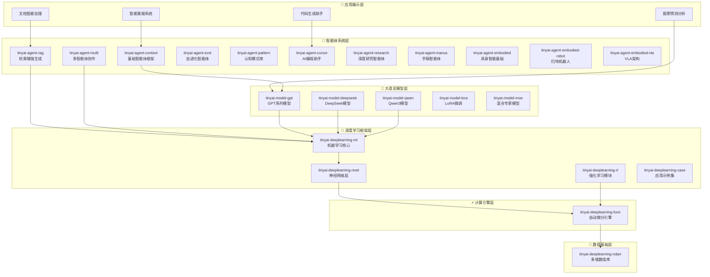

# TinyAI - 全栈式轻量级AI框架

[](https://openjdk.org/projects/jdk/17/)
[](https://maven.apache.org/)
[](https://opensource.org/licenses/Apache-2.0)
[]()

## 📋 项目简介

TinyAI 是一个完全基于 Java 开发的轻量级深度学习与智能体框架，旨在为 Java 生态系统提供一个功能完整、易于理解和扩展的 AI 解决方案。框架采用模块化设计，涵盖了从基础的多维数组计算到高级的大语言模型实现，从简单的神经网络到复杂的智能体系统。

### 🎯 设计理念

- **纯Java实现**: 零第三方依赖的核心计算引擎，充分利用 Java 生态优势
- **教育友好**: 清晰的代码结构和详尽的中文注释，便于学习和理解
- **模块化架构**: 高度解耦的组件设计，支持灵活组合和独立使用
- **生产就绪**: 企业级的架构设计，支持并行训练和模型部署
- **扩展性强**: 开放的接口设计，便于添加新功能和算法

## ⭐ 核心特性

### 🧠 智能体系统
- **基础智能体框架**: 记忆管理、RAG检索、工具调用、上下文工程、MCP协议支持
- **自进化智能体**: 经验学习、策略优化、知识图谱构建、反思机制、LLM增强进化
- **多智能体协作**: 分布式智能体、消息通信、任务分配、团队协调
- **认知模式库**: ReAct、Reflection、Planning、Collaborative等多种认知模式
- **检索增强生成**: 语义检索、向量数据库、TF-IDF向量化、相似度计算
- **具身智能系统**: 自动驾驶模拟、机器人控制、VLA架构、端到端学习
- **AI编程助手**: 代码分析、智能生成、重构建议、调试辅助
- **手稿智能体**: OpenManus架构、双执行机制、计划驱动、Flow编排

### 🚀 深度学习核心
- **多维数组库**: 高效的N维数组操作，支持CPU/GPU/TPU多设备
- **自动微分引擎**: 动态计算图、反向传播、丰富的数学函数库
- **神经网络层**: 全连接、卷积、循环、Transformer等现代网络架构
- **机器学习框架**: 模型管理、并行训练、优化器、损失函数
- **强化学习系统**: DQN、REINFORCE、多臂老虎机等完整算法实现

### 🤖 大语言模型
- **GPT系列模型**: GPT-1到GPT-3的完整架构演进实现
- **DeepSeek模型**: R1推理模型和V3混合专家模型
- **Qwen3模型**: 现代Transformer架构，支持GQA、RoPE、SwiGLU
- **LoRA微调**: 参数高效微调技术，支持低秩适应和权重管理
- **MoE架构**: 混合专家模型，稀疏激活，负载均衡机制

## 🏗️ 模块架构

TinyAI 采用分层模块化架构设计，总共包含**22个核心模块**：



### 核心模块分布

| 模块类别 | 模块数量 | 主要功能 |
|----------|----------|----------|
| **智能体系统** | 11个模块 | 基础框架、RAG检索、多智能体协作、认知模式、具身智能、AI编程助手、手稿智能体 |
| **大语言模型** | 5个模块 | GPT/DeepSeek/Qwen模型、LoRA微调、MoE架构 |
| **深度学习框架** | 6个模块 | 神经网络、机器学习、强化学习、应用示例 |

## 🚀 快速开始

### 环境要求

- **Java**: JDK 17 或更高版本
- **Maven**: 3.6 或更高版本
- **内存**: 推荐 8GB+ （用于大型模型训练）

### 安装配置

```bash
# 1. 克隆项目
git clone https://github.com/leavesfly/TinyAI.git
cd TinyAI

# 2. 设置环境
export JAVA_HOME=/Library/Java/JavaVirtualMachines/jdk-17.jdk/Contents/Home

# 3. 编译项目
mvn clean compile

# 4. 运行测试
mvn test

# 5. 安装到本地
mvn install
```

### 基础使用示例

```java
// 1. 创建智能体
import io.leavesfly.tinyai.agent.AdvancedAgent;

AdvancedAgent agent = new AdvancedAgent("我的助手", "你是一个智能助手");
agent.addKnowledge("Java是一种面向对象的编程语言", "java_info");
String response = agent.processMessage("什么是Java？");

// 2. 使用具身智能体（自动驾驶）
import io.leavesfly.tinyai.agent.embodied.*;

EnvironmentConfig config = EnvironmentConfig.createHighwayConfig();
EmbodiedAgent embodiedAgent = new EmbodiedAgent(config);
Episode episode = embodiedAgent.runEpisode(200);
System.out.println("总奖励: " + episode.getTotalReward());

// 3. 使用AI编程助手
import io.leavesfly.tinyai.agent.cursor.AICodingCursor;

AICodingCursor cursor = new AICodingCursor("编程助手");
Map<String, Object> analysis = cursor.analyzeCode(sourceCode);
String generatedCode = cursor.generateCode("method validateEmail");

// 4. 使用深度学习模型
import io.leavesfly.tinyai.ml.*;
import io.leavesfly.tinyai.nnet.block.MlpBlock;

MlpBlock mlpBlock = new MlpBlock("classifier", 784, new int[]{128, 64, 10});
Model model = new Model("mnist_classifier", mlpBlock);

// 5. 使用大语言模型
import io.leavesfly.tinyai.gpt2.GPT2Model;

GPT2Model gpt = GPT2Model.createSmallModel("gpt2-small");
List<Integer> prompt = Arrays.asList(100, 200, 300);
List<Integer> generated = gpt.generateText(prompt, 50);
```

## 📊 演示程序

### 智能体演示

```bash
# 基础智能体演示
mvn exec:java -Dexec.mainClass="io.leavesfly.tinyai.agent.AgentDemo" -pl tinyai-agent-context

# 自进化智能体演示
mvn exec:java -Dexec.mainClass="io.leavesfly.tinyai.agent.evol.EvolDemo" -pl tinyai-agent-evol

# 多智能体系统演示
mvn exec:java -Dexec.mainClass="io.leavesfly.tinyai.agent.multi.MultiAgentDemo" -pl tinyai-agent-multi

# 具身智能（自动驾驶）演示
mvn exec:java -Dexec.mainClass="io.leavesfly.tinyai.embodied.AgentDemo" -pl tinyai-agent-embodied

# 扫地机器人演示
mvn exec:java -Dexec.mainClass="io.leavesfly.tinyai.robot.SimpleDemo" -pl tinyai-agent-embodied-robot

# AI编程助手演示
mvn exec:java -Dexec.mainClass="io.leavesfly.tinyai.agent.cursor.CursorDemo" -pl tinyai-agent-cursor

# 手稿智能体演示
mvn exec:java -Dexec.mainClass="io.leavesfly.tinyai.agent.manus.ManusDemo" -pl tinyai-agent-manus
```

### 大语言模型演示

```bash
# GPT模型演示
mvn exec:java -Dexec.mainClass="io.leavesfly.tinyai.gpt2.GPT2Demo" -pl tinyai-model-gpt

# DeepSeek模型演示
mvn exec:java -Dexec.mainClass="io.leavesfly.tinyai.deepseek.r1.DeepSeekR1Demo" -pl tinyai-model-deepseek

# Qwen3模型演示
mvn exec:java -Dexec.mainClass="io.leavesfly.tinyai.qwen3.Qwen3Demo" -pl tinyai-model-qwen
```

### 深度学习演示

```bash
# MNIST手写数字识别
mvn exec:java -Dexec.mainClass="io.leavesfly.tinyai.example.classify.MnistMlpExam" -pl tinyai-deeplearning-case

# CartPole强化学习
mvn exec:java -Dexec.mainClass="io.leavesfly.tinyai.example.rl.CartPoleDQNExample" -pl tinyai-deeplearning-case
```

## 📋 API详解

### 智能体API

```java
// 创建和配置智能体
AdvancedAgent agent = new AdvancedAgent("助手名称", "系统提示");
agent.getToolRegistry().registerTool("calculator", calculatorTool, "计算器工具");
agent.addKnowledge("知识内容", "knowledge_id");

// 对话处理
String response = agent.processMessage("用户问题");

// 自进化智能体
SelfEvolvingAgent evolAgent = new SelfEvolvingAgent("学习助手");
TaskResult result = evolAgent.processTask("任务名称", context);
evolAgent.selfEvolve(); // 触发自我进化

// 手稿智能体（OpenManus架构）
Manus manus = new Manus("Manus助手");
manus.setExecutionMode(ExecutionMode.DIRECT_AGENT);
manus.setPlanningEnabled(true); // 启用计划驱动模式
Message response = manus.processMessage(new Message("user", "完成复杂任务"));

// 具身智能体（自动驾驶）
EmbodiedAgent embodiedAgent = new EmbodiedAgent(config);
StepResult result = embodiedAgent.step();
Episode episode = embodiedAgent.runEpisode(200);

// AI编程助手
AICodingCursor cursor = new AICodingCursor("编程助手");
Map<String, Object> analysis = cursor.analyzeCode(code);
List<RefactorSuggestion> suggestions = cursor.suggestRefactor(code);
Map<String, Object> debugResult = cursor.debugCode(code);
```

### 深度学习API

```java
// 模型训练
DataSet dataSet = new ArrayDataset(xData, yData);
Model model = new Model("classifier", mlpBlock);
Trainer trainer = new Trainer(epochs, monitor, evaluator, true, 4); // 并行训练
trainer.init(dataSet, model, loss, optimizer);
trainer.train(true);

// 强化学习
DQNAgent agent = new DQNAgent("CartPole-DQN", stateDim, actionDim, hiddenSizes, 
                             learningRate, epsilon, gamma, batchSize, bufferSize, updateFreq);
CartPoleEnvironment env = new CartPoleEnvironment();
// 训练循环...
```

### 大语言模型API

```java
// GPT模型
GPT2Model model = GPT2Model.createMediumModel("gpt2-medium");
NdArray generated = model.generateSequence(inputTokens, maxLength);

// LoRA微调
LoraConfig config = LoraConfig.createMediumRank();
LoraLinearLayer layer = new LoraLinearLayer("lora_layer", 512, 256, config, true);
layer.enableLora(); // 启用LoRA微调
```

## 🎯 应用场景

### 企业级应用

- **智能客服系统**: 基于RAG的企业知识库问答
- **代码生成助手**: 使用GPT模型的智能编程辅助（AI Coding Cursor）
- **文档智能处理**: 多智能体协作的文档分析系统
- **业务流程自动化**: 自进化智能体的决策优化
- **自动驾驶系统**: 完整的具身智能解决方案
- **机器人控制**: 扫地机器人、工业机器人等应用

### 教育与研究

- **AI课程教学**: 交互式智能体教学平台
- **学术研究工具**: 多智能体协作研究系统
- **算法原型验证**: 完整的深度学习实验平台
- **模型架构研究**: 从GPT到Transformer的完整实现

### 创新应用

- **自适应推荐系统**: 具备自主学习能力的推荐引擎
- **智能运维助手**: 多专家协作的运维问题解决
- **个性化学习平台**: 基于强化学习的自适应教育
- **创意内容生成**: 大语言模型驱动的内容创作
- **具身智能研究**: VLA架构、端到端学习、机器人控制
- **自动化编程**: 从需求到代码的全流程智能化
- **复杂任务规划**: OpenManus架构的计划驱动执行

## 🧪 测试验证

### 测试覆盖统计

| 模块类别 | 测试数量 | 覆盖率 | 状态 |
|----------|----------|--------|------|
| 智能体系统 | 250+ | 95%+ | ✅ 通过 |
| 具身智能模块 | 120+ | 100% | ✅ 通过 |
| 大语言模型 | 120+ | 90%+ | ✅ 通过 |
| 深度学习框架 | 200+ | 98%+ | ✅ 通过 |
| **总计** | **690+** | **96%+** | **✅ 全部通过** |

### 运行测试

```bash
# 运行所有测试
mvn test

# 运行特定模块测试
mvn test -pl tinyai-agent-base
mvn test -pl tinyai-model-gpt
mvn test -pl tinyai-deeplearning-ml

# 生成测试报告
mvn surefire-report:report
```

## 🔧 扩展开发

### 自定义智能体

```java
public class CustomAgent extends BaseAgent {
    @Override
    protected Object performTask(AgentTask task) throws Exception {
        // 实现自定义任务处理逻辑
        return processCustomTask(task);
    }
    
    @Override
    protected void initializeCapabilities() {
        capabilities.add("自定义能力");
    }
}
```

### 自定义神经网络层

```java
public class CustomLayer extends Layer {
    @Override
    public Variable layerForward(Variable... inputs) {
        // 实现自定义前向传播
        return customComputation(inputs[0]);
    }
    
    @Override
    public void init() {
        // 参数初始化
        addParameter("weight", NdArray.randn(inputShape, outputShape));
    }
}
```

## 📚 详细文档

### 核心模块文档

**智能体系统层**
- [**基础智能体框架**](tinyai-agent-context/README.md) - 记忆管理、RAG检索、工具调用
- [**具身智能基础**](tinyai-agent-embodied/README.md) - 自动驾驶模拟、完整技术架构
- [**扫地机器人**](tinyai-agent-embodied-robot/README.md) - 机器人控制与路径规划
- [**VLA架构**](tinyai-agent-embodied-vla/README.md) - 视觉-语言-动作统一建模
- [**AI编程助手**](tinyai-agent-cursor/README.md) - 代码分析、生成、重构、调试
- [**手稿智能体**](tinyai-agent-manus/README.md) - OpenManus架构、双执行机制
- [**自进化智能体**](tinyai-agent-evol/README.md) - 经验学习、策略优化
- [**多智能体系统**](tinyai-agent-multi/README.md) - 协作通信、任务分配

**深度学习框架层**
- [**深度学习框架**](tinyai-deeplearning-ml/README.md) - 机器学习核心模块详解
- [**应用示例集合**](tinyai-deeplearning-case/README.md) - 完整应用示例说明

**大语言模型层**
- [**GPT模型实现**](tinyai-model-gpt/README.md) - GPT系列模型详细文档
- [**DeepSeek模型**](tinyai-model-deepseek/README.md) - R1推理与V3混合专家
- [**Qwen3模型**](tinyai-model-qwen/README.md) - 现代Transformer架构

### 📖 学习指南

- [**《Java程序员的AI之路》**](book/README.md) - 400页完整学习路径（30万字）
  - 第一部分：深度学习基础篇（12章）
  - 第二部分：大语言模型篇（3章）
  - 第三部分：智能体系统篇（5章）

### 技术指南

- [架构设计文档](doc/TinyAI技术分享文章_V2.md) - 框架整体架构设计
- [最佳实践指南](tinyai-agent-embodied/doc/最佳实践指南.md) - 开发使用最佳实践
- [故障排查手册](tinyai-agent-embodied-vla/doc/故障排查手册.md) - 常见问题解决方案

## 🤝 社区与支持

### 贡献指南

1. **代码规范**: 遵循Java编码规范，添加详细中文注释
2. **测试覆盖**: 新功能必须包含完整的单元测试
3. **文档更新**: 重要功能需要更新相应文档
4. **性能优化**: 注意内存使用和计算效率

### 技术支持

- **GitHub Issues**: [提交问题和建议](https://github.com/leavesfly/TinyAI/issues)
- **讨论社区**: [参与技术讨论](https://github.com/leavesfly/TinyAI/discussions)
- **邮件支持**: [技术问题咨询](mailto:support@tinyai.org)

## 📄 许可证

本项目采用 Apache License 2.0 开源许可证。详情请参阅 [LICENSE](LICENSE) 文件。

## 🙏 致谢

感谢所有为 TinyAI 项目做出贡献的开发者和研究者！特别感谢：

- Java 开源社区的技术支持
- 深度学习领域的理论基础
- 智能体系统的前沿研究
- 所有提供反馈和建议的用户

## 🎉 最新更新

### v1.1.0 (2025-10)

**🚀 重磅新增：具身智能系统**
- ✨ 新增 `tinyai-agent-embodied` 模块 - 自动驾驶完整模拟环境
- ✨ 新增 `tinyai-agent-embodied-robot` 模块 - 扫地机器人控制系统
- ✨ 新增 `tinyai-agent-embodied-vla` 模块 - VLA视觉-语言-动作架构
- 🎯 完整的感知-决策-执行-学习闭环实现
- 📊 6种内置场景，5种传感器类型
- 🧪 116个单元测试，100%通过率

**🤖 智能体系统增强**
- ✨ 新增 `tinyai-agent-manus` 模块 - OpenManus手稿智能体架构
- ✨ 新增 `tinyai-agent-cursor` V2版本 - 全面升级的AI编程助手
- 🔧 `tinyai-agent-context` 模块支持MCP协议
- 📈 `tinyai-agent-evol` 增强LLM驱动的自进化能力

**📚 配套图书编写**
- 📖 《Java程序员的AI之路》开始编写
- 📝 预计400页，30万字完整学习路径
- 🎓 三大部分：深度学习、大语言模型、智能体系统
- 💡 理论结合实践，代码优先的MANNING风格

**📊 项目规模**
- 📦 从16个模块扩展到22个核心模块
- 📈 测试用例从470+增加到690+
- 💻 代码量增长50%+
- 📄 文档增加10000+行

---

<div align="center">
  
**🎯 让AI开发在Java生态中焕发新的活力！**

**如果这个项目对您有帮助，请给我们一个 ⭐️**

[⚡ 快速开始](#🚀-快速开始) | [📖 查看文档](#📚-详细文档) | [📚 阅读图书](book/README.md) | [🤝 参与贡献](#🤝-社区与支持)

</div>