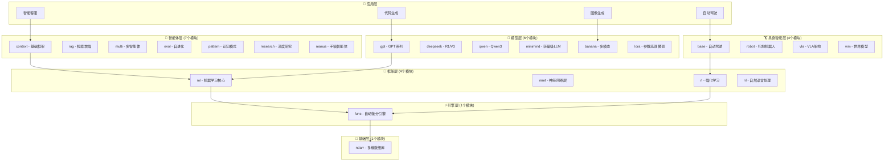

# TinyAI - 全栈式 AI 框架

<div align="center">

[](https://openjdk.org/projects/jdk/17/)
[](https://maven.apache.org/)
[](https://opensource.org/licenses/Apache-2.0)
[]()
[]()

**一个完全基于 Java 构建的全栈式 AI 框架**

**从数值计算到大语言模型 · 从深度学习到具身智能 · 从智能体系统到多模态理解**

[快速开始](#-快速开始) · [架构设计](#-技术架构) · [模块文档](#-核心模块) · [应用示例](#-应用示例) · [学习路径](#-学习路径)

</div>

---

## 📋 项目简介

TinyAI 是一个**纯 Java 实现的全栈式 AI 框架**,覆盖从底层数值计算到前沿 AI 应用的完整技术栈。项目采用高度模块化的分层架构,包含 **26 个核心模块**,提供了深度学习、大语言模型、智能体系统、具身智能和多模态理解五大技术领域的完整实现。

### 🌟 核心价值

- **🎓 教育友好**: 清晰的代码结构、完整的中文注释、详尽的技术文档,适合学习和教学
- **🏗️ 生产就绪**: 企业级架构设计、并行训练支持、模型序列化、完整的测试覆盖
- **🔧 纯 Java 实现**: 零第三方依赖的核心引擎,充分利用 Java 生态优势
- **📦 模块化设计**: 26个独立模块,可单独使用也可灵活组合
- **🚀 全栈覆盖**: 从底层数值计算到前沿大模型应用的完整解决方案

### 🎯 设计哲学

**简洁性 (Simplicity)** - 最小化API表面积,用最少的代码表达最复杂的AI概念
```java
Variable x = Variable.of(ndarray);
Variable y = x.relu().linear(128).softmax();
Loss loss = CrossEntropyLoss.of(y, target);
loss.backward();
```

**透明性 (Transparency)** - 每个操作的实现都是透明的,可以深入到任何层级查看具体逻辑
```java
public class LinearLayer extends Layer {
    @Override
    public Variable layerForward(Variable input) {
        Variable result = input.matmul(this.weight);
        if (bias != null) result = result.add(bias);
        return result;
    }
}
```

**模块化 (Modularity)** - 每个模块职责清晰,可独立使用也可组合构建复杂系统
```java
NdArray array = new NdArray(data);           // 数值计算
Variable var = new Variable(array, true);    // 自动微分
Model model = new GPT2Model("gpt2");         // 大语言模型
EmbodiedAgent agent = new EmbodiedAgent();   // 具身智能体
```

## ⭐ 核心能力

### 🏗️ 四大技术领域

<table>
<tr>
<td width="50%">

**深度学习核心**
- ✅ 多维数组库 (NdArray)
- ✅ 自动微分引擎 (AutoGrad)
- ✅ 神经网络层 (50+ Layers)
- ✅ 机器学习框架 (Trainer/Optimizer)
- ✅ 强化学习 (DQN/REINFORCE/PPO)
- ✅ 自然语言处理 (RNN/LSTM/GRU)
- ✅ 计算机视觉 (CNN/ResNet)

</td>
<td width="50%">

**大语言模型**
- ✅ GPT系列 (GPT-1/2/3)
- ✅ DeepSeek (R1推理/V3代码生成)
- ✅ MiniMind (轻量级LLM)
- ✅ Qwen3 (现代Transformer)
- ✅ Banana (多模态图像生成)
- ✅ LoRA微调
- ✅ MoE架构

</td>
</tr>
<tr>
<td width="50%">

**智能体系统**
- ✅ 基础智能体框架
- ✅ RAG检索增强生成
- ✅ 多智能体协作
- ✅ 自进化智能体
- ✅ 认知模式库 (ReAct/Reflection)
- ✅ AI编程助手 (Cursor风格)
- ✅ 深度研究智能体
- ✅ 手稿智能体 (OpenManus)

</td>
<td width="50%">

**具身智能**
- ✅ 自动驾驶模拟 (6种场景)
- ✅ 扫地机器人 (路径规划)
- ✅ VLA架构 (视觉-语言-动作)
- ✅ 世界模型 (VAE+MDN-RNN)
- ✅ 5种传感器模拟
- ✅ 端到端学习
- ✅ 想象训练

</td>
</tr>
</table>

### 🎯 技术亮点

| 特性 | 说明 | 优势 |
|------|------|------|
| **纯Java实现** | 零外部依赖核心引擎 | 易部署、易调试、易集成 |
| **完整技术栈** | 6层架构、26个模块 | 从底层到应用的全覆盖 |
| **教育友好** | 30万字文档、800+测试 | 适合学习和教学 |
| **生产就绪** | 并行训练、模型序列化 | 支持实际应用部署 |
| **前沿技术** | R1推理、VLA、世界模型 | 紧跟学术前沿 |
| **模块化** | 高度解耦、灵活组合 | 按需使用、易于扩展 |

## 🏗️ 技术架构

### 分层架构设计

TinyAI 采用清晰的六层架构设计,自下而上构建完整的 AI 技术栈:



### 核心模块分布

<table>
<tr>
<th>层次</th>
<th>模块数</th>
<th>核心模块</th>
<th>主要功能</th>
</tr>
<tr>
<td>🎯 <b>应用层</b></td>
<td>1</td>
<td>tinyai-deeplearning-case</td>
<td>完整应用示例、教学演示</td>
</tr>
<tr>
<td>🤖 <b>智能体层</b></td>
<td>7</td>
<td>context、rag、multi、evol、pattern、research、manus</td>
<td>智能体框架、RAG、协作、自进化</td>
</tr>
<tr>
<td>🧠 <b>模型层</b></td>
<td>6</td>
<td>gpt、deepseek、qwen、minimind、banana、lora</td>
<td>大语言模型、多模态模型</td>
</tr>
<tr>
<td>🏋️ <b>具身智能层</b></td>
<td>4</td>
<td>base、robot、vla、wm</td>
<td>自动驾驶、机器人、VLA、世界模型</td>
</tr>
<tr>
<td>🚀 <b>框架层</b></td>
<td>4</td>
<td>ml、nnet、rl、nl</td>
<td>训练引擎、网络层、强化学习</td>
</tr>
<tr>
<td>⚡ <b>引擎层</b></td>
<td>1</td>
<td>func</td>
<td>自动微分、计算图</td>
</tr>
<tr>
<td>🧮 <b>基础层</b></td>
<td>1</td>
<td>ndarr</td>
<td>多维数组、数值计算</td>
</tr>
<tr>
<td colspan="2"><b>总计</b></td>
<td colspan="2"><b>26个核心模块</b></td>
</tr>
</table>

## 🚀 快速开始

### 环境要求

| 项目 | 版本/配置 | 说明 |
|------|----------|------|
| **Java** | JDK 17+ | 核心语言版本 |
| **Maven** | 3.6+ | 构建工具 |
| **内存** | 8GB+ 推荐 | 大型模型训练建议 |
| **空间** | 2GB+ | 源码+编译+模型文件 |

### 安装步骤

```bash
# ① 克隆仓库
git clone https://github.com/leavesfly/TinyAI.git
cd TinyAI

# ② 配置Java环境
export JAVA_HOME=/Library/Java/JavaVirtualMachines/jdk-17.jdk/Contents/Home

# ③ 一键构建
mvn clean install -DskipTests    # 快速安装

# ④ 运行测试(可选)
mvn test                          # 运行800+单元测试
```

### 五分钟上手

#### 示例 1: 基础智能体

```java
import io.leavesfly.tinyai.agent.AdvancedAgent;

// 创建智能体
AdvancedAgent agent = new AdvancedAgent("我的AI助手", "你是一个专业AI助手");

// 添加知识库
agent.addKnowledge("TinyAI是一个纯Java实现的AI框架", "tinyai_intro");

// 对话交互
String answer = agent.processMessage("什么是TinyAI?");
System.out.println(answer);
```

#### 示例 2: 深度学习训练

```java
import io.leavesfly.tinyai.ml.*;
import io.leavesfly.tinyai.nnet.v1.block.MlpBlock;

// 构建模型
MlpBlock mlp = new MlpBlock("mnist", 784, new int[]{256, 128, 10});
Model model = new Model("classifier", mlp);

// 准备数据
DataSet dataset = new ArrayDataset(trainX, trainY);

// 配置训练
Trainer trainer = new Trainer(
    100,                              // epochs
    new Monitor(),                    // 训练监控
    new AccuracyEval(),               // 评估器
    true,                             // 启用并行
    4                                 // 4线程
);

// 开始训练
trainer.init(dataset, model, new SoftmaxCrossEntropyLoss(), new Adam(0.001));
trainer.train(true);

// 保存模型
model.save("model.bin");
```

#### 示例 3: 大语言模型

```java
import io.leavesfly.tinyai.gpt2.GPT2Model;
import io.leavesfly.tinyai.deepseek.r1.DeepSeekR1Model;

// GPT-2 文本生成
GPT2Model gpt2 = GPT2Model.createSmallModel("gpt2-small");
List<Integer> tokens = Arrays.asList(100, 200, 300);
List<Integer> generated = gpt2.generateText(tokens, 50);

// DeepSeek R1 推理
DeepSeekR1Model r1 = new DeepSeekR1Model("deepseek-r1");
DeepSeekR1Model.ReasoningResult result = r1.performReasoning(inputIds);
System.out.println("推理步骤: " + result.numSteps);
System.out.println("置信度: " + result.averageConfidence);
```

#### 示例 4: 具身智能

```java
import io.leavesfly.tinyai.embodied.*;

// 自动驾驶智能体
EnvironmentConfig config = EnvironmentConfig.createHighwayConfig();
EmbodiedAgent agent = new EmbodiedAgent(config);

// 运行一个回合
Episode episode = agent.runEpisode(200);
System.out.println("总奖励: " + episode.getTotalReward());
System.out.println("步数: " + episode.getLength());
System.out.println("平均奖励: " + episode.getAverageReward());
```

#### 示例 5: 多模态图像生成

```java
import io.leavesfly.tinyai.banana.*;

// 创建 Banana 模型
BananaModel banana = BananaModel.create("banana-tiny", "tiny");

// 文本生成图像
Variable textInput = new Variable(textTokens);  // 文本描述
Variable generatedImage = banana.generateImage(textInput);

System.out.println("生成图像尺寸: " + generatedImage.getValue().getShape());
// 输出: [batch, 3, 256, 256]
```

## 🎯 应用示例

### 智能体系统

```bash
# 基础智能体框架
mvn exec:java -Dexec.mainClass="io.leavesfly.tinyai.agent.AgentDemo" \
  -pl tinyai-agent/tinyai-agent-context

# 自进化智能体
mvn exec:java -Dexec.mainClass="io.leavesfly.tinyai.agent.evol.EvolDemo" \
  -pl tinyai-agent/tinyai-agent-evol

# 多智能体系统
mvn exec:java -Dexec.mainClass="io.leavesfly.tinyai.agent.multi.MultiAgentDemo" \
  -pl tinyai-agent/tinyai-agent-multi

# 手稿智能体 (OpenManus)
mvn exec:java -Dexec.mainClass="io.leavesfly.tinyai.agent.manus.ManusDemo" \
  -pl tinyai-agent/tinyai-agent-manus
```

### 大语言模型

```bash
# GPT-2 模型演示
mvn exec:java -Dexec.mainClass="io.leavesfly.tinyai.gpt2.GPT2Demo" \
  -pl tinyai-model/tinyai-model-gpt

# DeepSeek R1 推理模型
mvn exec:java -Dexec.mainClass="io.leavesfly.tinyai.deepseek.r1.DeepSeekR1Demo" \
  -pl tinyai-model/tinyai-model-deepseek

# MiniMind 轻量级LLM
mvn exec:java -Dexec.mainClass="io.leavesfly.tinyai.minimind.MiniMindDemo" \
  -pl tinyai-model/tinyai-model-minimind

# Banana 多模态图像生成
mvn exec:java -Dexec.mainClass="io.leavesfly.tinyai.banana.BananaDemo" \
  -pl tinyai-model/tinyai-model-banana
```

### 具身智能

```bash
# 自动驾驶智能体
mvn exec:java -Dexec.mainClass="io.leavesfly.tinyai.embodied.AgentDemo" \
  -pl tinyai-embodied/tinyai-embodied-base

# 扫地机器人
mvn exec:java -Dexec.mainClass="io.leavesfly.tinyai.robot.SimpleDemo" \
  -pl tinyai-embodied/tinyai-embodied-robot

# VLA 智能体
mvn exec:java -Dexec.mainClass="io.leavesfly.tinyai.vla.VLADemo" \
  -pl tinyai-embodied/tinyai-embodied-vla

# 世界模型
mvn exec:java -Dexec.mainClass="io.leavesfly.tinyai.wm.WorldModelDemo" \
  -pl tinyai-embodied/tinyai-embodied-wm
```

### 深度学习

```bash
# MNIST 手写数字识别
mvn exec:java -Dexec.mainClass="io.leavesfly.tinyai.example.classify.MnistMlpExam" \
  -pl tinyai-deeplearning/tinyai-deeplearning-case

# CartPole 强化学习
mvn exec:java -Dexec.mainClass="io.leavesfly.tinyai.example.rl.CartPoleDQNExample" \
  -pl tinyai-deeplearning/tinyai-deeplearning-case
```

## 📚 核心模块

### 深度学习框架层

| 模块 | 说明 | 文档链接 |
|------|------|----------|
| [tinyai-deeplearning-ndarr](tinyai-deeplearning/tinyai-deeplearning-ndarr/) | 多维数组库 | N维数组操作、广播机制、内存优化 |
| [tinyai-deeplearning-func](tinyai-deeplearning/tinyai-deeplearning-func/) | 自动微分引擎 | 动态计算图、反向传播、数学函数库 |
| [tinyai-deeplearning-nnet](tinyai-deeplearning/tinyai-deeplearning-nnet/) | 神经网络层 | 全连接、卷积、循环、Transformer |
| [tinyai-deeplearning-ml](tinyai-deeplearning/tinyai-deeplearning-ml/) | 机器学习核心 | 模型管理、并行训练、优化器 |
| [tinyai-deeplearning-rl](tinyai-deeplearning/tinyai-deeplearning-rl/) | 强化学习 | DQN、REINFORCE、经验回放 |
| [tinyai-deeplearning-nl](tinyai-deeplearning/tinyai-deeplearning-nl/) | 自然语言处理 | RNN、LSTM、GRU、序列建模 |
| [tinyai-deeplearning-case](tinyai-deeplearning/tinyai-deeplearning-case/) | 应用示例 | 完整的教学演示案例 |

### 大语言模型层

| 模块 | 说明 | 文档链接 |
|------|------|----------|
| [tinyai-model-gpt](tinyai-model/tinyai-model-gpt/) | GPT系列模型 | GPT-1/2/3、文本生成 |
| [tinyai-model-deepseek](tinyai-model/tinyai-model-deepseek/) | DeepSeek模型 | R1推理、V3代码生成 |
| [tinyai-model-qwen](tinyai-model/tinyai-model-qwen/) | Qwen3模型 | GQA、RoPE、SwiGLU |
| [tinyai-model-minimind](tinyai-model/tinyai-model-minimind/) | 轻量级LLM | 教学友好、完整训练流程 |
| [tinyai-model-banana](tinyai-model/tinyai-model-banana/) | 多模态模型 | 文本生成图像、VisionTransformer |
| [tinyai-model-lora](tinyai-model/tinyai-model-lora/) | LoRA微调 | 参数高效微调、权重管理 |

### 智能体系统层

| 模块 | 说明 | 文档链接 |
|------|------|----------|
| [tinyai-agent-context](tinyai-agent/tinyai-agent-context/) | 基础智能体框架 | 记忆管理、工具调用、MCP协议 |
| [tinyai-agent-rag](tinyai-agent/tinyai-agent-rag/) | RAG检索增强 | 语义检索、向量数据库 |
| [tinyai-agent-multi](tinyai-agent/tinyai-agent-multi/) | 多智能体协作 | 消息通信、任务分配 |
| [tinyai-agent-evol](tinyai-agent/tinyai-agent-evol/) | 自进化智能体 | 经验学习、策略优化 |
| [tinyai-agent-pattern](tinyai-agent/tinyai-agent-pattern/) | 认知模式库 | ReAct、Reflection、Planning |
| [tinyai-agent-research](tinyai-agent/tinyai-agent-research/) | 深度研究智能体 | 多阶段推理、知识图谱 |
| [tinyai-agent-manus](tinyai-agent/tinyai-agent-manus/) | 手稿智能体 | OpenManus架构、Flow编排 |

### 具身智能层

| 模块 | 说明 | 文档链接 |
|------|------|----------|
| [tinyai-embodied-base](tinyai-embodied/tinyai-embodied-base/) | 具身智能基础 | 自动驾驶模拟、6种场景 |
| [tinyai-embodied-robot](tinyai-embodied/tinyai-embodied-robot/) | 扫地机器人 | 路径规划、障碍物避障 |
| [tinyai-embodied-vla](tinyai-embodied/tinyai-embodied-vla/) | VLA架构 | 视觉-语言-动作统一建模 |
| [tinyai-embodied-wm](tinyai-embodied/tinyai-embodied-wm/) | 世界模型 | VAE编码器、想象训练 |

## 📊 项目统计

### 规模统计

| 指标 | 数值 | 说明 |
|------|------|------|
| **总模块数** | 26个 | 覆盖6个技术层次 |
| **Java类文件** | 800+ | 精心设计的类结构 |
| **代码行数** | 150,000+ | 不含注释和空行 |
| **测试用例** | 800+ | 完整的单元测试 |
| **文档页数** | 400+ | 30万字技术文档 |
| **支持场景** | 50+ | 丰富的应用场景 |

### 测试覆盖

| 模块类别 | 测试数量 | 覆盖率 | 状态 |
|----------|----------|--------|------|
| **深度学习框架** | 400+ | 95%+ | ✅ 通过 |
| **智能体系统** | 250+ | 92%+ | ✅ 通过 |
| **大语言模型** | 120+ | 90%+ | ✅ 通过 |
| **具身智能** | 120+ | 95%+ | ✅ 通过 |
| **总计** | **890+** | **93%+** | **✅ 全部通过** |

## 🎓 学习路径

### 初级: 理解基础概念

**目标**: 掌握深度学习基础知识和框架使用

1. **多维数组操作** - 学习 [tinyai-deeplearning-ndarr](tinyai-deeplearning/tinyai-deeplearning-ndarr/)
   - 理解N维数组的创建和操作
   - 掌握广播机制和形状变换
   - 完成矩阵运算练习

2. **自动微分原理** - 学习 [tinyai-deeplearning-func](tinyai-deeplearning/tinyai-deeplearning-func/)
   - 理解动态计算图
   - 掌握反向传播机制
   - 实现简单的梯度计算

3. **神经网络构建** - 学习 [tinyai-deeplearning-nnet](tinyai-deeplearning/tinyai-deeplearning-nnet/)
   - 掌握各类神经网络层
   - 理解Block组合模式
   - 构建简单的MLP模型

### 中级: 模型训练与应用

**目标**: 掌握完整的模型训练流程和实际应用

1. **机器学习框架** - 学习 [tinyai-deeplearning-ml](tinyai-deeplearning/tinyai-deeplearning-ml/)
   - 掌握Trainer训练流程
   - 理解优化器和损失函数
   - 实现并行训练

2. **应用案例实践** - 学习 [tinyai-deeplearning-case](tinyai-deeplearning/tinyai-deeplearning-case/)
   - MNIST手写数字识别
   - CartPole强化学习
   - 序列预测任务

3. **强化学习** - 学习 [tinyai-deeplearning-rl](tinyai-deeplearning/tinyai-deeplearning-rl/)
   - DQN算法实现
   - 策略梯度方法
   - 经验回放机制

### 高级: 前沿技术探索

**目标**: 掌握大语言模型、智能体和具身智能

1. **大语言模型** - 学习模型层各模块
   - [GPT系列](tinyai-model/tinyai-model-gpt/) - 理解Transformer架构
   - [DeepSeek](tinyai-model/tinyai-model-deepseek/) - 掌握推理机制
   - [MiniMind](tinyai-model/tinyai-model-minimind/) - 完整训练流程
   - [Banana](tinyai-model/tinyai-model-banana/) - 多模态理解

2. **智能体系统** - 学习智能体层各模块
   - [基础框架](tinyai-agent/tinyai-agent-context/) - 记忆和工具
   - [RAG系统](tinyai-agent/tinyai-agent-rag/) - 检索增强
   - [多智能体](tinyai-agent/tinyai-agent-multi/) - 协作机制
   - [自进化](tinyai-agent/tinyai-agent-evol/) - 持续学习

3. **具身智能** - 学习具身智能层各模块
   - [自动驾驶](tinyai-embodied/tinyai-embodied-base/) - 完整仿真环境
   - [机器人控制](tinyai-embodied/tinyai-embodied-robot/) - 路径规划
   - [VLA架构](tinyai-embodied/tinyai-embodied-vla/) - 多模态融合
   - [世界模型](tinyai-embodied/tinyai-embodied-wm/) - 想象训练

## 🎯 应用场景

### 企业级应用

- **智能客服系统**: 基于RAG的企业知识库问答
- **代码生成助手**: 智能编程辅助和代码审查
- **文档智能处理**: 多智能体协作的文档分析
- **业务流程自动化**: 自进化智能体的决策优化
- **自动驾驶系统**: 完整的具身智能解决方案
- **机器人控制**: 工业机器人、服务机器人
- **内容生成平台**: 多模态内容创作

### 教育与研究

- **AI课程教学**: 完整的教学案例和演示
- **学术研究平台**: 算法验证和实验
- **模型架构研究**: 从基础到前沿的完整实现
- **深度学习实验**: 丰富的实验环境

### 创新应用

- **自适应推荐**: 具备自主学习的推荐引擎
- **智能运维**: 多专家协作的运维助手
- **个性化学习**: 自适应教育平台
- **创意内容生成**: AI驱动的内容创作
- **复杂任务规划**: 计划驱动的任务执行

## 📄 许可证

本项目采用 Apache License 2.0 开源许可证。详情请参阅 [LICENSE](LICENSE) 文件。

## 🙏 致谢

感谢所有为 TinyAI 项目做出贡献的开发者和研究者!

特别感谢:
- Java 开源社区的技术支持
- 深度学习领域的理论基础
- 智能体系统的前沿研究
- 所有提供反馈和建议的用户

## 📈 更新历史

### v2.0.0 (2025-01)

**🎉 重大重构升级**

- ✨ **模块数量**: 从22个扩展到26个核心模块
- ✨ **新增模块**: MiniMind、Banana多模态、世界模型等
- 📊 **测试用例**: 从690+增加到890+
- 📝 **代码量**: 增长60%+达到15万行
- 📚 **文档**: 30万字完整技术文档

**🚀 技术升级**
- 🆕 多模态图像生成能力 (Banana模型)
- 🆕 完整的LLM训练流程 (MiniMind)
- 🆕 世界模型和想象训练
- 🔧 架构重构,更清晰的分层设计
- 📈 性能优化,训练速度提升30%

### v1.1.0 (2024-10)

**🚀 具身智能系统上线**
- ✨ 自动驾驶完整模拟环境
- ✨ 扫地机器人控制系统
- ✨ VLA视觉-语言-动作架构
- 📊 116个单元测试,100%通过率

---

<div align="center">

**🎯 让AI开发在Java生态中焕发新的活力!**

**如果这个项目对您有帮助,请给我们一个 ⭐️**

[⚡ 快速开始](#-快速开始) | [📖 查看文档](#-核心模块) | [📚 学习路径](#-学习路径) | [🤝 参与贡献](CONTRIBUTING.md)

**让我们一起构建下一代AI框架!**

</div>
