# 1.2 TinyAI项目总览：从零构建AI框架

## 引言：为什么要从零开始？

在前一节中，我们分析了Java在AI领域的独特优势和现有框架的局限性。现在你可能会问：**既然已经有了DL4J、TensorFlow Java等框架，为什么还要从零开始构建一个新的AI框架？**

答案很简单：**学习和理解的最佳方式就是亲手构建**。

想象一下，如果你想成为一位优秀的建筑师，你会选择：
- A) 只学会使用现成的建筑工具和材料
- B) 了解每一块砖、每一根梁的作用原理

显然，B选项会让你对建筑有更深入的理解。同样的道理，通过从零构建AI框架，我们能够：

1. **深入理解AI算法的本质**：不再是黑盒调用，而是知其然知其所以然
2. **掌握系统设计能力**：学会如何设计可扩展、高性能的AI系统
3. **建立工程思维**：在追求算法精度的同时，兼顾工程实践的各种约束

## TinyAI项目愿景与目标

### 项目愿景
**构建一个纯Java实现的、教学友好的、生产可用的轻量级AI框架**

```mermaid
graph TB
    subgraph "TinyAI核心价值"
        A[教学友好<br/>代码清晰易懂]
        B[生产可用<br/>性能和可靠性兼顾]
        C[Java原生<br/>零第三方AI库依赖]
        D[模块化设计<br/>组件可独立使用]
    end
    
    subgraph "目标用户"
        E[Java程序员<br/>想要转型AI]
        F[AI研究者<br/>需要Java实现]
        G[企业开发者<br/>构建AI产品]
        H[教育工作者<br/>AI课程教学]
    end
    
    A --> E
    B --> G
    C --> F
    D --> H
```



### 核心设计原则

#### 1. 简洁性原则 (Simplicity First)
```java
// TinyAI的API设计：简洁直观
Variable x = Variable.of(ndarray);
Variable y = x.relu().linear(128).softmax();
Loss loss = CrossEntropyLoss.of(y, target);
loss.backward();
```

与其他框架相比，TinyAI追求最小化的API表面积，让开发者能够用最少的代码表达最复杂的AI概念。

#### 2. 透明性原则 (Transparency)
```java
public class LinearLayer extends Layer {
    @Override
    public Variable layerForward(Variable input) {
        // 每一步都清晰可见，没有隐藏的魔法
        Variable result = input.matmul(this.weight);
        if (bias != null) {
            result = result.add(bias);
        }
        return result;
    }
}
```

每个操作的实现都是透明的，你可以深入到任何层级查看具体的计算逻辑。

#### 3. 模块化原则 (Modularity)
```java
// 各个模块可以独立使用
NdArray array = new NdArray(data);           // 数值计算模块
Variable var = new Variable(array, true);    // 自动微分模块
Model model = new MLP(784, 128, 10);         // 神经网络模块
Trainer trainer = new AdamTrainer(model);    // 训练模块
```

每个模块都有清晰的职责边界，可以单独使用，也可以组合使用。

#### 4. 性能优化原则 (Performance Aware)
```java
public class NdArray {
    // 内存布局优化
    private float[] data;              // 使用原生数组
    private Shape shape;               // 形状信息分离
    private Stride stride;             // 步长信息用于广播
    
    // JIT编译友好的热点方法
    public void addInplace(NdArray other) {
        // 避免对象创建，直接修改现有数据
        for (int i = 0; i < data.length; i++) {
            data[i] += other.data[i];
        }
    }
}
```

## TinyAI技术架构详解

### 整体架构设计

```mermaid
graph TB
    subgraph "🎯 应用层"
        App1[智能客服]
        App2[代码生成]
        App3[自动驾驶]
        App4[图像生成]
    end
    
    subgraph "🤖 智能体层 (7个模块)"
        Agent1[context - 基础框架]
        Agent2[rag - 检索增强]
        Agent3[multi - 多智能体]
        Agent4[evol - 自进化]
        Agent5[pattern - 认知模式]
        Agent6[research - 深度研究]
        Agent7[manus - 手稿智能体]
    end
    
    subgraph "🧠 模型层 (6个模块)"
        Model1[gpt - GPT系列]
        Model2[deepseek - R1/V3]
        Model3[qwen - Qwen3]
        Model4[minimind - 轻量级LLM]
        Model5[banana - 多模态]
        Model6[lora - 参数高效微调]
    end
    
    subgraph "🏋️ 具身智能层 (4个模块)"
        Embodied1[base - 自动驾驶]
        Embodied2[robot - 扫地机器人]
        Embodied3[vla - VLA架构]
        Embodied4[wm - 世界模型]
    end
    
    subgraph "🚀 框架层 (4个模块)"
        Framework1[ml - 机器学习核心]
        Framework2[nnet - 神经网络层]
        Framework3[rl - 强化学习]
        Framework4[nl - 自然语言处理]
    end
    
    subgraph "⚡ 引擎层 (1个模块)"
        Engine1[func - 自动微分引擎]
    end
    
    subgraph "🧮 基础层 (1个模块)"
        Base1[ndarr - 多维数组库]
    end
    
    App1 --> Agent1
    App2 --> Model1
    App3 --> Embodied1
    App4 --> Model5
    
    Agent1 --> Framework1
    Model1 --> Framework1
    Embodied1 --> Framework3
    
    Framework1 --> Engine1
    Framework3 --> Engine1
    
    Engine1 --> Base1
```



### 核心模块详解

#### 1. 数值基础层 (tinyai-deeplearning-ndarr)
这是整个框架的基石，提供高性能的多维数组操作：

```java
// 多维数组的创建和操作
NdArray matrix = NdArray.create(new float[][]{
    {1.0f, 2.0f, 3.0f},
    {4.0f, 5.0f, 6.0f}
});

// 支持复杂的数学运算
NdArray result = matrix.multiply(2.0f)      // 标量乘法
                      .add(bias)            // 矩阵加法
                      .transpose()          // 矩阵转置
                      .reshape(3, 2);       // 形状变换
```

**设计特色**：
- **零拷贝操作**：尽可能避免数据复制
- **广播机制**：自动处理不同形状的数组运算
- **内存池管理**：减少GC压力
- **SIMD优化**：利用现代CPU的向量化指令

#### 2. 自动微分引擎 (tinyai-deeplearning-func)
实现了完整的计算图和反向传播机制：

```java
// 构建计算图
Variable x = Variable.of(inputData, true);    // requires_grad=true
Variable w = Variable.of(weights, true);
Variable b = Variable.of(bias, true);

// 前向传播
Variable y = x.matmul(w).add(b).relu();

// 反向传播
y.backward();

// 获取梯度
NdArray wGrad = w.getGrad();
NdArray bGrad = b.getGrad();
```

**技术亮点**：
- **动态计算图**：类似PyTorch的Eager模式
- **内存优化**：及时释放不需要的中间结果
- **梯度检查**：内置数值梯度验证功能
- **高阶导数**：支持二阶及更高阶导数计算

#### 3. 神经网络层 (tinyai-deeplearning-nnet)
提供了丰富的网络层和激活函数：

```java
// 构建深度神经网络
Sequential model = new Sequential(
    new Linear("fc1", 784, 256),
    new ReLU("relu1"),
    new Dropout("dropout1", 0.5),
    new Linear("fc2", 256, 128),
    new BatchNorm1d("bn1", 128),
    new ReLU("relu2"),
    new Linear("fc3", 128, 10),
    new Softmax("softmax")
);

// 前向传播
Variable output = model.forward(input);
```

**支持的层类型**：
- **全连接层**：Linear、Dense
- **卷积层**：Conv1d、Conv2d、ConvTranspose2d
- **池化层**：MaxPool、AvgPool、AdaptivePool
- **归一化层**：BatchNorm、LayerNorm、GroupNorm
- **注意力机制**：MultiHeadAttention、SelfAttention

#### 4. 训练引擎 (tinyai-deeplearning-ml)
提供完整的模型训练和优化功能：

```java
// 配置训练器
Trainer trainer = Trainer.builder()
    .model(model)
    .optimizer(new Adam(0.001))
    .lossFunction(new CrossEntropyLoss())
    .device(Device.GPU)
    .build();

// 训练循环
for (int epoch = 0; epoch < 100; epoch++) {
    for (DataBatch batch : dataLoader) {
        TrainingResult result = trainer.trainBatch(batch);
        System.out.printf("Epoch %d, Loss: %.4f, Acc: %.2f%%\n", 
                         epoch, result.getLoss(), result.getAccuracy() * 100);
    }
}
```

**优化器支持**：
- **基础优化器**：SGD、Momentum
- **自适应优化器**：Adam、AdamW、RMSprop
- **学习率调度**：StepLR、ExponentialLR、CosineAnnealingLR
- **正则化技术**：WeightDecay、GradientClipping

## 代码组织与项目结构

### Maven模块化设计
```
TinyAI/
├── tinyai-deeplearning-ndarr/     # 多维数组基础库
│   ├── src/main/java/
│   │   └── org/tinyai/ndarr/
│   │       ├── NdArray.java       # 核心数组类
│   │       ├── Shape.java         # 形状管理
│   │       └── ops/              # 数值运算
├── tinyai-deeplearning-func/     # 自动微分引擎
│   ├── src/main/java/
│   │   └── org/tinyai/func/
│   │       ├── Variable.java      # 变量类
│   │       ├── Function.java      # 函数抽象
│   │       └── functions/        # 具体函数实现
├── tinyai-deeplearning-nnet/     # 神经网络层
│   ├── src/main/java/
│   │   └── org/tinyai/nnet/
│   │       ├── Layer.java         # 层抽象
│   │       ├── Block.java         # 模块抽象
│   │       └── layers/           # 具体层实现
└── tinyai-deeplearning-ml/       # 机器学习核心
    ├── src/main/java/
    │   └── org/tinyai/ml/
    │       ├── Model.java         # 模型抽象
    │       ├── Trainer.java       # 训练器
    │       └── optimizers/       # 优化器实现
```

### 依赖关系管理

```mermaid
graph TB
    A[tinyai-deeplearning-ml]
    B[tinyai-deeplearning-nnet]
    C[tinyai-deeplearning-func]
    D[tinyai-deeplearning-ndarr]
    
    A --> B
    A --> C
    B --> C
    C --> D
    
    A -.->|使用| E[模型训练和优化]
    B -.->|提供| F[神经网络层]
    C -.->|提供| G[自动微分能力]
    D -.->|提供| H[数值计算基础]
```


**依赖原则**：
- **单向依赖**：上层模块依赖下层模块，反之不成立
- **最小依赖**：每个模块只依赖必需的组件
- **接口隔离**：通过接口定义模块间的交互契约

## 性能设计考虑

### 内存管理策略

#### 1. 对象池模式
```java
public class NdArrayPool {
    private static final ThreadLocal<Queue<NdArray>> POOL = 
        ThreadLocal.withInitial(() -> new ArrayDeque<>());
    
    public static NdArray acquire(Shape shape) {
        Queue<NdArray> pool = POOL.get();
        NdArray array = pool.poll();
        if (array == null || !array.getShape().equals(shape)) {
            array = new NdArray(shape);
        }
        return array;
    }
    
    public static void release(NdArray array) {
        array.zero();  // 清零数据
        POOL.get().offer(array);
    }
}
```

#### 2. 内存映射文件
```java
public class LargeDataset {
    private MappedByteBuffer buffer;
    
    public LargeDataset(String filename) throws IOException {
        FileChannel channel = FileChannel.open(
            Paths.get(filename), StandardOpenOption.READ);
        this.buffer = channel.map(
            FileChannel.MapMode.READ_ONLY, 0, channel.size());
    }
    
    public NdArray getBatch(int batchIndex, int batchSize) {
        // 直接从内存映射中读取数据，避免加载整个数据集
        int offset = batchIndex * batchSize * Float.BYTES;
        FloatBuffer slice = buffer.asFloatBuffer();
        slice.position(offset);
        
        float[] data = new float[batchSize];
        slice.get(data);
        return NdArray.of(data);
    }
}
```

### 并行计算优化

#### 1. 数据并行
```java
public class ParallelComputation {
    private static final ForkJoinPool POOL = new ForkJoinPool();
    
    public static NdArray parallelAdd(NdArray a, NdArray b) {
        if (a.size() < 1000) {
            return a.add(b);  // 小数组直接计算
        }
        
        return POOL.submit(() -> {
            // 分治算法实现并行加法
            return divideAndConquerAdd(a, b, 0, a.size());
        }).join();
    }
}
```

#### 2. 流水线并行
```java
public class PipelineTrainer {
    private final BlockingQueue<DataBatch> dataQueue = new LinkedBlockingQueue<>();
    private final BlockingQueue<TrainingResult> resultQueue = new LinkedBlockingQueue<>();
    
    public void startPipelineTraining() {
        // 数据加载线程
        CompletableFuture.runAsync(this::loadData);
        
        // 前向传播线程
        CompletableFuture.runAsync(this::forwardPass);
        
        // 反向传播线程
        CompletableFuture.runAsync(this::backwardPass);
        
        // 参数更新线程
        CompletableFuture.runAsync(this::updateParameters);
    }
}
```

## 与生产环境的对接

### 模型序列化与部署
```java
public class ModelSerializer {
    public void saveModel(Model model, String filename) throws IOException {
        ModelCheckpoint checkpoint = new ModelCheckpoint(
            model.getStateDict(),
            model.getConfiguration(),
            getMetadata()
        );
        
        try (ObjectOutputStream oos = new ObjectOutputStream(
                new FileOutputStream(filename))) {
            oos.writeObject(checkpoint);
        }
    }
    
    public Model loadModel(String filename) throws IOException, ClassNotFoundException {
        try (ObjectInputStream ois = new ObjectInputStream(
                new FileInputStream(filename))) {
            ModelCheckpoint checkpoint = (ModelCheckpoint) ois.readObject();
            return Model.fromCheckpoint(checkpoint);
        }
    }
}
```

### REST API集成
```java
@RestController
@RequestMapping("/api/model")
public class ModelController {
    
    @Autowired
    private ModelService modelService;
    
    @PostMapping("/predict")
    public ResponseEntity<PredictionResult> predict(
            @RequestBody PredictionRequest request) {
        
        try {
            NdArray input = NdArray.of(request.getData());
            Variable output = modelService.predict(input);
            
            return ResponseEntity.ok(new PredictionResult(
                output.toArray(), 
                System.currentTimeMillis()
            ));
        } catch (Exception e) {
            return ResponseEntity.status(HttpStatus.INTERNAL_SERVER_ERROR)
                .body(new PredictionResult("预测失败: " + e.getMessage()));
        }
    }
}
```

## 小节总结

### 核心要点
1. **教育价值**：TinyAI通过从零构建的方式，帮助开发者深入理解AI技术的本质
2. **架构设计**：采用分层模块化设计，每一层都有清晰的职责和接口
3. **性能优化**：在保持代码可读性的同时，通过多种技术手段实现高性能
4. **生产就绪**：提供完整的模型训练、序列化、部署能力

### 设计理念
- **简洁性**：最小化API表面积，降低学习成本
- **透明性**：每个操作都是可见和可理解的
- **模块化**：组件可独立使用，也可组合使用
- **性能**：在教学友好的前提下，追求生产级性能

### 项目价值
TinyAI不仅仅是一个AI框架，更是一个**学习AI技术的最佳实践平台**。通过这个项目，Java程序员可以：
- 掌握AI算法的核心原理
- 学会高性能系统的设计方法
- 建立完整的AI工程化思维
- 在AI时代找到自己的技术定位

## 思考题

1. **架构设计题**：如果要在TinyAI中添加GPU加速支持，你会如何设计架构？需要修改哪些模块？

2. **性能优化题**：对于大规模矩阵乘法运算，除了文中提到的方法，你还能想到哪些优化策略？

3. **扩展性思考**：如果要支持分布式训练，TinyAI的架构需要做哪些调整？

4. **对比分析题**：相比于PyTorch或TensorFlow，TinyAI的设计有哪些独特优势和局限性？

## 拓展阅读

- **Java性能优化**：《Java性能权威指南》
- **并发编程**：《Java并发编程实战》
- **深度学习框架设计**：PyTorch源码分析
- **企业级架构**：《软件架构实践》

---

**本小节完**：下一小节我们将进入实战环节，搭建开发环境并运行第一个AI程序。