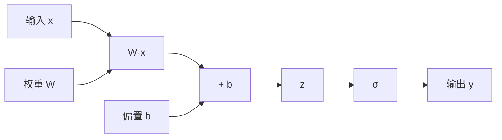

# 3.1 计算图理论：静态图vs动态图

## 引言：深度学习的"道路系统"

想象一下，你在一个复杂的城市中导航。有两种方式来规划路线：

1. **静态路线**：出发前就规划好整条路线，一旦确定就不能更改，但可以进行全局优化
2. **动态路线**：边走边决定下一步怎么走，灵活但难以进行全局优化

**计算图就是深度学习中的"道路系统"**，它描述了数据如何在神经网络中流动，梯度如何反向传播。理解计算图的本质，是掌握自动微分的关键。

## 计算图的数学基础

### 复合函数与链式法则

计算图本质上是**复合函数的可视化表示**。考虑一个简单的函数：

```
f(x) = σ(W·x + b)
```

其中σ是sigmoid函数。我们可以将其分解为：
```
z = W·x + b    (线性变换)
y = σ(z)       (非线性激活)
```

这就形成了一个简单的计算图：



**梯度计算的链式法则**：
```
∂f/∂x = ∂f/∂y · ∂y/∂z · ∂z/∂x
```

### 计算图的基本结构

```java
/**
 * 计算图的基本组件
 */
public class ComputationGraphBasics {
    
    /**
     * 计算图节点
     */
    public static class GraphNode {
        private final String id;
        private final NodeType type;
        private final List<GraphNode> inputs;
        private final String operation;
        
        public enum NodeType {
            VARIABLE,    // 变量节点（叶子节点）
            OPERATION    // 操作节点（函数应用）
        }
        
        public GraphNode(String id, NodeType type) {
            this.id = id;
            this.type = type;
            this.inputs = new ArrayList<>();
            this.operation = null;
        }
        
        public GraphNode(String id, String operation, List<GraphNode> inputs) {
            this.id = id;
            this.type = NodeType.OPERATION;
            this.operation = operation;
            this.inputs = new ArrayList<>(inputs);
        }
        
        /**
         * 前向传播
         */
        public float forwardPass(Map<String, Float> values) {
            if (type == NodeType.VARIABLE) {
                return values.get(id);
            } else {
                // 计算输入值
                List<Float> inputValues = inputs.stream()
                    .map(input -> input.forwardPass(values))
                    .collect(Collectors.toList());
                
                // 应用操作
                return applyOperation(operation, inputValues);
            }
        }
        
        /**
         * 反向传播
         */
        public Map<String, Float> backwardPass(float gradient, Map<String, Float> values) {
            Map<String, Float> gradients = new HashMap<>();
            
            if (type == NodeType.VARIABLE) {
                gradients.put(id, gradient);
            } else {
                // 计算输入梯度
                List<Float> inputGradients = computeInputGradients(operation, gradient, values);
                
                for (int i = 0; i < inputs.size(); i++) {
                    Map<String, Float> inputGrads = inputs.get(i).backwardPass(
                        inputGradients.get(i), values);
                    
                    // 累积梯度
                    inputGrads.forEach((key, grad) -> 
                        gradients.merge(key, grad, Float::sum));
                }
            }
            
            return gradients;
        }
        
        private float applyOperation(String op, List<Float> inputs) {
            switch (op) {
                case "add":
                    return inputs.get(0) + inputs.get(1);
                case "mul":
                    return inputs.get(0) * inputs.get(1);
                case "sigmoid":
                    float x = inputs.get(0);
                    return 1.0f / (1.0f + (float) Math.exp(-x));
                default:
                    throw new UnsupportedOperationException("未支持的操作: " + op);
            }
        }
        
        private List<Float> computeInputGradients(String op, float grad, Map<String, Float> values) {
            switch (op) {
                case "add":
                    return Arrays.asList(grad, grad); // ∂(a+b)/∂a = 1, ∂(a+b)/∂b = 1
                case "mul":
                    float a = inputs.get(0).forwardPass(values);
                    float b = inputs.get(1).forwardPass(values);
                    return Arrays.asList(grad * b, grad * a); // ∂(a*b)/∂a = b, ∂(a*b)/∂b = a
                case "sigmoid":
                    float x = inputs.get(0).forwardPass(values);
                    float sigmoidX = 1.0f / (1.0f + (float) Math.exp(-x));
                    return Arrays.asList(grad * sigmoidX * (1 - sigmoidX)); // ∂σ(x)/∂x = σ(x)(1-σ(x))
                default:
                    throw new UnsupportedOperationException("未支持的操作: " + op);
            }
        }
    }
}
```

## 静态图 vs 动态图

### 静态图（Symbol-to-Symbol）

静态图在执行前就确定了整个计算图的结构：

```java
/**
 * 静态计算图实现
 */
public class StaticComputationGraph {
    
    private final Map<String, GraphNode> nodes = new HashMap<>();
    private boolean isCompiled = false;
    
    /**
     * 构建阶段：定义计算图
     */
    public void defineVariable(String name) {
        if (isCompiled) {
            throw new IllegalStateException("图已编译，无法添加新节点");
        }
        
        GraphNode node = new GraphNode(name, GraphNode.NodeType.VARIABLE);
        nodes.put(name, node);
    }
    
    public void defineOperation(String name, String operation, String... inputs) {
        if (isCompiled) {
            throw new IllegalStateException("图已编译，无法添加新节点");
        }
        
        List<GraphNode> inputNodes = Arrays.stream(inputs)
            .map(nodes::get)
            .collect(Collectors.toList());
        
        GraphNode node = new GraphNode(name, operation, inputNodes);
        nodes.put(name, node);
    }
    
    /**
     * 编译阶段：优化计算图
     */
    public void compile() {
        if (isCompiled) return;
        
        System.out.println("编译计算图，进行优化...");
        // 在这里可以进行各种图优化
        optimizeGraph();
        
        isCompiled = true;
    }
    
    /**
     * 执行阶段
     */
    public float execute(String outputNode, Map<String, Float> inputs) {
        if (!isCompiled) {
            throw new IllegalStateException("图未编译，无法执行");
        }
        
        GraphNode output = nodes.get(outputNode);
        return output.forwardPass(inputs);
    }
    
    /**
     * 计算梯度
     */
    public Map<String, Float> computeGradients(String outputNode, Map<String, Float> values) {
        GraphNode output = nodes.get(outputNode);
        return output.backwardPass(1.0f, values);
    }
    
    private void optimizeGraph() {
        // 图优化：常量折叠、公共子表达式消除等
        System.out.println("应用图优化策略...");
    }
    
    /**
     * 静态图使用示例
     */
    public static void demonstrateStaticGraph() {
        System.out.println("=== 静态图演示 ===");
        
        StaticComputationGraph graph = new StaticComputationGraph();
        
        // 定义计算图: y = sigmoid(x * w + b)
        graph.defineVariable("x");
        graph.defineVariable("w");
        graph.defineVariable("b");
        graph.defineOperation("z", "mul", "x", "w");
        graph.defineOperation("y1", "add", "z", "b");
        graph.defineOperation("output", "sigmoid", "y1");
        
        // 编译图
        graph.compile();
        
        // 执行
        Map<String, Float> inputs = Map.of("x", 2.0f, "w", 3.0f, "b", 1.0f);
        float result = graph.execute("output", inputs);
        
        // 计算梯度
        Map<String, Float> gradients = graph.computeGradients("output", inputs);
        
        System.out.printf("输出: %.6f%n", result);
        System.out.println("梯度: " + gradients);
    }
}
```

### 动态图（Define-by-Run）

动态图在执行过程中构建计算图：

```java
/**
 * 动态计算图实现
 */
public class DynamicComputationGraph {
    
    /**
     * 动态图中的变量
     */
    public static class DynamicVariable {
        private final float value;
        private final boolean requiresGrad;
        private final Function gradFn;
        private float grad = 0.0f;
        
        public DynamicVariable(float value, boolean requiresGrad) {
            this.value = value;
            this.requiresGrad = requiresGrad;
            this.gradFn = null;
        }
        
        public DynamicVariable(float value, boolean requiresGrad, Function gradFn) {
            this.value = value;
            this.requiresGrad = requiresGrad;
            this.gradFn = gradFn;
        }
        
        /**
         * 加法操作：动态构建计算图
         */
        public DynamicVariable add(DynamicVariable other) {
            float result = this.value + other.value;
            
            if (this.requiresGrad || other.requiresGrad) {
                Function addGradFn = new AddFunction(this, other);
                return new DynamicVariable(result, true, addGradFn);
            } else {
                return new DynamicVariable(result, false);
            }
        }
        
        /**
         * 乘法操作
         */
        public DynamicVariable multiply(DynamicVariable other) {
            float result = this.value * other.value;
            
            if (this.requiresGrad || other.requiresGrad) {
                Function mulGradFn = new MultiplyFunction(this, other);
                return new DynamicVariable(result, true, mulGradFn);
            } else {
                return new DynamicVariable(result, false);
            }
        }
        
        /**
         * Sigmoid激活函数
         */
        public DynamicVariable sigmoid() {
            float result = 1.0f / (1.0f + (float) Math.exp(-this.value));
            
            if (this.requiresGrad) {
                Function sigmoidGradFn = new SigmoidFunction(this, result);
                return new DynamicVariable(result, true, sigmoidGradFn);
            } else {
                return new DynamicVariable(result, false);
            }
        }
        
        /**
         * 反向传播
         */
        public void backward() {
            backward(1.0f);
        }
        
        public void backward(float gradient) {
            if (!requiresGrad) return;
            
            // 累积梯度
            grad += gradient;
            
            // 继续反向传播
            if (gradFn != null) {
                gradFn.backward(gradient);
            }
        }
        
        public float getValue() { return value; }
        public float getGrad() { return grad; }
        public void zeroGrad() { grad = 0.0f; }
    }
    
    /**
     * 梯度函数基类
     */
    public abstract static class Function {
        protected final List<DynamicVariable> inputs;
        
        public Function(DynamicVariable... inputs) {
            this.inputs = Arrays.asList(inputs);
        }
        
        public abstract void backward(float gradient);
    }
    
    /**
     * 加法的反向传播
     */
    public static class AddFunction extends Function {
        public AddFunction(DynamicVariable a, DynamicVariable b) {
            super(a, b);
        }
        
        @Override
        public void backward(float gradient) {
            inputs.get(0).backward(gradient); // ∂(a+b)/∂a = 1
            inputs.get(1).backward(gradient); // ∂(a+b)/∂b = 1
        }
    }
    
    /**
     * 乘法的反向传播
     */
    public static class MultiplyFunction extends Function {
        public MultiplyFunction(DynamicVariable a, DynamicVariable b) {
            super(a, b);
        }
        
        @Override
        public void backward(float gradient) {
            inputs.get(0).backward(gradient * inputs.get(1).getValue()); // ∂(a*b)/∂a = b
            inputs.get(1).backward(gradient * inputs.get(0).getValue()); // ∂(a*b)/∂b = a
        }
    }
    
    /**
     * Sigmoid的反向传播
     */
    public static class SigmoidFunction extends Function {
        private final float sigmoidOutput;
        
        public SigmoidFunction(DynamicVariable input, float sigmoidOutput) {
            super(input);
            this.sigmoidOutput = sigmoidOutput;
        }
        
        @Override
        public void backward(float gradient) {
            // ∂σ(x)/∂x = σ(x) * (1 - σ(x))
            float sigmoidGrad = sigmoidOutput * (1 - sigmoidOutput);
            inputs.get(0).backward(gradient * sigmoidGrad);
        }
    }
    
    /**
     * 动态图使用示例
     */
    public static void demonstrateDynamicGraph() {
        System.out.println("=== 动态图演示 ===");
        
        // 创建变量（同时开始构建计算图）
        DynamicVariable x = new DynamicVariable(2.0f, true);
        DynamicVariable w = new DynamicVariable(3.0f, true);
        DynamicVariable b = new DynamicVariable(1.0f, true);
        
        // 前向传播（动态构建计算图）
        DynamicVariable z = x.multiply(w);
        DynamicVariable y = z.add(b);
        DynamicVariable output = y.sigmoid();
        
        System.out.printf("输出: %.6f%n", output.getValue());
        
        // 反向传播
        output.backward();
        
        System.out.printf("x的梯度: %.6f%n", x.getGrad());
        System.out.printf("w的梯度: %.6f%n", w.getGrad());
        System.out.printf("b的梯度: %.6f%n", b.getGrad());
        
        // 动态图的灵活性：条件计算
        demonstrateConditionalComputation();
    }
    
    /**
     * 展示动态图的条件计算能力
     */
    private static void demonstrateConditionalComputation() {
        System.out.println("\n=== 条件计算演示 ===");
        
        DynamicVariable x = new DynamicVariable(-1.5f, true);
        
        // 条件计算：如果x > 0，计算x²，否则计算x³
        DynamicVariable result;
        if (x.getValue() > 0) {
            result = x.multiply(x); // x²
            System.out.println("执行分支: x²");
        } else {
            DynamicVariable x2 = x.multiply(x);
            result = x2.multiply(x); // x³
            System.out.println("执行分支: x³");
        }
        
        result.backward();
        System.out.printf("x = %.2f, 结果 = %.6f, 梯度 = %.6f%n", 
                         x.getValue(), result.getValue(), x.getGrad());
    }
}
```

## 静态图与动态图的对比

### 性能与灵活性对比

| 特性 | 静态图 | 动态图 |
|------|--------|--------|
| **执行性能** | 高（预编译优化） | 中等（运行时构建） |
| **内存使用** | 优化的 | 较高 |
| **调试难度** | 困难 | 容易 |
| **开发速度** | 慢 | 快 |
| **控制流支持** | 受限 | 完全支持 |
| **图优化** | 丰富 | 有限 |
| **分布式支持** | 好 | 一般 |

### 适用场景

```java
/**
 * 使用场景分析
 */
public class UseCaseAnalysis {
    
    /**
     * 静态图适用场景
     */
    public static void staticGraphUseCases() {
        System.out.println("静态图适用场景:");
        System.out.println("1. 生产环境推理 - 性能关键");
        System.out.println("2. 大规模分布式训练 - 需要图分割");
        System.out.println("3. 移动端部署 - 内存受限");
        System.out.println("4. 固定网络结构 - 不需要动态变化");
    }
    
    /**
     * 动态图适用场景
     */
    public static void dynamicGraphUseCases() {
        System.out.println("动态图适用场景:");
        System.out.println("1. 研究和原型开发 - 快速迭代");
        System.out.println("2. 变长序列处理 - RNN动态展开");
        System.out.println("3. 强化学习 - 动态决策");
        System.out.println("4. 调试和可视化 - 需要中间结果");
    }
}
```

## TinyAI的设计选择

基于教学和实用性的考虑，TinyAI选择了**动态图设计**：

```java
/**
 * TinyAI的Variable设计预览
 */
public class TinyAIVariable {
    private final NdArray data;
    private final boolean requiresGrad;
    private final Function gradFn;
    private NdArray grad;
    
    // 动态图的核心：每个操作都会创建新的计算节点
    public Variable add(Variable other) {
        NdArray result = this.data.add(other.data);
        
        if (this.requiresGrad || other.requiresGrad) {
            AddFunction addFn = new AddFunction(this, other);
            return new Variable(result, true, addFn);
        }
        
        return new Variable(result, false, null);
    }
    
    public void backward() {
        backward(NdArray.ones(data.getShape().getDims()));
    }
    
    private void backward(NdArray gradient) {
        if (grad == null) {
            grad = gradient;
        } else {
            grad = grad.add(gradient);
        }
        
        if (gradFn != null) {
            gradFn.backward(gradient);
        }
    }
}
```

**选择动态图的原因**：
1. **教学友好**：直观易懂，便于理解
2. **调试方便**：可以逐步执行和检查
3. **灵活性高**：支持控制流和动态网络
4. **开发效率**：快速原型和实验

## 小节总结

### 核心要点
1. **计算图本质**：复合函数的可视化表示，支持自动微分
2. **静态图优势**：性能高、内存优化、适合生产环境
3. **动态图优势**：灵活、直观、适合研究开发
4. **设计权衡**：在性能和灵活性之间找到平衡

### 技术洞察
- 计算图是深度学习框架的核心抽象
- 链式法则是自动微分的数学基础
- 不同的图设计适用于不同的场景
- 现代框架趋向于混合图设计

### 实践指导
- **研究开发**：优先选择动态图
- **生产部署**：考虑静态图优化
- **性能关键**：使用图编译技术
- **调试困难**：动态图更容易排查问题

## 思考题

1. **设计题**：如何设计一个既有动态图灵活性又有静态图性能的混合系统？

2. **优化题**：在动态图中，如何减少计算图构建的开销？

3. **应用题**：对于一个变长序列的RNN，静态图和动态图分别如何实现？

4. **扩展题**：如何在分布式环境下实现计算图的分割和执行？

## 拓展阅读

- **自动微分理论**：《Automatic Differentiation: A Survey》
- **计算图优化**：《Graph Optimization in Deep Learning Frameworks》
- **PyTorch设计**：PyTorch官方论文和文档
- **TensorFlow架构**：TensorFlow系统架构分析

---

**本小节完**：下一小节我们将深入Variable类的设计与实现，构建TinyAI的自动微分核心。