# TinyAI：全栈式轻量级AI框架

> 山泽 著
> 
> 一个完全用Java实现的全栈式轻量级AI框架，TinyAI IS ALL YOU NEED。

## 前言：为什么要用Java做AI？

在AI领域，Python无疑是当前的主流语言。但对于Java开发者来说，要想深入理解AI算法的本质，或者在企业级Java应用中集成AI能力，往往面临着技术栈割裂的困扰。TinyAI项目正是在这样的背景下应运而生——用纯Java语言，从最基础的数学运算开始，一步步构建起一个功能完整的AI框架。

**TinyAI的核心理念：**
- 🎯 **教育友好**：清晰的代码结构，详尽的中文注释，让每一行代码都能说话
- 🧩 **模块化设计**：像搭乐高一样组合AI组件，每个模块职责明确
- 🚀 **生产级别**：不仅是玩具，更是可以投入实际应用的框架
- 🔧 **零外部依赖**：核心计算引擎完全自主实现，不依赖任何第三方AI库

## 第一章：架构之美——分层设计的智慧

### 1.1 从"搭积木"的角度理解TinyAI

想象一下，如果要建造一座摩天大楼，我们会怎么做？首先需要坚实的地基，然后是承重结构，再是各种功能模块，最后是外观装饰。TinyAI的架构设计正是遵循了这样的思路：

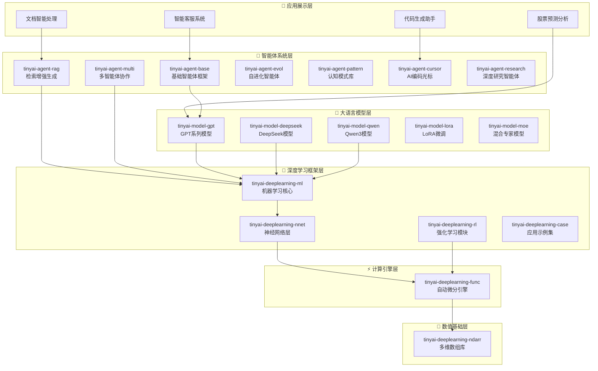

这种分层设计的好处显而易见：
- **底层稳定**：数值计算和自动微分引擎为整个系统提供可靠基础
- **中层灵活**：神经网络层提供丰富的组件库，支持各种网络架构
- **上层开放**：智能体和模型层面向应用，支持快速开发

### 1.2 核心模块：16个精心设计的组件

TinyAI总共包含16个核心模块，每个模块都有其独特的职责：

| 层次 | 模块 | 核心功能 | 设计理念 |
|------|------|----------|----------|
| **基础层** | `tinyai-deeplearning-ndarr` | 多维数组计算 | 高性能数值运算的基石 |
| **基础层** | `tinyai-deeplearning-func` | 自动微分引擎 | 深度学习的"魔法"核心 |
| **网络层** | `tinyai-deeplearning-nnet` | 神经网络组件 | 丰富的网络层积木 |
| **框架层** | `tinyai-deeplearning-ml` | 机器学习核心 | 训练、优化、评估一站式 |
| **应用层** | `tinyai-agent-*` (6个模块) | 智能体系统 | 从基础到进化的完整智能体生态 |
| **模型层** | `tinyai-model-*` (5个模块) | 大语言模型 | GPT系列、DeepSeek、Qwen等前沿模型 |

## 第二章：从零开始的数学之旅

### 2.1 多维数组：一切计算的起点

在深度学习中，数据都是以张量（多维数组）的形式存在。TinyAI的`NdArray`接口设计得非常优雅：

```java
// 创建数组的多种方式
NdArray a = NdArray.of(new float[][]{{1, 2}, {3, 4}});     // 从二维数组创建
NdArray b = NdArray.zeros(Shape.of(2, 3));                 // 创建2x3的零矩阵
NdArray c = NdArray.randn(Shape.of(100, 50));              // 创建随机正态分布矩阵

// 丰富的数学运算
NdArray result = a.add(b)           // 矩阵加法
                 .mul(c)            // 对应元素相乘
                 .dot(d)            // 矩阵乘法
                 .sigmoid()         // Sigmoid激活函数
                 .transpose();      // 转置
```

**设计亮点：**
- **链式调用**：支持流畅的链式操作，代码可读性极佳
- **形状安全**：编译时和运行时的双重形状检查，避免维度错误
- **内存优化**：智能的内存管理，避免不必要的数据拷贝

### 2.2 自动微分：深度学习的"魔法"核心


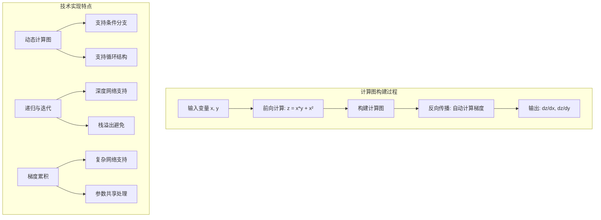

自动微分是深度学习的核心技术。TinyAI的`Variable`类通过计算图自动追踪操作历史：

```java
// 构建一个简单的计算图
Variable x = new Variable(NdArray.of(2.0f), "x");
Variable y = new Variable(NdArray.of(3.0f), "y");

// 正向传播：构建计算图
Variable z = x.mul(y).add(x.squ());  // z = x*y + x²

// 反向传播：自动计算梯度
z.backward();

System.out.println("dz/dx = " + x.getGrad().getNumber());  // 输出：dz/dx = 7.0
System.out.println("dz/dy = " + y.getGrad().getNumber());  // 输出：dz/dy = 2.0
```

**技术实现的精妙之处：**

1. **动态计算图**：每次运算都会动态构建计算图，支持条件分支和循环
2. **递归与迭代**：提供两种反向传播实现，适应不同场景需求
3. **梯度累积**：支持梯度的自动累积，处理复杂的网络结构

```java
public void backward() {
    if (!requireGrad) return;
    
    // 初始化梯度为1（链式法则的起点）
    if (Objects.isNull(grad)) {
        setGrad(NdArray.ones(this.getValue().getShape()));
    }
    
    Function creator = this.creator;
    if (creator != null) {
        Variable[] inputs = creator.getInputs();
        List<NdArray> grads = creator.backward(grad);  // 计算输入的梯度
        
        // 递归计算每个输入变量的梯度
        for (int i = 0; i < inputs.length; i++) {
            Variable input = inputs[i];
            // 梯度累积：支持变量被多次使用的情况
            if (input.getGrad() != null) {
                input.setGrad(input.getGrad().add(grads.get(i)));
            } else {
                input.setGrad(grads.get(i));
            }
            input.backward();  // 递归调用
        }
    }
}
```

## 第三章：神经网络的积木世界

### 3.1 Layer与Block：组合的艺术

TinyAI采用了类似PyTorch的Layer-Block设计模式：

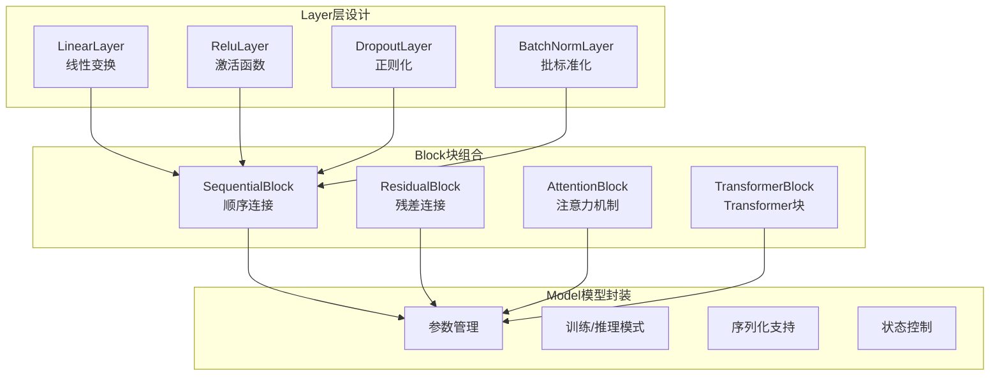

```java
// Layer：最基础的计算单元
public abstract class Layer {
    protected Map<String, Variable> parameters = new HashMap<>();
    
    public abstract Variable layerForward(Variable... inputs);
    
    // 参数管理
    protected void addParameter(String name, NdArray value) {
        parameters.put(name, new Variable(value, name));
    }
}

// Block：Layer的组合容器
public abstract class Block {
    protected List<Layer> layers = new ArrayList<>();
    
    public abstract Variable blockForward(Variable... inputs);
    
    // 支持嵌套组合
    public void addBlock(Block subBlock) {
        // 将子Block的Layer添加到当前Block
    }
}
```

**实际应用示例：**

```java
// 构建一个多层感知机
MlpBlock mlp = new MlpBlock("classifier", 784, new int[]{128, 64, 10});

// 构建一个完整的神经网络
SequentialBlock network = new SequentialBlock("mnist_net");
network.addLayer(new FlattenLayer("flatten"))           // 展平层
       .addLayer(new LinearLayer("fc1", 784, 128))      // 全连接层1
       .addLayer(new ReluLayer("relu1"))                // ReLU激活
       .addLayer(new LinearLayer("fc2", 128, 64))       // 全连接层2
       .addLayer(new ReluLayer("relu2"))                // ReLU激活
       .addLayer(new LinearLayer("fc3", 64, 10))        // 输出层
       .addLayer(new SoftmaxLayer("softmax"));          // Softmax
```

### 3.2 现代网络架构的实现

TinyAI不仅支持基础的神经网络，还实现了现代的先进架构：

**Transformer架构：**
```java
public class TransformerBlock extends Block {
    private MultiHeadAttentionLayer attention;
    private FeedForwardLayer feedForward;
    private LayerNormalizationLayer norm1, norm2;
    
    @Override
    public Variable blockForward(Variable... inputs) {
        Variable input = inputs[0];
        
        // Self-Attention + 残差连接
        Variable attnOut = norm1.layerForward(input);
        attnOut = attention.layerForward(attnOut, attnOut, attnOut);
        Variable residual1 = input.add(attnOut);
        
        // Feed-Forward + 残差连接
        Variable ffOut = norm2.layerForward(residual1);
        ffOut = feedForward.layerForward(ffOut);
        return residual1.add(ffOut);
    }
}
```

**LSTM循环网络：**
```java
public class LstmLayer extends Layer {
    @Override
    public Variable layerForward(Variable... inputs) {
        Variable x = inputs[0];
        Variable h = inputs[1];  // 隐藏状态
        Variable c = inputs[2];  // 细胞状态
        
        // 遗忘门
        Variable f = sigmoid(linear(concat(x, h), Wf).add(bf));
        // 输入门
        Variable i = sigmoid(linear(concat(x, h), Wi).add(bi));
        // 候选值
        Variable g = tanh(linear(concat(x, h), Wg).add(bg));
        // 输出门
        Variable o = sigmoid(linear(concat(x, h), Wo).add(bo));
        
        // 更新细胞状态和隐藏状态
        Variable newC = f.mul(c).add(i.mul(g));
        Variable newH = o.mul(tanh(newC));
        
        return newH;
    }
}
```

## 第四章：训练的艺术——从数据到智慧

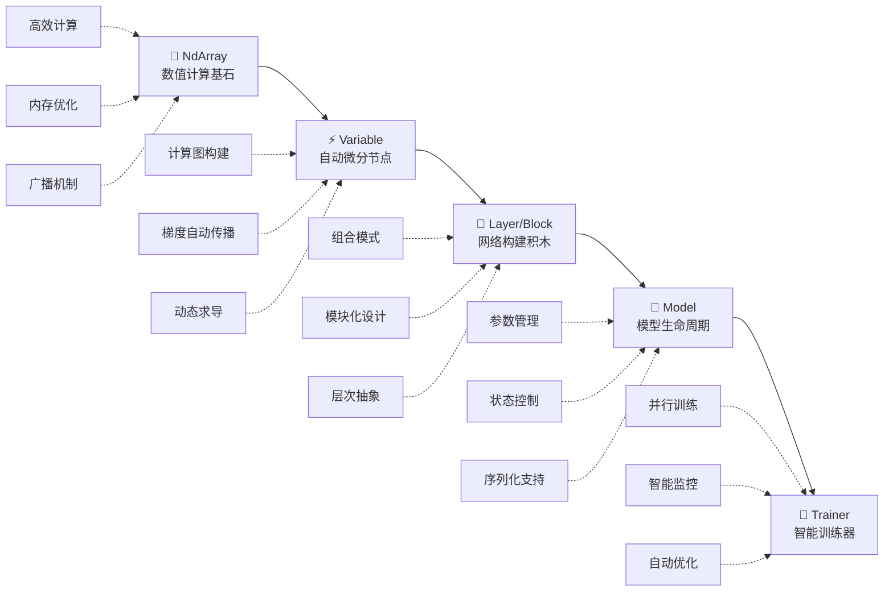

### 4.1 Trainer：训练过程的指挥家

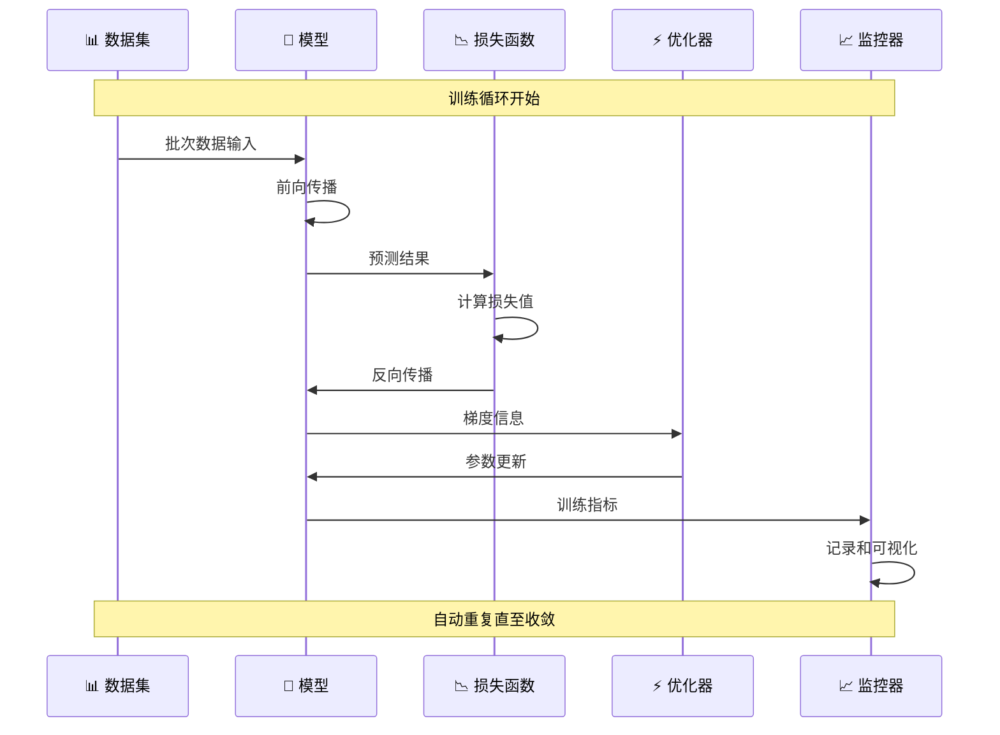

TinyAI的`Trainer`类封装了完整的训练流程，让复杂的训练过程变得简单：

```java
// 创建数据集
DataSet trainData = new ArrayDataset(trainX, trainY);

// 构建模型
Model model = new Model("mnist_classifier", mlpBlock);

// 配置训练器（支持并行训练）
Trainer trainer = new Trainer(
    epochs: 100,                          // 训练轮数
    monitor: new TrainingMonitor(),       // 训练监控器
    evaluator: new AccuracyEvaluator(),   // 评估器
    useParallel: true,                    // 启用并行训练
    threadCount: 4                        // 线程数
);

// 初始化训练器
trainer.init(trainData, model, 
            new MeanSquaredErrorLoss(),    // 损失函数
            new SgdOptimizer(0.01f));      // 优化器

// 开始训练（一键式训练）
trainer.train(showTrainingCurve: true);
```

**训练过程的核心流程：**

```java
public void train(boolean showCurve) {
    for (int epoch = 0; epoch < epochs; epoch++) {
        // 1. 设置模型为训练模式
        model.setTraining(true);
        
        // 2. 批次训练
        for (DataBatch batch : dataSet.getBatches()) {
            // 2.1 前向传播
            Variable prediction = model.forward(batch.getInputs());
            
            // 2.2 计算损失
            Variable loss = lossFunction.forward(prediction, batch.getTargets());
            
            // 2.3 清空梯度
            model.clearGradients();
            
            // 2.4 反向传播
            loss.backward();
            
            // 2.5 参数更新
            optimizer.step(model.getParameters());
            
            // 2.6 记录训练信息
            monitor.recordTrainingStep(loss.getValue().getNumber());
        }
        
        // 3. 模型评估
        if (epoch % 10 == 0) {
            float accuracy = evaluator.evaluate(model, validationData);
            monitor.recordEpoch(epoch, accuracy);
        }
    }
    
    // 4. 可视化训练曲线
    if (showCurve) {
        monitor.plotTrainingCurve();
    }
}
```

### 4.2 并行训练：榨干多核性能

TinyAI支持多线程并行训练，充分利用现代CPU的多核优势：

```java
public class ParallelTrainer {
    private ExecutorService executorService;
    private int threadCount;
    
    public void parallelTrainBatch(List<DataBatch> batches) {
        // 创建线程池
        executorService = Executors.newFixedThreadPool(threadCount);
        
        // 将批次分配给不同线程
        List<Future<TrainingResult>> futures = new ArrayList<>();
        for (DataBatch batch : batches) {
            Future<TrainingResult> future = executorService.submit(() -> {
                // 每个线程独立训练一个批次
                return trainSingleBatch(batch);
            });
            futures.add(future);
        }
        
        // 收集训练结果并聚合梯度
        List<Map<String, NdArray>> gradients = new ArrayList<>();
        for (Future<TrainingResult> future : futures) {
            TrainingResult result = future.get();
            gradients.add(result.getGradients());
        }
        
        // 梯度聚合和参数更新
        Map<String, NdArray> aggregatedGrads = aggregateGradients(gradients);
        optimizer.step(aggregatedGrads);
    }
}
```

## 第五章：大语言模型的实现——从GPT到现代架构

### 5.1 GPT系列：Transformer的演进之路

TinyAI完整实现了GPT-1到GPT-3的架构演进，让我们能够清晰地看到大语言模型的发展脉络：

**GPT-1：Transformer的初次应用**
```java
public class GPT1Model extends Model {
    private TokenEmbedding tokenEmbedding;
    private PositionalEncoding posEncoding;
    private List<TransformerBlock> transformerBlocks;
    private LayerNormalizationLayer finalNorm;
    private LinearLayer outputProjection;
    
    @Override
    public Variable forward(Variable... inputs) {
        Variable tokens = inputs[0];
        
        // 1. Token嵌入 + 位置编码
        Variable embedded = tokenEmbedding.forward(tokens);
        Variable positioned = posEncoding.forward(embedded);
        
        // 2. 多层Transformer块
        Variable hidden = positioned;
        for (TransformerBlock block : transformerBlocks) {
            hidden = block.blockForward(hidden);
        }
        
        // 3. 最终归一化和输出投影
        hidden = finalNorm.layerForward(hidden);
        return outputProjection.layerForward(hidden);
    }
}
```

**GPT-2：更大的模型，更强的能力**
```java
public class GPT2Model extends GPT1Model {
    // GPT-2相对于GPT-1的主要改进：
    // 1. 更大的模型参数（1.5B）
    // 2. 更多的注意力头和层数
    // 3. 改进的初始化策略
    
    public static GPT2Model createMediumModel() {
        GPT2Config config = GPT2Config.builder()
            .vocabSize(50257)
            .hiddenSize(1024)
            .numLayers(24)
            .numHeads(16)
            .maxPositionEmbeddings(1024)
            .build();
        
        return new GPT2Model(config);
    }
}
```

**GPT-3：稀疏注意力的探索**
```java
public class GPT3Model extends GPT2Model {
    @Override
    protected MultiHeadAttentionLayer createAttentionLayer(GPT3Config config) {
        // GPT-3引入稀疏注意力机制
        return new SparseMultiHeadAttentionLayer(
            config.getHiddenSize(),
            config.getNumHeads(),
            config.getAttentionPatterns()  // 稀疏注意力模式
        );
    }
}
```

### 5.2 现代架构：Qwen3的先进设计

TinyAI还实现了更现代的Qwen3模型，集成了最新的技术进展：

```java
public class Qwen3Model extends Model {
    @Override
    public Variable forward(Variable... inputs) {
        Variable tokens = inputs[0];
        
        // 1. 嵌入层
        Variable embedded = tokenEmbedding.forward(tokens);
        
        // 2. 多个Decoder块（集成了现代技术）
        Variable hidden = embedded;
        for (Qwen3DecoderBlock block : decoderBlocks) {
            hidden = block.blockForward(hidden);
        }
        
        // 3. RMS归一化（替代LayerNorm）
        hidden = rmsNorm.layerForward(hidden);
        
        return outputProjection.layerForward(hidden);
    }
}

public class Qwen3DecoderBlock extends Block {
    private Qwen3AttentionBlock attention;    // 集成GQA和RoPE
    private Qwen3MLPBlock mlp;               // 集成SwiGLU激活
    private RMSNormLayer preAttnNorm;
    private RMSNormLayer preMlpNorm;
    
    @Override
    public Variable blockForward(Variable... inputs) {
        Variable input = inputs[0];
        
        // 预归一化 + 注意力 + 残差连接
        Variable normed1 = preAttnNorm.layerForward(input);
        Variable attnOut = attention.blockForward(normed1);
        Variable residual1 = input.add(attnOut);
        
        // 预归一化 + MLP + 残差连接
        Variable normed2 = preMlpNorm.layerForward(residual1);
        Variable mlpOut = mlp.blockForward(normed2);
        return residual1.add(mlpOut);
    }
}
```

**关键技术实现：**

1. **RoPE位置编码**：
```java
public class RotaryPositionalEmbeddingLayer extends Layer {
    @Override
    public Variable layerForward(Variable... inputs) {
        Variable x = inputs[0];
        int seqLen = x.getValue().getShape().get(1);
        int dim = x.getValue().getShape().get(2);
        
        // 计算旋转角度
        NdArray freqs = computeFrequencies(dim, seqLen);
        
        // 应用旋转变换
        return applyRotaryEmbedding(x, freqs);
    }
}
```

2. **分组查询注意力（GQA）**：
```java
public class GroupedQueryAttention extends Layer {
    private int numHeads;
    private int numKeyValueHeads;  // KV头数少于Q头数
    
    @Override
    public Variable layerForward(Variable... inputs) {
        // Q、K、V投影，但K和V共享参数组
        Variable q = queryProjection.layerForward(inputs[0]);
        Variable k = keyProjection.layerForward(inputs[0]);
        Variable v = valueProjection.layerForward(inputs[0]);
        
        // 重复K和V以匹配Q的头数
        k = repeatKVHeads(k);
        v = repeatKVHeads(v);
        
        return computeAttention(q, k, v);
    }
}
```

## 第六章：智能体系统——赋予AI思考的能力

### 6.1 智能体的层次化设计

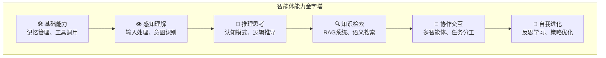


TinyAI的智能体系统从最基础的Agent开始，逐步发展到具备自我进化能力的高级智能体：

```java
// 基础智能体：具备基本的感知和行动能力
public abstract class BaseAgent {
    protected String name;
    protected String systemPrompt;
    protected Memory memory;
    protected ToolRegistry toolRegistry;
    
    public abstract AgentResponse processMessage(String message);
    
    protected Object performTask(AgentTask task) throws Exception {
        // 任务执行的基本流程
        return null;
    }
}

// 高级智能体：具备学习和推理能力
public class AdvancedAgent extends BaseAgent {
    private KnowledgeBase knowledgeBase;
    private ReasoningEngine reasoningEngine;
    
    @Override
    public AgentResponse processMessage(String message) {
        // 1. 理解用户意图
        Intent intent = intentRecognition.analyze(message);
        
        // 2. 检索相关知识
        List<Knowledge> relevantKnowledge = knowledgeBase.retrieve(intent);
        
        // 3. 推理和生成回答
        String response = reasoningEngine.generateResponse(intent, relevantKnowledge);
        
        // 4. 更新记忆
        memory.store(new Conversation(message, response));
        
        return new AgentResponse(response);
    }
}
```

### 6.2 自进化智能体：具备学习能力的AI

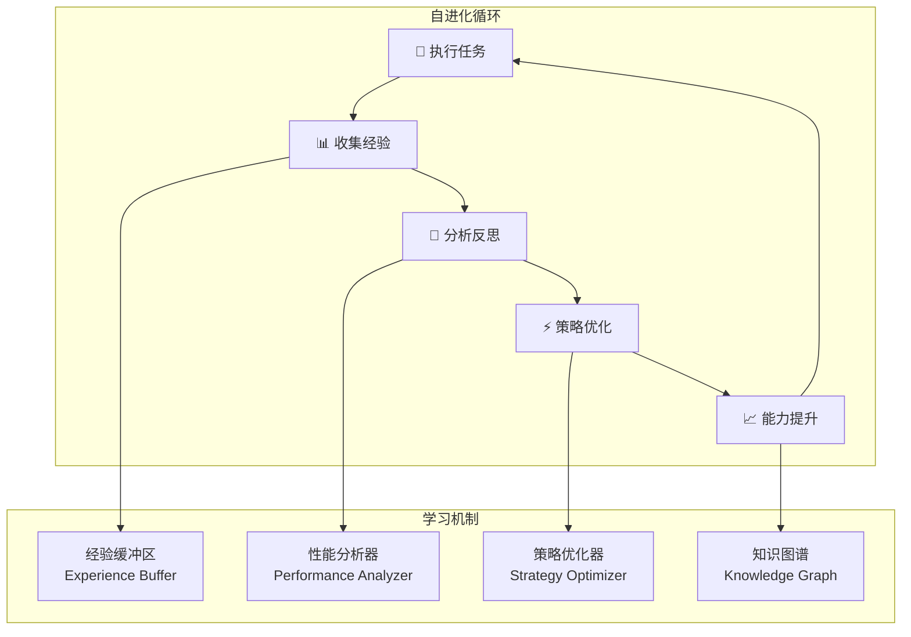

自进化智能体是TinyAI的一个重要创新，它能够从经验中学习并优化自己的行为：

```java
public class SelfEvolvingAgent extends AdvancedAgent {
    private ExperienceBuffer experienceBuffer;
    private StrategyOptimizer strategyOptimizer;
    private KnowledgeGraphBuilder knowledgeGraphBuilder;
    
    @Override
    public TaskResult processTask(String taskName, TaskContext context) {
        // 1. 记录任务开始状态
        TaskSnapshot snapshot = captureTaskSnapshot(taskName, context);
        
        // 2. 执行任务
        TaskResult result = super.processTask(taskName, context);
        
        // 3. 记录经验
        Experience experience = new Experience(snapshot, result);
        experienceBuffer.add(experience);
        
        // 4. 触发学习（如果需要）
        if (shouldTriggerLearning()) {
            selfEvolve();
        }
        
        return result;
    }
    
    public void selfEvolve() {
        // 1. 经验分析
        List<Experience> recentExperiences = experienceBuffer.getRecentExperiences();
        PerformanceAnalysis analysis = analyzePerformance(recentExperiences);
        
        // 2. 策略优化
        if (analysis.hasImprovementOpportunity()) {
            Strategy newStrategy = strategyOptimizer.optimize(analysis);
            updateStrategy(newStrategy);
        }
        
        // 3. 知识图谱更新
        List<KnowledgeNode> newNodes = extractKnowledgeFromExperiences(recentExperiences);
        knowledgeGraphBuilder.updateGraph(newNodes);
        
        // 4. 能力提升
        enhanceCapabilities(analysis);
    }
}
```

### 6.3 多智能体协作：集体智慧的体现

TinyAI支持多个智能体之间的协作，实现复杂任务的分工合作：

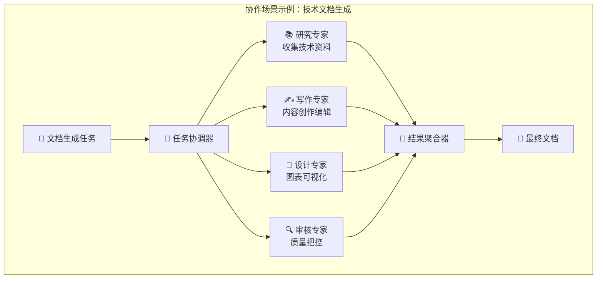

### 6.4 RAG系统：知识检索增强生成

TinyAI实现了完整的RAG（Retrieval-Augmented Generation）系统：

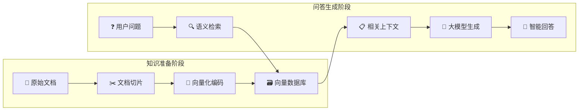

```java
public class RAGSystem {
    private VectorDatabase vectorDB;
    private TextEncoder textEncoder;
    private DocumentProcessor documentProcessor;
    
    public String generateAnswer(String question, List<Document> documents) {
        // 1. 文档预处理和向量化
        for (Document doc : documents) {
            List<TextChunk> chunks = documentProcessor.chunkDocument(doc);
            for (TextChunk chunk : chunks) {
                NdArray embedding = textEncoder.encode(chunk.getText());
                vectorDB.store(chunk.getId(), embedding, chunk);
            }
        }
        
        // 2. 问题向量化
        NdArray questionEmbedding = textEncoder.encode(question);
        
        // 3. 相似度检索
        List<RetrievalResult> relevantChunks = vectorDB.similaritySearch(
            questionEmbedding, topK: 5);
        
        // 4. 上下文构建
        String context = buildContext(relevantChunks);
        
        // 5. 生成回答
        String prompt = String.format(
            "基于以下上下文回答问题：\n上下文：%s\n问题：%s\n回答：", 
            context, question);
        
        return textGenerator.generate(prompt);
    }
}
```

## 第七章：设计理念与技术哲学

### 7.1 面向对象设计的精髓

TinyAI的设计充分体现了面向对象编程的精髓：

**1. 单一职责原则**
```java
// 每个类都有明确的单一职责
public class LinearLayer extends Layer {        // 只负责线性变换
public class ReluLayer extends Layer {          // 只负责ReLU激活
public class SoftmaxLayer extends Layer {       // 只负责Softmax计算
```

**2. 开闭原则**
```java
// 对扩展开放，对修改封闭
public abstract class Layer {
    // 基础功能稳定不变
    public final Variable forward(Variable... inputs) {
        return layerForward(inputs);  // 委托给子类实现
    }
    
    // 扩展点：子类可以实现自己的计算逻辑
    protected abstract Variable layerForward(Variable... inputs);
}
```

**3. 依赖倒置原则**
```java
// 高层模块不依赖低层模块，都依赖抽象
public class Trainer {
    private LossFunction lossFunction;      // 依赖抽象接口
    private Optimizer optimizer;            // 依赖抽象接口
    private Evaluator evaluator;            // 依赖抽象接口
    
    // 通过依赖注入获得具体实现
    public void init(DataSet dataSet, Model model, 
                    LossFunction loss, Optimizer opt) {
        this.lossFunction = loss;
        this.optimizer = opt;
    }
}
```

### 7.2 设计模式的巧妙运用

**1. 组合模式：构建复杂网络**
```java
public class SequentialBlock extends Block {
    private List<Layer> layers = new ArrayList<>();
    
    public SequentialBlock addLayer(Layer layer) {
        layers.add(layer);
        return this;  // 支持链式调用
    }
    
    @Override
    public Variable blockForward(Variable... inputs) {
        Variable output = inputs[0];
        for (Layer layer : layers) {
            output = layer.layerForward(output);  // 逐层前向传播
        }
        return output;
    }
}
```

**2. 策略模式：灵活的算法选择**
```java
// 优化器策略
public interface Optimizer {
    void step(Map<String, Variable> parameters);
}

public class SgdOptimizer implements Optimizer {
    public void step(Map<String, Variable> parameters) {
        // SGD优化策略
    }
}

public class AdamOptimizer implements Optimizer {
    public void step(Map<String, Variable> parameters) {
        // Adam优化策略
    }
}
```

**3. 观察者模式：训练过程监控**
```java
public class TrainingMonitor {
    private List<TrainingListener> listeners = new ArrayList<>();
    
    public void addListener(TrainingListener listener) {
        listeners.add(listener);
    }
    
    public void notifyEpochComplete(int epoch, float loss, float accuracy) {
        for (TrainingListener listener : listeners) {
            listener.onEpochComplete(epoch, loss, accuracy);
        }
    }
}
```

### 7.3 内存管理与性能优化

**1. 智能的内存管理**
```java
public class NdArrayCpu implements NdArray {
    private float[] data;
    private Shape shape;
    private boolean isView = false;  // 标记是否为视图（共享数据）
    
    // 避免不必要的数据拷贝
    public NdArray reshape(Shape newShape) {
        if (newShape.size() != shape.size()) {
            throw new IllegalArgumentException("Shape size mismatch");
        }
        
        NdArrayCpu result = new NdArrayCpu();
        result.data = this.data;      // 共享底层数据
        result.shape = newShape;
        result.isView = true;         // 标记为视图
        return result;
    }
}
```

**2. 计算图的智能剪枝**
```java
public class Variable {
    public void unChainBackward() {
        // 切断计算图，释放不需要的引用
        Function creatorFunc = creator;
        if (creatorFunc != null) {
            Variable[] xs = creatorFunc.getInputs();
            unChain();  // 清除当前节点的creator引用
            for (Variable x : xs) {
                x.unChainBackward();  // 递归切断
            }
        }
    }
}
```

### 7.4 错误处理与调试友好

**1. 丰富的错误信息**
```java
public NdArray dot(NdArray other) {
    if (!isMatrix() || !other.isMatrix()) {
        throw new IllegalArgumentException(
            String.format("Matrix multiplication requires 2D arrays. " +
                         "Got shapes: %s and %s", 
                         this.getShape(), other.getShape()));
    }
    
    if (this.getShape().get(1) != other.getShape().get(0)) {
        throw new IllegalArgumentException(
            String.format("Matrix dimensions mismatch for multiplication: " +
                         "(%d x %d) * (%d x %d)", 
                         this.getShape().get(0), this.getShape().get(1),
                         other.getShape().get(0), other.getShape().get(1)));
    }
    
    return dotImpl(other);
}
```

**2. 调试信息的保留**
```java
public class Variable {
    private String name;  // 变量名称，便于调试
    
    @Override
    public String toString() {
        return String.format("Variable(name='%s', shape=%s, requireGrad=%s)", 
                           name, value.getShape(), requireGrad);
    }
}
```

## 第八章：实际应用案例

### 8.1 MNIST手写数字识别

**问题场景**：经典的计算机视觉入门任务

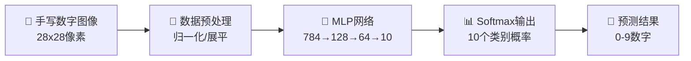

**训练效果可视化**：
```
📈 训练进度展示
Epoch 1/50:  Loss=2.156, Accuracy=23.4% ████▒▒▒▒▒▒
Epoch 10/50: Loss=0.845, Accuracy=75.6% ████████▒▒
Epoch 25/50: Loss=0.234, Accuracy=89.3% █████████▒
Epoch 50/50: Loss=0.089, Accuracy=97.3% ██████████

🎯 最终测试准确率: 97.3%
```

### 8.2 智能客服系统

```java
public class IntelligentCustomerService {
    public static void main(String[] args) {
        // 1. 创建RAG系统
        RAGSystem ragSystem = new RAGSystem();
        
        // 2. 加载企业知识库
        List<Document> knowledgeBase = Arrays.asList(
            new Document("产品说明书", loadProductDocs()),
            new Document("常见问题", loadFAQs()),
            new Document("服务流程", loadServiceProcesses())
        );
        
        // 3. 创建智能客服Agent
        AdvancedAgent customerServiceAgent = new AdvancedAgent(
            "智能客服小助手", 
            "你是一个专业的客服助手，能够基于企业知识库回答用户问题"
        );
        
        // 4. 集成RAG能力
        customerServiceAgent.addTool("knowledge_search", 
            (query) -> ragSystem.generateAnswer(query, knowledgeBase));
        
        // 5. 处理客户咨询
        Scanner scanner = new Scanner(System.in);
        System.out.println("智能客服系统启动，请输入您的问题：");
        
        while (true) {
            String userInput = scanner.nextLine();
            if ("退出".equals(userInput)) break;
            
            AgentResponse response = customerServiceAgent.processMessage(userInput);
            System.out.println("客服助手：" + response.getMessage());
        }
    }
}
```

### 8.3 股票预测系统

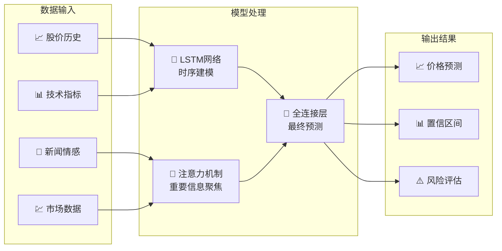


```java
public class StockPredictionSystem {
    public static void main(String[] args) {
        // 1. 构建LSTM网络
        SequentialBlock lstm = new SequentialBlock("stock_predictor");
        lstm.addLayer(new LstmLayer("lstm1", 10, 50))      // 输入10个特征，隐藏50维
            .addLayer(new DropoutLayer("dropout1", 0.2f))
            .addLayer(new LstmLayer("lstm2", 50, 25))       // 第二层LSTM
            .addLayer(new DropoutLayer("dropout2", 0.2f))
            .addLayer(new LinearLayer("output", 25, 1))     // 输出层预测价格
            .addLayer(new LinearLayer("final", 1, 1));      // 最终输出
        
        Model model = new Model("stock_predictor", lstm);
        
        // 2. 准备时间序列数据
        TimeSeriesDataSet stockData = new TimeSeriesDataSet(
            loadStockData("AAPL", "2020-01-01", "2023-12-31"),
            sequenceLength: 30,  // 使用30天的历史数据预测下一天
            features: Arrays.asList("open", "high", "low", "close", "volume", 
                                   "ma5", "ma20", "rsi", "macd", "volume_ma")
        );
        
        // 3. 训练模型
        Trainer trainer = new Trainer(100, new TrainingMonitor(), 
                                    new MSEEvaluator());
        trainer.init(stockData, model, 
                    new MeanSquaredErrorLoss(), 
                    new AdamOptimizer(0.001f));
        trainer.train(true);
        
        // 4. 预测未来价格
        Variable prediction = model.forward(stockData.getLastSequence());
        float predictedPrice = prediction.getValue().getNumber().floatValue();
        
        System.out.printf("预测明日股价: $%.2f\n", predictedPrice);
    }
}
```

## 第九章：性能优化与最佳实践

### 9.1 性能优化策略

**1. 内存池技术**
```java
public class NdArrayPool {
    private static final Map<Shape, Queue<NdArrayCpu>> pool = new ConcurrentHashMap<>();
    
    public static NdArrayCpu acquire(Shape shape) {
        Queue<NdArrayCpu> queue = pool.computeIfAbsent(shape, 
            k -> new ConcurrentLinkedQueue<>());
        
        NdArrayCpu array = queue.poll();
        if (array == null) {
            array = new NdArrayCpu(shape);
        }
        return array;
    }
    
    public static void release(NdArrayCpu array) {
        // 清零数据并返回池中
        Arrays.fill(array.getData(), 0.0f);
        Queue<NdArrayCpu> queue = pool.get(array.getShape());
        if (queue != null) {
            queue.offer(array);
        }
    }
}
```

**2. 批量计算优化**
```java
public class BatchProcessor {
    public static NdArray batchMatMul(List<NdArray> matrices1, 
                                     List<NdArray> matrices2) {
        // 将多个矩阵乘法合并为一次批量操作
        NdArray batch1 = NdArray.stack(matrices1, axis: 0);
        NdArray batch2 = NdArray.stack(matrices2, axis: 0);
        
        return batch1.batchDot(batch2);  // 批量矩阵乘法，充分利用并行性
    }
}
```

### 9.2 最佳实践指南

**1. 模型设计最佳实践**
```java
// ✅ 好的做法：层次清晰，易于理解和调试
public class GoodModelDesign {
    public Model createModel() {
        // 特征提取器
        Block featureExtractor = new SequentialBlock("feature_extractor")
            .addLayer(new LinearLayer("fe1", 784, 512))
            .addLayer(new BatchNormalizationLayer("bn1", 512))
            .addLayer(new ReluLayer("relu1"))
            .addLayer(new DropoutLayer("dropout1", 0.3f));
        
        // 分类器
        Block classifier = new SequentialBlock("classifier")
            .addLayer(new LinearLayer("cls1", 512, 256))
            .addLayer(new ReluLayer("relu2"))
            .addLayer(new LinearLayer("cls2", 256, 10))
            .addLayer(new SoftmaxLayer("softmax"));
        
        // 组合模型
        SequentialBlock fullModel = new SequentialBlock("full_model")
            .addBlock(featureExtractor)
            .addBlock(classifier);
        
        return new Model("mnist_advanced", fullModel);
    }
}

// ❌ 不好的做法：所有层混在一起，难以理解和修改
public class BadModelDesign {
    public Model createModel() {
        SequentialBlock model = new SequentialBlock("model");
        model.addLayer(new LinearLayer("l1", 784, 512))
             .addLayer(new BatchNormalizationLayer("b1", 512))
             .addLayer(new ReluLayer("rx"))
             .addLayer(new DropoutLayer("d1", 0.3f))
             .addLayer(new LinearLayer("l2", 512, 256))
             .addLayer(new ReluLayer("r2"))
             .addLayer(new LinearLayer("l3", 256, 10))
             .addLayer(new SoftmaxLayer("s1"));
        
        return new Model("mnist_bad", model);
    }
}
```

**2. 训练过程最佳实践**
```java
public class TrainingBestPractices {
    public void trainModel() {
        // ✅ 使用学习率调度
        LearningRateScheduler scheduler = new CosineAnnealingScheduler(
            initialLR: 0.01f, minLR: 0.001f, maxEpochs: 100);
        
        // ✅ 使用早停机制
        EarlyStopping earlyStopping = new EarlyStopping(
            patience: 10, minDelta: 0.001f);
        
        // ✅ 使用检查点保存
        ModelCheckpoint checkpoint = new ModelCheckpoint(
            "best_model.json", saveOnlyBest: true);
        
        Trainer trainer = new Trainer(100, new TrainingMonitor(), 
                                    new AccuracyEvaluator());
        trainer.addCallback(scheduler)
               .addCallback(earlyStopping)
               .addCallback(checkpoint);
        
        trainer.train(true);
    }
}
```

## 第十章：未来展望与社区建设

### 10.1 技术发展路线图

TinyAI的未来发展将围绕以下几个方向：

**1. 硬件加速支持**
```java
// 计划支持GPU加速
public interface NdArray {
    NdArray toGPU();         // 数据迁移到GPU
    NdArray toCPU();         // 数据迁移回CPU
    DeviceType getDevice();  // 获取当前设备类型
}

// 支持分布式训练
public class DistributedTrainer extends Trainer {
    private List<TrainingNode> nodes;
    
    public void distributedTrain() {
        // AllReduce梯度聚合
        // 参数同步
        // 负载均衡
    }
}
```

**2. 模型量化与压缩**
```java
public class ModelQuantization {
    public Model quantizeToInt8(Model model) {
        // 将Float32模型量化为Int8
        // 减少模型大小和推理时间
    }
    
    public Model pruneModel(Model model, float sparsity) {
        // 模型剪枝，移除不重要的连接
        // 保持精度的同时减少计算量
    }
}
```

**3. 更丰富的模型生态**
```java
// 计算机视觉模型
public class VisionModels {
    public static Model createResNet50() { /* ... */ }
    public static Model createViT() { /* ... */ }
    public static Model createYOLOv8() { /* ... */ }
}

// 自然语言处理模型
public class NLPModels {
    public static Model createBERT() { /* ... */ }
    public static Model createT5() { /* ... */ }
    public static Model createLLaMA() { /* ... */ }
}
```

### 10.2 社区生态建设

**1. 开发者友好的工具链**
```bash
# TinyAI CLI工具
tinyai create-project my-ai-app --template=chatbot
tinyai train --config=training.yaml --data=dataset/
tinyai deploy --model=best_model.json --endpoint=/api/predict
tinyai benchmark --model=my_model.json --dataset=test_data/
```

**2. 丰富的示例和教程**
- 从零开始的深度学习课程
- 实战项目案例集合
- 最佳实践指南
- 性能优化技巧

**3. 插件化架构**
```java
// 支持第三方插件
public interface TinyAIPlugin {
    String getName();
    String getVersion();
    void initialize(TinyAIContext context);
    void shutdown();
}

// 插件管理器
public class PluginManager {
    public void loadPlugin(String pluginPath) { /* ... */ }
    public void unloadPlugin(String pluginName) { /* ... */ }
    public List<TinyAIPlugin> getLoadedPlugins() { /* ... */ }
}
```

### 10.3 教育与人才培养

TinyAI不仅是一个技术框架，更是一个教育平台：

**1. 交互式学习环境**
```java
public class InteractiveLearning {
    public void demonstrateBackpropagation() {
        // 可视化反向传播过程
        Variable x = new Variable(NdArray.of(2.0f), "输入x");
        Variable w = new Variable(NdArray.of(3.0f), "权重w");
        Variable y = x.mul(w).add(x.squ());  // y = w*x + x²
        
        // 显示计算图
        ComputationGraphVisualizer.display(y);
        
        // 逐步展示反向传播
        y.backward();
        StepByStepVisualizer.showBackpropagation(y);
    }
}
```

**2. 渐进式学习路径**
```
Level 1: 基础概念 → 多维数组、基本运算
Level 2: 自动微分 → 计算图、梯度计算
Level 3: 神经网络 → 层、块、网络构建
Level 4: 训练过程 → 优化器、损失函数
Level 5: 高级模型 → Transformer、LSTM
Level 6: 智能体系统 → RAG、多智能体协作
```

## 结语：Java AI生态的新起点

TinyAI项目代表了Java在AI领域的一次重要探索。它不仅证明了Java在AI开发中的可行性，更展示了面向对象设计在复杂系统中的优雅和力量。

**TinyAI的价值在于：**

1. **技术价值**：完整的AI框架实现，从底层数值计算到高层智能体系统
2. **教育价值**：清晰的代码结构和详尽的文档，是学习AI的最佳教材
3. **生态价值**：为Java开发者提供了原生的AI解决方案，促进技术栈统一
4. **创新价值**：在智能体系统、自动微分等领域有独特的设计和实现

**未来的愿景：**

我们希望TinyAI能够成为：
- Java AI开发的首选框架
- AI教育的标准教材
- 开源社区协作的典范
- 产业应用的可靠基础

正如TinyAI的名字所体现的——虽然"Tiny"，但志向远大。我们相信，通过社区的共同努力，TinyAI必将在Java AI生态中发挥重要作用，为更多开发者打开AI世界的大门。

**让我们一起，用Java的方式，拥抱AI的未来！**

---

*关于作者：山泽，AI技术爱好者，TinyAI项目发起人。致力于推动Java在AI领域的发展，让更多Java开发者能够轻松踏入AI的世界。*

*如果您对TinyAI项目感兴趣，欢迎访问GitHub仓库，参与开源贡献，共同建设Java AI生态！*