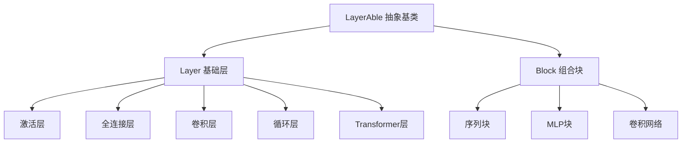

# TinyAI Neural Network 神经网络模块 (tinyai-dl-nnet)

## 模块概述

`tinyai-dl-nnet` 是 TinyAI 深度学习框架的神经网络核心模块，提供了构建各种深度学习模型所需的基础层和组合块。本模块实现了从基础的全连接层、激活层到复杂的 Transformer、LSTM 等高级网络结构，是框架中神经网络构建的基石。

## 核心架构

### 设计理念

本模块采用分层设计，通过 `Layer` 和 `Block` 两个核心抽象类构建了灵活可扩展的神经网络架构：

- **Layer（层）**：神经网络的基本组成单元，实现特定的数学变换功能
- **Block（块）**：由多个 Layer 组合而成的复合结构，支持嵌套组合



### 核心组件

#### 1. 基础抽象类
- [`LayerAble`](src/main/java/io/leavesfly/tinyai/nnet/LayerAble.java) - 所有网络组件的基类
- [`Layer`](src/main/java/io/leavesfly/tinyai/nnet/Layer.java) - 神经网络层的抽象类
- [`Block`](src/main/java/io/leavesfly/tinyai/nnet/Block.java) - 网络块的抽象类
- [`Parameter`](src/main/java/io/leavesfly/tinyai/nnet/Parameter.java) - 参数管理类
- [`RnnLayer`](src/main/java/io/leavesfly/tinyai/nnet/RnnLayer.java) - RNN层基类

## 功能特性

### 🧠 多样化神经网络层

#### 激活层 (activate)
- [`ReLuLayer`](src/main/java/io/leavesfly/tinyai/nnet/layer/activate/ReLuLayer.java) - ReLU 激活函数
- [`SigmoidLayer`](src/main/java/io/leavesfly/tinyai/nnet/layer/activate/SigmoidLayer.java) - Sigmoid 激活函数
- [`TanhLayer`](src/main/java/io/leavesfly/tinyai/nnet/layer/activate/TanhLayer.java) - Tanh 激活函数
- [`SoftMaxLayer`](src/main/java/io/leavesfly/tinyai/nnet/layer/activate/SoftMaxLayer.java) - SoftMax 归一化层

#### 全连接层 (dnn)
- [`AffineLayer`](src/main/java/io/leavesfly/tinyai/nnet/layer/dnn/AffineLayer.java) - 仿射变换层 (y = xW + b)
- [`LinearLayer`](src/main/java/io/leavesfly/tinyai/nnet/layer/dnn/LinearLayer.java) - 线性变换层

#### 卷积层 (cnn)
- 卷积层实现
- 池化层实现
- 深度分离卷积层

#### 循环神经网络层 (rnn)
- [`SimpleRnnLayer`](src/main/java/io/leavesfly/tinyai/nnet/layer/rnn/SimpleRnnLayer.java) - 简单 RNN 层
- [`LstmLayer`](src/main/java/io/leavesfly/tinyai/nnet/layer/rnn/LstmLayer.java) - LSTM 长短期记忆网络
- [`GruLayer`](src/main/java/io/leavesfly/tinyai/nnet/layer/rnn/GruLayer.java) - GRU 门控循环单元

#### Transformer 层 (transformer)
- [`MultiHeadAttention`](src/main/java/io/leavesfly/tinyai/nnet/layer/transf/MultiHeadAttention.java) - 多头注意力机制
- [`LayerNorm`](src/main/java/io/leavesfly/tinyai/nnet/layer/transf/LayerNorm.java) - 层归一化
- [`PositionalEncoding`](src/main/java/io/leavesfly/tinyai/nnet/layer/transf/PositionalEncoding.java) - 位置编码
- [`FeedForward`](src/main/java/io/leavesfly/tinyai/nnet/layer/transf/FeedForward.java) - 前馈网络
- [`TransformerEncoderLayer`](src/main/java/io/leavesfly/tinyai/nnet/layer/transf/TransformerEncoderLayer.java) - Transformer 编码器层
- [`TransformerDecoderLayer`](src/main/java/io/leavesfly/tinyai/nnet/layer/transf/TransformerDecoderLayer.java) - Transformer 解码器层

#### 嵌入层 (embedd)
- 词嵌入层实现

#### 正则化层 (norm)
- 批归一化
- 层归一化
- Dropout 层

### 🔧 预构建网络块

#### 基础块 (block)
- [`SequentialBlock`](src/main/java/io/leavesfly/tinyai/nnet/block/SequentialBlock.java) - 序列组合块
- [`MlpBlock`](src/main/java/io/leavesfly/tinyai/nnet/block/MlpBlock.java) - 多层感知机块
- [`LstmBlock`](src/main/java/io/leavesfly/tinyai/nnet/block/LstmBlock.java) - LSTM 网络块
- [`GruBlock`](src/main/java/io/leavesfly/tinyai/nnet/block/GruBlock.java) - GRU 网络块
- [`SimpleRnnBlock`](src/main/java/io/leavesfly/tinyai/nnet/block/SimpleRnnBlock.java) - 简单 RNN 块
- [`SimpleConvNet`](src/main/java/io/leavesfly/tinyai/nnet/block/SimpleConvNet.java) - 简单卷积神经网络

#### 高级块
- **seq2seq/** - 序列到序列模型实现
- **transformer/** - Transformer 网络块

## 技术依赖

本模块依赖以下 TinyAI 核心模块：

- `tinyai-dl-ndarr` - 多维数组基础库，提供张量计算支持
- `tinyai-dl-func` - 自动微分引擎，提供反向传播计算

外部依赖：
- `jfreechart` - 图表可视化库
- `junit` - 单元测试框架

## 使用示例

### 创建简单的多层感知机

```java
import io.leavesfly.tinyai.nnet.block.MlpBlock;
import io.leavesfly.tinyai.nnet.layer.activate.ReLuLayer;
import io.leavesfly.tinyai.nnet.layer.dnn.AffineLayer;
import io.leavesfly.tinyai.ndarr.Shape;

// 创建 MLP 网络
Shape inputShape = new Shape(784); // 输入维度
MlpBlock mlp = new MlpBlock("mnist_mlp", inputShape, 
                           new int[]{128, 64, 10}); // 隐藏层和输出层维度

// 前向传播
Variable output = mlp.layerForward(inputVariable);
```

### 构建自定义网络

```java
import io.leavesfly.tinyai.nnet.block.SequentialBlock;

// 创建序列块
SequentialBlock model = new SequentialBlock("custom_model", inputShape);

// 添加层
model.addLayer(new AffineLayer("hidden1", inputShape, hiddenShape));
model.addLayer(new ReLuLayer("relu1", hiddenShape));
model.addLayer(new AffineLayer("output", hiddenShape, outputShape));

// 初始化网络
model.init();
```

### 使用 Transformer 组件

```java


// 创建多头注意力层
MultiHeadAttention attention=new MultiHeadAttention("mha",
        modelDim,numHeads);

// 创建 Transformer 编码器层
        TransformerEncoderLayer encoder=new TransformerEncoderLayer("encoder",
        modelDim,numHeads,feedForwardDim);
```

## 参数管理

所有网络组件都支持统一的参数管理：

```java
// 获取所有参数
Map<String, Parameter> allParams = block.getAllParams();

// 清空梯度
block.clearGrads();

// 参数初始化
block.init();
```

## 测试覆盖

模块包含完整的单元测试，覆盖：
- 各种网络层的前向和反向传播
- 网络块的组合和嵌套
- 参数管理和梯度计算
- Transformer 组件的复杂交互

运行测试：
```bash
mvn test
```

## 模块特色

### 🏗️ 模块化设计
- 清晰的层次结构，支持灵活组合
- 统一的接口设计，易于扩展
- 工厂模式变体，简化对象创建

### ⚡ 高性能计算
- 基于 `tinyai-dl-ndarr` 的高效张量计算
- 自动微分支持，无需手动计算梯度
- 内存优化的参数管理

### 🔄 现代架构支持
- 完整的 Transformer 实现
- 先进的 RNN 变体 (LSTM/GRU)
- 序列建模和注意力机制

### 🧪 可靠性保证
- 广泛的单元测试覆盖
- 详细的文档和示例
- 持续的测试修复和改进

## 开发指南

### 添加新的层类型

1. 继承 `Layer` 抽象类
2. 实现 `layerForward` 方法
3. 重写 `init` 方法进行参数初始化
4. 添加相应的单元测试

### 创建复合网络块

1. 继承 `Block` 抽象类
2. 在构造函数中添加子层
3. 实现特定的前向传播逻辑
4. 确保参数管理的正确性

## 版本信息

- **当前版本**: 1.0-SNAPSHOT
- **Java 版本**: 17+
- **构建工具**: Maven 3.6+

## 相关模块

- [`tinyai-dl-ml`](../tinyai-dl-ml/README.md) - 机器学习核心模块
- [`tinyai-dl-func`](../tinyai-dl-func/README.md) - 自动微分引擎
- [`tinyai-dl-ndarr`](../tinyai-dl-ndarr/README.md) - 多维数组基础库

---

**TinyAI Neural Network 模块** - 让深度学习模型构建变得简单而强大 🚀