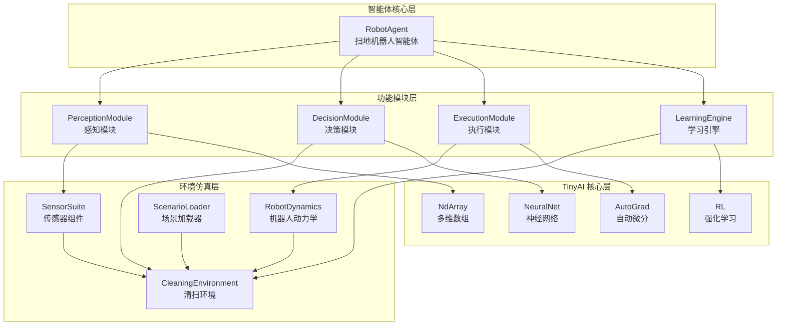
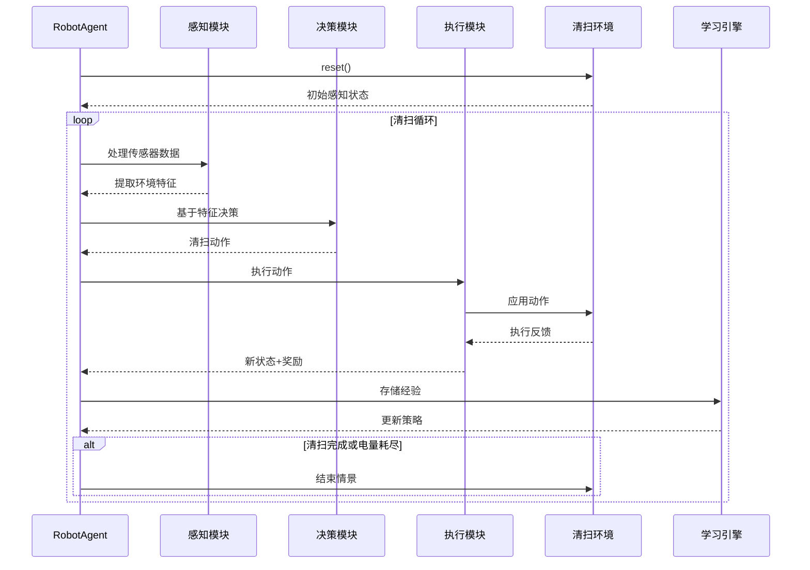
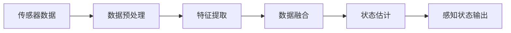
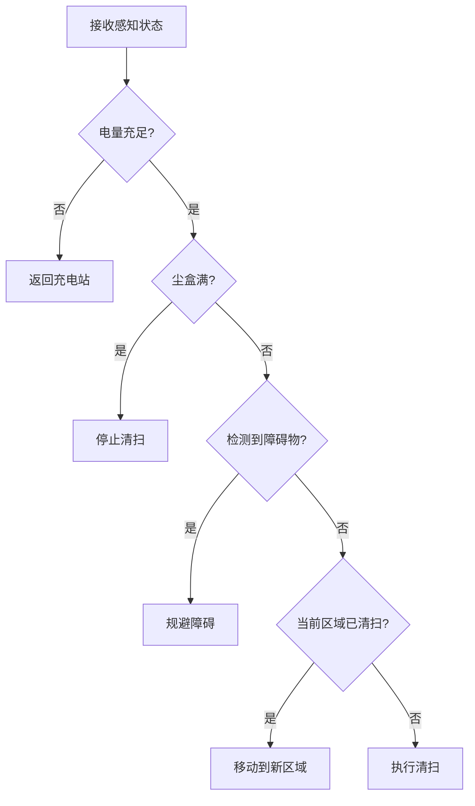
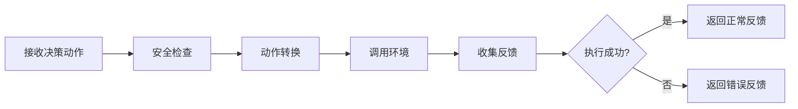
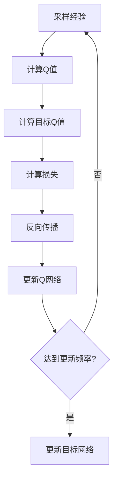

# TinyAI 具身智能扫地机器人模块 - 设计文档

## 1. 项目概述

### 1.1 设计背景

本模块旨在创建一个名为 `tinyai-agent-embodied-robot` 的新模块，用于实现扫地机器人的完整仿真系统。该模块以**扫地机器人场景**为典型应用案例，展示具身智能在端到端学习中的实际应用。设计严格参照现有的 `tinyai-agent-embodied` 模块的架构模式，保持项目风格的一致性。

### 1.2 设计目标

| 目标维度 | 具体要求 | 实现策略 |
|---------|---------|---------|
| **架构一致性** | 与 `tinyai-agent-embodied` 保持相同的模块结构 | 复用四层架构：环境仿真层、感知层、决策层、执行层、学习层 |
| **功能完整性** | 实现扫地机器人的完整工作流程 | 环境识别、路径规划、障碍规避、清扫执行、学习优化 |
| **技术复用** | 最大化利用 TinyAI 现有组件 | 复用 NdArray、AutoGrad、NeuralNet、RL 等核心模块 |
| **零依赖性** | 减少对第三方库的依赖 | 基于纯 Java 实现，仅依赖 TinyAI 内部模块 |
| **可扩展性** | 支持添加新场景、新传感器、新策略 | 模块化设计，开放接口 |
| **教育价值** | 代码清晰易懂 | 详细注释，清晰的类职责划分 |

### 1.3 应用场景

扫地机器人在家庭环境中的智能清扫任务，包括：

- **室内环境清扫**：客厅、卧室、厨房等不同房间类型
- **障碍物规避**：家具、墙壁、楼梯等固定和移动障碍
- **路径优化**：覆盖最大面积，最小化重复清扫
- **电量管理**：自动返回充电站，能耗优化
- **地面类型适应**：瓷砖、地毯、木地板等不同材质

## 2. 系统整体架构

### 2.1 分层架构设计



### 2.2 核心数据流



## 3. 数据模型设计

### 3.1 核心数据模型

#### 3.1.1 基础几何类

**Vector2D - 二维向量**

| 字段名 | 类型 | 说明 | 单位 |
|-------|------|------|------|
| x | double | X坐标 | 米 |
| y | double | Y坐标 | 米 |

核心方法：
- `magnitude()`: 计算向量长度
- `distanceTo(Vector2D other)`: 计算两点距离
- `add(Vector2D other)`: 向量加法
- `subtract(Vector2D other)`: 向量减法
- `multiply(double scalar)`: 标量乘法
- `normalize()`: 归一化
- `angle()`: 计算与X轴夹角

**BoundingBox - 包围盒**

| 字段名 | 类型 | 说明 | 单位 |
|-------|------|------|------|
| width | double | 宽度 | 米 |
| length | double | 长度 | 米 |
| height | double | 高度 | 米 |

核心方法：
- `getArea()`: 计算占地面积
- `getVolume()`: 计算体积
- `contains(Vector2D point)`: 判断点是否在内部

#### 3.1.2 机器人状态

**RobotState - 机器人状态**

| 字段名 | 类型 | 说明 | 单位 | 取值范围 |
|-------|------|------|------|---------|
| position | Vector2D | 机器人位置 | 米 | - |
| heading | double | 朝向角度 | 弧度 | [0, 2π) |
| linearSpeed | double | 线速度 | m/s | [0, 0.5] |
| angularSpeed | double | 角速度 | rad/s | [-π/2, π/2] |
| batteryLevel | double | 电池电量 | 百分比 | [0, 100] |
| dustCapacity | double | 尘盒容量 | 百分比 | [0, 100] |
| brushSpeed | double | 刷子转速 | RPM | [0, 5000] |
| isCleaning | boolean | 是否正在清扫 | - | true/false |

核心方法：
- `needsCharging()`: 判断是否需要充电
- `needsEmptying()`: 判断尘盒是否需要清空
- `isOperational()`: 判断是否可正常工作

**CleaningState - 清扫状态**

| 字段名 | 类型 | 说明 |
|-------|------|------|
| visualFeatures | NdArray | 视觉特征向量（256维） |
| lidarFeatures | NdArray | 激光雷达特征（128维） |
| robotState | RobotState | 机器人自身状态 |
| obstacleMap | List&lt;ObstacleInfo&gt; | 障碍物列表 |
| floorMap | FloorMap | 地面清扫地图 |
| chargingStationInfo | ChargingStationInfo | 充电站信息 |
| timestamp | long | 时间戳 |

#### 3.1.3 动作定义

**CleaningAction - 清扫动作**

| 字段名 | 类型 | 说明 | 取值范围 |
|-------|------|------|---------|
| linearVelocity | double | 线速度控制 | [-1.0, 1.0] |
| angularVelocity | double | 角速度控制 | [-1.0, 1.0] |
| brushPower | double | 刷子功率 | [0.0, 1.0] |
| suctionPower | double | 吸力大小 | [0.0, 1.0] |

动作类型枚举（ActionType）：
- `MOVE_FORWARD`: 前进
- `TURN_LEFT`: 左转
- `TURN_RIGHT`: 右转
- `CLEAN_SPOT`: 定点清扫
- `RETURN_HOME`: 返回充电站
- `STOP`: 停止

核心方法：
- `clip()`: 限制到有效范围
- `isMoving()`: 判断是否在移动
- `toArray()`: 转换为数组表示
- `fromArray(NdArray)`: 从数组创建动作

#### 3.1.4 环境对象

**ObstacleInfo - 障碍物信息**

| 字段名 | 类型 | 说明 |
|-------|------|------|
| type | ObstacleType | 障碍物类型 |
| position | Vector2D | 位置 |
| boundingBox | BoundingBox | 包围盒 |
| distance | double | 与机器人的距离 |
| relativeAngle | double | 相对角度 |
| isMoving | boolean | 是否移动（如宠物） |

障碍物类型（ObstacleType）：
- `WALL`: 墙壁
- `FURNITURE`: 家具
- `STAIRS`: 楼梯
- `PET`: 宠物
- `SMALL_OBJECT`: 小物体
- `CHARGING_STATION`: 充电站

**FloorMap - 地面清扫地图**

| 字段名 | 类型 | 说明 |
|-------|------|------|
| width | int | 地图宽度（网格数） |
| height | int | 地图高度（网格数） |
| gridSize | double | 网格大小（米） |
| cleanedGrid | boolean[][] | 已清扫标记 |
| dustDensity | double[][] | 灰尘密度分布 |
| floorType | FloorType[][] | 地面类型分布 |

地面类型（FloorType）：
- `TILE`: 瓷砖
- `WOOD`: 木地板
- `CARPET`: 地毯
- `MARBLE`: 大理石

核心方法：
- `getCoverageRate()`: 计算覆盖率
- `getTotalDust()`: 计算剩余灰尘量
- `markCleaned(Vector2D position)`: 标记已清扫
- `getDustAt(Vector2D position)`: 获取某位置灰尘量

**ChargingStationInfo - 充电站信息**

| 字段名 | 类型 | 说明 |
|-------|------|------|
| position | Vector2D | 充电站位置 |
| distance | double | 与机器人的距离 |
| direction | double | 方向角度 |
| isOccupied | boolean | 是否被占用 |
| chargingRate | double | 充电速率（%/秒） |

#### 3.1.5 执行结果

**StepResult - 步进结果**

| 字段名 | 类型 | 说明 |
|-------|------|------|
| observation | CleaningState | 新的感知状态 |
| reward | double | 即时奖励 |
| done | boolean | 是否结束 |
| info | Map&lt;String, Object&gt; | 附加信息 |

**ExecutionFeedback - 执行反馈**

| 字段名 | 类型 | 说明 |
|-------|------|------|
| nextState | CleaningState | 下一个状态 |
| reward | double | 奖励值 |
| done | boolean | 是否结束 |
| energyConsumed | double | 消耗的能量 |
| areaCleaned | double | 清扫面积 |
| collisionOccurred | boolean | 是否发生碰撞 |

#### 3.1.6 学习相关

**Transition - 状态转移**

| 字段名 | 类型 | 说明 |
|-------|------|------|
| state | CleaningState | 当前状态 |
| action | CleaningAction | 执行动作 |
| reward | double | 获得奖励 |
| nextState | CleaningState | 下一状态 |
| done | boolean | 是否终止 |

**Episode - 情景**

| 字段名 | 类型 | 说明 |
|-------|------|------|
| episodeId | String | 情景ID |
| scenarioType | ScenarioType | 场景类型 |
| transitions | List&lt;Transition&gt; | 状态转移序列 |
| totalReward | double | 总奖励 |
| length | int | 情景长度 |
| cleaningEfficiency | double | 清扫效率 |
| energyEfficiency | double | 能量效率 |

核心方法：
- `addTransition(Transition)`: 添加转移
- `getAverageReward()`: 获取平均奖励
- `getCoverageRate()`: 获取覆盖率
- `getSuccessful()`: 判断是否成功

### 3.2 枚举类型定义

**ScenarioType - 场景类型**

| 枚举值 | 说明 | 难度 |
|-------|------|------|
| SIMPLE_ROOM | 简单房间（空旷） | ★☆☆☆☆ |
| LIVING_ROOM | 客厅（家具中等） | ★★☆☆☆ |
| BEDROOM | 卧室（家具密集） | ★★★☆☆ |
| KITCHEN | 厨房（障碍复杂） | ★★★☆☆ |
| MULTI_ROOM | 多房间（大面积） | ★★★★☆ |
| COMPLEX_LAYOUT | 复杂布局（混合） | ★★★★★ |

**SensorType - 传感器类型**

| 枚举值 | 说明 | 功能 |
|-------|------|------|
| CAMERA | 摄像头 | 视觉识别 |
| LIDAR | 激光雷达 | 距离测量 |
| CLIFF_SENSOR | 悬崖传感器 | 防跌落 |
| BUMP_SENSOR | 碰撞传感器 | 碰撞检测 |
| DIRT_SENSOR | 灰尘传感器 | 灰尘检测 |
| ODOMETER | 里程计 | 位移测量 |

**LearningStrategy - 学习策略**

| 枚举值 | 说明 | 适用场景 |
|-------|------|---------|
| DQN | 深度Q网络 | 离散动作空间 |
| DDPG | 深度确定性策略梯度 | 连续动作空间 |
| PPO | 近端策略优化 | 稳定训练 |
| END_TO_END | 端到端学习 | 直接感知到动作映射 |

## 4. 环境仿真层设计

### 4.1 机器人动力学模型

**RobotDynamics - 差分驱动模型**

采用经典的差分驱动机器人运动学模型：

**状态更新方程**：

```
x(t+Δt) = x(t) + v·cos(θ)·Δt
y(t+Δt) = y(t) + v·sin(θ)·Δt
θ(t+Δt) = θ(t) + ω·Δt
battery(t+Δt) = battery(t) - energyCost(v, ω, brush, suction)·Δt
```

其中：
- `v`: 线速度，由左右轮速度合成
- `ω`: 角速度，由左右轮速度差决定
- `θ`: 朝向角
- `energyCost`: 能量消耗函数

**物理参数表**：

| 参数名 | 默认值 | 说明 | 单位 |
|-------|--------|------|------|
| wheelBase | 0.25 | 轮距 | 米 |
| maxLinearSpeed | 0.5 | 最大线速度 | m/s |
| maxAngularSpeed | π/2 | 最大角速度 | rad/s |
| maxAcceleration | 0.5 | 最大加速度 | m/s² |
| robotRadius | 0.175 | 机器人半径 | 米 |
| batteryCapacity | 3000 | 电池容量 | mAh |
| dustCapacity | 0.6 | 尘盒容量 | 升 |
| maxBrushSpeed | 5000 | 最大刷速 | RPM |

**能量消耗模型**：

```
energyCost = baseConsumption 
           + movementCost(v, ω) 
           + brushCost(brushPower) 
           + suctionCost(suctionPower)

其中：
baseConsumption = 0.1 %/s          (待机功耗)
movementCost = 0.3·|v| + 0.2·|ω|   (运动功耗)
brushCost = 0.4·brushPower         (刷子功耗)
suctionCost = 0.5·suctionPower     (吸尘功耗)
```

核心方法：
- `update(RobotState current, CleaningAction action, double dt)`: 更新机器人状态
- `computeEnergyConsumption(CleaningAction action, double dt)`: 计算能量消耗
- `computeCleaningEfficiency(FloorType type, CleaningAction action)`: 计算清扫效率

### 4.2 清扫环境

**CleaningEnvironment - 清扫环境接口**

核心方法定义：

| 方法名 | 参数 | 返回值 | 说明 |
|-------|------|--------|------|
| reset() | - | CleaningState | 重置环境到初始状态 |
| step(CleaningAction) | action | StepResult | 执行一步动作 |
| getObservation() | - | CleaningState | 获取当前观测 |
| isTerminated() | - | boolean | 判断是否终止 |
| getSensorData(SensorType) | type | NdArray | 获取传感器数据 |
| render() | - | Object | 渲染环境（可选） |
| close() | - | void | 关闭环境 |
| getScenarioType() | - | ScenarioType | 获取场景类型 |

**SimpleCleaningEnv - 简单清扫环境实现**

主要职责：
1. 环境初始化与重置
2. 动作执行与状态更新
3. 奖励计算
4. 碰撞检测
5. 清扫效果模拟
6. 终止条件判断

**状态更新流程**：


具体步骤：
1. **动作限幅**：将动作值限制在有效范围
2. **状态更新**：基于动力学模型更新位置、朝向、速度
3. **电量更新**：根据动作计算能量消耗
4. **地图更新**：标记已清扫区域，减少灰尘密度
5. **碰撞检测**：检查与障碍物、墙壁的碰撞
6. **奖励计算**：基于多个维度计算即时奖励
7. **终止判断**：检查是否满足终止条件
8. **结果封装**：返回新状态、奖励、终止标志

### 4.3 奖励函数设计

**组合奖励公式**：

```
R_total = w1·R_coverage + w2·R_efficiency + w3·R_energy + w4·R_collision + w5·R_dust

各项奖励详细定义：

R_coverage = Δcoverage                      (覆盖奖励：新清扫面积)
R_efficiency = areaCleaned / timeSpent      (效率奖励)
R_energy = -energyConsumed                  (能量惩罚)
R_collision = -10 (碰撞) / 0 (无碰撞)        (碰撞惩罚)
R_dust = Δdust                              (灰尘清除奖励)

权重配置：
w1 = 1.0    (覆盖最重要)
w2 = 0.5    (效率次要)
w3 = 0.2    (能量管理)
w4 = 2.0    (安全优先)
w5 = 0.8    (清洁效果)
```

**额外奖励机制**：

| 触发条件 | 奖励值 | 说明 |
|---------|--------|------|
| 完成全部清扫 | +100 | 达到目标覆盖率 |
| 返回充电站 | +50 | 低电量时返回 |
| 避免重复清扫 | +5 | 探索新区域 |
| 尘盒已满未清空 | -20 | 维护不及时 |
| 电量耗尽 | -50 | 能量管理失败 |

### 4.4 场景管理

**ScenarioLoader - 场景加载器**

**内置场景配置表**：

| 场景类型 | 房间大小 | 障碍物数量 | 灰尘分布 | 目标覆盖率 | 难度 |
|---------|---------|----------|---------|-----------|------|
| SIMPLE_ROOM | 5m × 5m | 2-3 | 均匀 | 95% | ★☆☆☆☆ |
| LIVING_ROOM | 8m × 6m | 8-10 | 中等 | 90% | ★★☆☆☆ |
| BEDROOM | 6m × 5m | 12-15 | 集中 | 85% | ★★★☆☆ |
| KITCHEN | 5m × 4m | 15-18 | 重度 | 80% | ★★★☆☆ |
| MULTI_ROOM | 12m × 10m | 20-25 | 混合 | 85% | ★★★★☆ |
| COMPLEX_LAYOUT | 15m × 12m | 30+ | 混合 | 80% | ★★★★★ |

**场景元素**：
- **障碍物分布**：随机生成或预定义布局
- **灰尘密度**：初始灰尘分布模式
- **充电站位置**：固定或随机位置
- **地面类型**：单一或混合类型
- **特殊区域**：禁区、重点清扫区

核心方法：
- `loadScenario(ScenarioType)`: 加载预定义场景
- `createCustomScenario(Map<String, Object>)`: 创建自定义场景
- `generateObstacles(int count)`: 生成障碍物
- `generateDustDistribution(String pattern)`: 生成灰尘分布

### 4.5 碰撞检测算法

**碰撞检测策略**：

1. **机器人与障碍物碰撞**：
   - 使用圆形简化模型（机器人）与矩形包围盒（障碍物）
   - 计算最近距离，若小于阈值则判定为碰撞

2. **机器人与墙壁碰撞**：
   - 检查机器人位置是否超出房间边界
   - 边界检测：`x < 0 || x > roomWidth || y < 0 || y > roomHeight`

3. **悬崖检测**：
   - 针对楼梯等特殊区域
   - 使用悬崖传感器检测高度变化

碰撞处理机制：
- **停止移动**：立即停止当前动作
- **回退**：退回上一有效位置
- **惩罚**：给予负奖励
- **记录**：统计碰撞次数

## 5. 感知层设计

### 5.1 传感器系统

**Sensor - 传感器接口**

核心方法定义：

| 方法名 | 返回值 | 说明 |
|-------|--------|------|
| getType() | SensorType | 获取传感器类型 |
| readData() | NdArray | 读取传感器数据 |
| isReady() | boolean | 判断是否就绪 |
| reset() | void | 重置传感器 |
| getNoiseLevel() | double | 获取噪声水平 |

**传感器实现类**：

**1. CameraSensor - 摄像头传感器**
- 输出维度：256维视觉特征向量
- 功能：识别障碍物类型、地面类型、灰尘分布
- 噪声模拟：添加高斯噪声（σ = 0.05）

**2. LidarSensor - 激光雷达传感器**
- 输出维度：128维距离测量向量（360度，每2.8度一个测量点）
- 测量范围：0-5米
- 精度：±2cm
- 功能：障碍物距离和方向检测

**3. CliffSensor - 悬崖传感器**
- 输出维度：4个方向的高度测量
- 检测范围：机器人前方5cm
- 功能：防止跌落楼梯

**4. BumpSensor - 碰撞传感器**
- 输出维度：8个方向的碰撞检测
- 功能：物理碰撞检测

**5. DirtSensor - 灰尘传感器**
- 输出维度：当前位置的灰尘密度
- 检测范围：机器人底部
- 功能：检测清扫效果

**6. Odometer - 里程计**
- 输出维度：位移和朝向变化
- 功能：位置估计（存在累积误差）

**SensorSuite - 传感器组件**

集成所有传感器，提供统一访问接口：

核心方法：
- `readAll()`: 读取所有传感器数据
- `readSensor(SensorType)`: 读取指定传感器
- `calibrate()`: 校准传感器
- `getSensorStatus()`: 获取传感器状态

### 5.2 感知处理模块

**PerceptionModule - 感知处理模块**

主要职责：
1. **数据融合**：整合多个传感器数据
2. **特征提取**：从原始数据中提取高层特征
3. **状态估计**：估计机器人和环境状态
4. **障碍物检测**：识别和定位障碍物

处理流程：



核心方法：
- `initialize()`: 初始化感知模块
- `process(CleaningState)`: 处理感知状态
- `extractFeatures(NdArray rawData)`: 提取特征
- `fuseData(Map<SensorType, NdArray>)`: 融合传感器数据

**FeatureExtractor - 特征提取器**

功能模块：

| 模块名 | 输入 | 输出 | 说明 |
|-------|------|------|------|
| 视觉特征提取 | 摄像头数据 | 256维特征 | 使用卷积网络 |
| 雷达特征提取 | 激光雷达数据 | 128维特征 | 距离和角度编码 |
| 运动特征提取 | 里程计数据 | 16维特征 | 速度和朝向 |
| 状态特征提取 | 机器人状态 | 32维特征 | 电量、尘盒等 |

核心方法：
- `extractVisualFeatures(NdArray)`: 提取视觉特征
- `extractLidarFeatures(NdArray)`: 提取雷达特征
- `extractMotionFeatures(NdArray)`: 提取运动特征
- `combineFeatures(List<NdArray>)`: 组合特征

## 6. 决策层设计

### 6.1 决策模块

**DecisionModule - 决策模块**

决策策略：

| 策略类型 | 说明 | 适用场景 |
|---------|------|---------|
| 规则策略 | 基于预定义规则 | 简单场景，快速原型 |
| 学习策略 | 基于神经网络 | 复杂场景，需要适应 |
| 混合策略 | 规则+学习结合 | 安全关键场景 |

**决策流程**：



核心方法：
- `decide(CleaningState)`: 基于状态做决策
- `selectAction(NdArray features)`: 选择动作
- `evaluateAction(CleaningAction)`: 评估动作

### 6.2 策略网络

**PolicyNetwork - 策略网络**

网络架构：

```
输入层：感知特征（432维）
    ↓
全连接层1：256个神经元（ReLU激活）
    ↓
全连接层2：128个神经元（ReLU激活）
    ↓
输出层：4个动作维度
    ├─ linearVelocity（Tanh激活）
    ├─ angularVelocity（Tanh激活）
    ├─ brushPower（Sigmoid激活）
    └─ suctionPower（Sigmoid激活）
```

核心方法：
- `forward(NdArray features)`: 前向传播
- `backward(NdArray gradient)`: 反向传播
- `updateWeights(double learningRate)`: 更新权重
- `saveModel(String path)`: 保存模型
- `loadModel(String path)`: 加载模型

### 6.3 安全约束

**SafetyConstraint - 安全约束**

约束规则：

| 约束类型 | 条件 | 动作修正 |
|---------|------|---------|
| 碰撞约束 | 障碍物距离 < 0.2m | 停止前进，后退或转向 |
| 电量约束 | 电量 < 20% | 强制返回充电站 |
| 悬崖约束 | 检测到高度差 | 立即停止并后退 |
| 速度约束 | 速度超限 | 限制到最大值 |
| 区域约束 | 超出工作区域 | 引导返回 |

核心方法：
- `checkConstraints(CleaningState, CleaningAction)`: 检查约束
- `enforceSafety(CleaningAction)`: 强制安全
- `getSafetyLevel(CleaningState)`: 获取安全等级

## 7. 执行层设计

**ExecutionModule - 执行模块**

主要职责：
1. **动作转换**：将高层决策转换为底层控制指令
2. **动作执行**：调用环境接口执行动作
3. **反馈收集**：收集执行结果和环境反馈
4. **异常处理**：处理执行过程中的异常情况

执行流程：



核心方法：
- `execute(CleaningAction)`: 执行清扫动作
- `convertAction(CleaningAction)`: 转换动作格式
- `handleError(Exception)`: 处理执行错误
- `getExecutionStatus()`: 获取执行状态

## 8. 学习层设计

### 8.1 学习引擎

**LearningEngine - 学习引擎**

支持的学习策略：

| 策略 | 算法 | 特点 | 适用场景 |
|-----|------|------|---------|
| DQN | 深度Q网络 | 值函数学习 | 离散动作空间 |
| DDPG | 深度确定性策略梯度 | 策略梯度+值函数 | 连续动作空间 |
| PPO | 近端策略优化 | 稳定性好 | 长期学习 |
| END_TO_END | 端到端学习 | 直接映射 | 快速适应 |

核心方法：
- `setStrategy(LearningStrategy)`: 设置学习策略
- `learnFromEpisode(Episode)`: 从情景中学习
- `updatePolicy(List<Transition>)`: 更新策略
- `savePolicy(String path)`: 保存策略
- `loadPolicy(String path)`: 加载策略

### 8.2 DQN学习器

**DQNLearner - DQN学习器**

核心组件：
- **Q网络**：估计状态-动作价值
- **目标网络**：稳定训练
- **经验回放**：打破数据相关性
- **ε-贪婪策略**：平衡探索与利用

训练流程：



超参数配置：

| 参数 | 默认值 | 说明 |
|-----|--------|------|
| learningRate | 0.001 | 学习率 |
| gamma | 0.99 | 折扣因子 |
| epsilon | 1.0 → 0.1 | 探索率（衰减） |
| batchSize | 32 | 批次大小 |
| bufferSize | 10000 | 回放缓冲大小 |
| targetUpdateFreq | 100 | 目标网络更新频率 |

### 8.3 端到端学习器

**EndToEndLearner - 端到端学习器**

直接从原始感知到动作的映射，无需手工特征工程。

网络架构：

```
感知状态（多模态输入）
    ├─ 视觉特征（256维）
    ├─ 雷达特征（128维）
    ├─ 状态特征（32维）
    └─ 地图特征（16维）
          ↓
    特征融合层（512维）
          ↓
    全连接层1（256维，ReLU）
          ↓
    全连接层2（128维，ReLU）
          ↓
    动作输出层（4维）
```

训练目标：
- **模仿学习**：学习专家策略
- **强化学习**：优化长期奖励
- **行为克隆**：直接监督学习

### 8.4 情景记忆

**EpisodicMemory - 情景记忆**

功能：
- **存储情景**：保存完整的清扫情景
- **经验回放**：随机采样用于训练
- **优先采样**：优先采样高价值经验
- **场景筛选**：按场景类型筛选

数据结构：

```
EpisodicMemory
├── buffer: 循环缓冲区（固定大小）
├── priorities: 优先级数组
├── position: 当前写入位置
└── size: 当前存储数量
```

核心方法：
- `storeEpisode(Episode)`: 存储情景
- `sampleBatch(int batchSize)`: 批量采样
- `samplePrioritized(int batchSize)`: 优先采样
- `filterByScenario(ScenarioType)`: 场景筛选
- `clear()`: 清空记忆

## 9. 智能体核心

### 9.1 扫地机器人智能体

**RobotAgent - 扫地机器人智能体**

整合所有模块，实现完整的感知-决策-执行-学习闭环。

核心属性：

| 属性名 | 类型 | 说明 |
|-------|------|------|
| environment | CleaningEnvironment | 清扫环境 |
| perceptionModule | PerceptionModule | 感知模块 |
| decisionModule | DecisionModule | 决策模块 |
| executionModule | ExecutionModule | 执行模块 |
| learningEngine | LearningEngine | 学习引擎 |
| currentState | CleaningState | 当前状态 |
| episodeSteps | int | 情景步数 |
| totalReward | double | 总奖励 |

核心方法：

**1. initialize()** - 初始化智能体
- 初始化所有模块
- 设置默认参数
- 加载预训练模型（可选）

**2. reset()** - 重置到初始状态
- 重置环境
- 重置统计信息
- 清空临时数据

**3. step()** - 执行一步
```
step流程：
1. 感知：处理传感器数据
2. 决策：基于感知状态选择动作
3. 执行：执行动作并获取反馈
4. 学习：存储经验（可选）
5. 更新：更新内部状态
6. 返回：返回步进结果
```

**4. runEpisode(int maxSteps)** - 运行完整情景
```
情景流程：
1. 重置环境
2. 循环执行step
3. 记录所有转移
4. 计算情景统计
5. 触发学习（可选）
6. 返回情景对象
```

**5. train(int episodes)** - 训练智能体
```
训练流程：
1. for each episode:
   a. 运行情景
   b. 存储经验
   c. 从经验中学习
   d. 更新策略
   e. 记录性能指标
2. 保存最佳模型
3. 返回训练统计
```

**6. evaluate(int episodes)** - 评估智能体
```
评估流程：
1. 加载训练好的模型
2. 禁用探索（ε=0）
3. 运行多个评估情景
4. 统计性能指标
5. 返回评估结果
```

### 9.2 运行模式

**单步模式**：
- 适用于调试和可视化
- 每次调用step()执行一步
- 可实时观察状态变化

**情景模式**：
- 适用于批量训练
- 运行完整情景后返回
- 自动记录所有转移

**训练模式**：
- 运行多个情景
- 自动学习和更新
- 定期保存检查点

**评估模式**：
- 禁用探索和学习
- 评估策略性能
- 生成性能报告

## 10. 接口设计

### 10.1 核心接口

**CleaningEnvironment - 清扫环境接口**

定义环境的标准行为，确保可替换性。

```
interface CleaningEnvironment {
    CleaningState reset();
    StepResult step(CleaningAction action);
    CleaningState getObservation();
    boolean isTerminated();
    NdArray getSensorData(SensorType type);
    Object render();
    void close();
    ScenarioType getScenarioType();
    EnvironmentConfig getConfig();
}
```

**Sensor - 传感器接口**

定义传感器的标准行为，支持扩展新传感器。

```
interface Sensor {
    SensorType getType();
    NdArray readData();
    boolean isReady();
    void reset();
    double getNoiseLevel();
    void calibrate();
}
```

## 11. 配置管理

### 11.1 环境配置

**EnvironmentConfig - 环境配置类**

| 配置项 | 类型 | 默认值 | 说明 |
|-------|------|--------|------|
| scenarioType | ScenarioType | SIMPLE_ROOM | 场景类型 |
| roomWidth | double | 5.0 | 房间宽度（米） |
| roomHeight | double | 5.0 | 房间高度（米） |
| gridSize | double | 0.1 | 网格大小（米） |
| obstacleCount | int | 5 | 障碍物数量 |
| initialBattery | double | 100.0 | 初始电量（%） |
| targetCoverage | double | 0.95 | 目标覆盖率 |
| timeStep | double | 0.1 | 时间步长（秒） |
| maxSteps | int | 2000 | 最大步数 |
| enableVisualization | boolean | false | 是否启用可视化 |

配置方法：
- `createSimpleRoomConfig()`: 创建简单房间配置
- `createLivingRoomConfig()`: 创建客厅配置
- `createBedroomConfig()`: 创建卧室配置
- `createCustomConfig(...)`: 创建自定义配置

### 11.2 学习配置

**LearningConfig - 学习配置类**

| 配置项 | 类型 | 默认值 | 说明 |
|-------|------|--------|------|
| strategy | LearningStrategy | DQN | 学习策略 |
| learningRate | double | 0.001 | 学习率 |
| gamma | double | 0.99 | 折扣因子 |
| epsilon | double | 1.0 | 初始探索率 |
| epsilonDecay | double | 0.995 | 探索率衰减 |
| epsilonMin | double | 0.1 | 最小探索率 |
| batchSize | int | 32 | 批次大小 |
| bufferSize | int | 10000 | 缓冲区大小 |
| updateFreq | int | 100 | 更新频率 |

## 12. 性能优化策略

### 12.1 计算效率优化

**优化方向**：

| 优化项 | 策略 | 预期效果 |
|-------|------|---------|
| 障碍物管理 | 空间索引（四叉树） | 减少碰撞检测复杂度 |
| 地图更新 | 增量更新 | 避免全图重计算 |
| 特征计算 | 缓存机制 | 减少重复计算 |
| 传感器采样 | 按需采样 | 降低采样频率 |
| 批量处理 | 并行环境 | 加速训练 |

### 12.2 内存优化

**优化策略**：

| 优化项 | 方法 | 说明 |
|-------|------|------|
| 对象复用 | 对象池 | 复用RobotState、CleaningAction |
| 数据压缩 | 稀疏表示 | 地图采用稀疏矩阵 |
| 定期清理 | GC友好 | 及时释放大对象 |
| 延迟加载 | 按需创建 | 推迟创建重对象 |

### 12.3 训练加速

**加速方法**：

| 方法 | 说明 | 适用场景 |
|-----|------|---------|
| 经验回放 | 提高样本利用率 | 所有策略 |
| 并行环境 | 多环境同时采样 | 大规模训练 |
| 异步更新 | CPU采样+GPU训练 | 资源充足场景 |
| 迁移学习 | 复用相似场景模型 | 新场景适应 |

## 13. 扩展性设计

### 13.1 添加新传感器

扩展步骤：

1. **定义传感器类型**：在SensorType枚举中添加新类型
2. **实现传感器接口**：继承AbstractSensor或实现Sensor接口
3. **注册到传感器组件**：在SensorSuite中注册
4. **更新感知模块**：集成新传感器数据

示例场景：
- 红外传感器：检测热源
- 超声波传感器：近距离障碍检测
- 压力传感器：检测地面材质

### 13.2 添加新场景

扩展步骤：

1. **定义场景类型**：在ScenarioType枚举中添加
2. **配置场景参数**：设置房间大小、障碍物布局等
3. **实现场景加载**：在ScenarioLoader中添加加载逻辑
4. **测试验证**：确保场景可正常运行

示例场景：
- 办公室场景：工位+走廊
- 商场场景：大空间+密集人流
- 仓库场景：货架+窄通道

### 13.3 添加新学习策略

扩展步骤：

1. **定义策略类型**：在LearningStrategy枚举中添加
2. **实现学习器**：创建新的Learner类
3. **集成到学习引擎**：在LearningEngine中注册
4. **配置超参数**：添加策略特定配置

示例策略：
- A3C：异步优势演员-评论家
- SAC：软演员-评论家
- TD3：双延迟深度确定性策略梯度

## 14. 测试策略

### 14.1 单元测试

测试模块：

| 测试对象 | 测试内容 | 验证目标 |
|---------|---------|---------|
| RobotDynamics | 运动学精度 | 状态更新正确性 |
| 奖励函数 | 各项奖励计算 | 奖励值合理性 |
| 碰撞检测 | 各种碰撞场景 | 检测准确性 |
| 传感器 | 数据读取 | 数据格式正确 |
| 特征提取 | 特征维度 | 输出维度一致 |

### 14.2 集成测试

测试场景：

| 场景 | 测试内容 | 验证目标 |
|-----|---------|---------|
| 完整情景 | 运行完整清扫任务 | 流程正确性 |
| 多场景切换 | 切换不同场景 | 适应能力 |
| 长时间运行 | 运行1000+情景 | 稳定性 |
| 异常情况 | 碰撞、低电量等 | 鲁棒性 |

### 14.3 性能测试

测试指标：

| 指标 | 目标值 | 说明 |
|-----|--------|------|
| 步进耗时 | < 10ms | 单步执行时间 |
| 内存占用 | < 500MB | 运行时内存 |
| 训练速度 | > 100 ep/h | 每小时训练情景数 |
| 覆盖率 | > 90% | 测试场景覆盖率 |

## 15. 文档规范

### 15.1 代码注释

注释规范：

```
每个类：
- 类功能说明
- 主要职责
- 使用示例
- 作者信息

每个方法：
- 方法功能
- 参数说明
- 返回值说明
- 异常说明
```

### 15.2 文档结构

必需文档：

| 文档名称 | 内容 | 位置 |
|---------|------|------|
| README.md | 模块介绍、快速开始 | 模块根目录 |
| 技术架构文档.md | 详细设计文档 | doc/ |
| API参考文档.md | API详细说明 | doc/ |
| 使用示例.md | 典型使用案例 | doc/ |

## 16. 项目依赖

### 16.1 Maven依赖配置

```
模块依赖：
- tinyai-deeplearning-ndarr（必需）
- tinyai-deeplearning-func（必需）
- tinyai-deeplearning-nnet（必需）
- tinyai-deeplearning-ml（必需）
- tinyai-deeplearning-rl（必需）

测试依赖：
- junit（测试框架）
- junit-jupiter（JUnit 5）
```

### 16.2 模块结构

```
tinyai-agent-embodied-robot/
├── src/
│   ├── main/
│   │   └── java/io/leavesfly/tinyai/agent/robot/
│   │       ├── model/          # 数据模型
│   │       ├── env/            # 环境仿真
│   │       ├── dynamics/       # 机器人动力学
│   │       ├── sensor/         # 传感器系统
│   │       ├── perception/     # 感知模块
│   │       ├── decision/       # 决策模块
│   │       ├── execution/      # 执行模块
│   │       ├── learning/       # 学习引擎
│   │       ├── RobotAgent.java # 智能体核心
│   │       ├── SimpleDemo.java # 简单演示
│   │       └── AgentDemo.java  # 完整演示
│   └── test/
│       └── java/io/leavesfly/tinyai/agent/robot/
│           ├── model/          # 模型测试
│           ├── env/            # 环境测试
│           └── learning/       # 学习测试
├── doc/
│   ├── 技术架构文档.md
│   ├── API参考文档.md
│   ├── 使用示例.md
│   └── 实施总结.md
├── README.md
└── pom.xml
```

## 17. 演示程序设计

### 17.1 简单演示（SimpleDemo）

功能：展示基础环境交互

```
主要流程：
1. 创建简单房间环境
2. 初始化机器人
3. 执行预定义动作序列
4. 打印状态信息
5. 展示清扫效果
```

### 17.2 完整演示（AgentDemo）

功能：展示完整智能体工作流程

```
主要流程：
1. 创建多种场景
2. 初始化智能体
3. 运行完整情景
4. 展示学习过程
5. 评估性能指标
6. 保存训练模型
```

## 18. 里程碑规划

### 18.1 开发阶段

| 阶段 | 任务 | 交付物 |
|-----|------|--------|
| 阶段一 | 基础架构搭建 | Maven配置、数据模型、枚举类型 |
| 阶段二 | 环境仿真实现 | 动力学模型、环境实现、场景加载 |
| 阶段三 | 感知模块开发 | 传感器系统、感知处理、特征提取 |
| 阶段四 | 决策执行模块 | 决策模块、策略网络、执行模块 |
| 阶段五 | 学习引擎集成 | 学习引擎、DQN学习器、端到端学习器 |
| 阶段六 | 智能体核心 | RobotAgent、完整闭环 |
| 阶段七 | 测试与验证 | 单元测试、集成测试、演示程序 |
| 阶段八 | 文档编写 | README、技术文档、API文档 |

### 18.2 验收标准

| 验收项 | 标准 | 验证方法 |
|-------|------|---------|
| 编译成功 | Maven构建无错误 | `mvn clean compile` |
| 运行成功 | 演示程序正常运行 | 运行SimpleDemo和AgentDemo |
| 功能完整 | 实现所有核心功能 | 检查功能清单 |
| 代码质量 | 注释充分、命名规范 | 代码审查 |
| 文档完整 | 所有文档齐全 | 文档检查 |
| 性能达标 | 满足性能指标 | 性能测试 |
