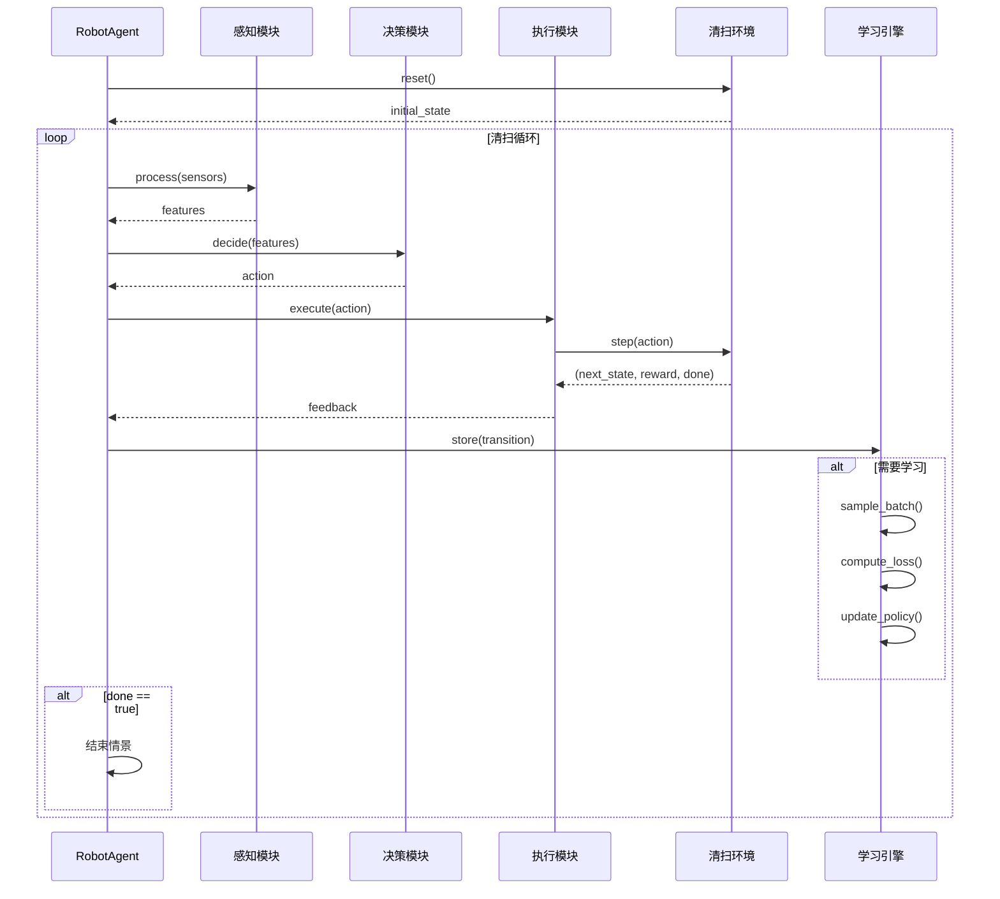

# TinyAI 具身智能扫地机器人模块 - 技术架构文档

## 1. 概述

本文档详细描述了 `tinyai-agent-embodied-robot` 模块的技术架构、设计决策和实现细节。该模块以扫地机器人为应用场景，展示具身智能系统的完整实现。

## 2. 系统架构

### 2.1 整体架构图

```
┌─────────────────────────────────────────────────────────┐
│                    RobotAgent                          │
│                   (智能体核心)                          │
└──────────────┬────────────────────────┬─────────────────┘
               │                        │
       ┌───────┴────────┐      ┌───────┴────────┐
       │  PerceptionModule│      │ DecisionModule │
       │   (感知模块)     │      │  (决策模块)    │
       └────────┬─────────┘      └──────┬─────────┘
                │                       │
       ┌────────┴────────┐     ┌───────┴────────┐
       │ ExecutionModule │     │ LearningEngine │
       │  (执行模块)     │     │  (学习引擎)    │
       └────────┬─────────┘     └───────┬─────────┘
                │                       │
       ┌────────┴───────────────────────┴─────────┐
       │         CleaningEnvironment              │
       │            (清扫环境)                    │
       └──────────────────┬───────────────────────┘
                          │
          ┌───────────────┴───────────────┐
          │        TinyAI Core            │
          │  (NdArray, AutoGrad, etc.)    │
          └───────────────────────────────┘
```

### 2.2 模块职责

#### 2.2.1 数据模型层 (model/)

**职责**：定义系统中的核心数据结构

**核心类**：
- **Vector2D**: 二维空间中的点和向量
- **RobotState**: 机器人完整状态
- **CleaningAction**: 控制动作
- **CleaningState**: 观测状态
- **FloorMap**: 清扫地图
- **ObstacleInfo/ChargingStationInfo**: 环境对象
- **Transition/Episode**: 学习数据

**设计原则**：
- 不可变性：关键数据使用拷贝构造保护
- 类型安全：使用枚举代替魔法数字
- 边界检查：自动限制数值到有效范围

#### 2.2.2 环境仿真层 (env/)

**职责**：模拟真实清扫环境

**核心组件**（待实现）：
- **CleaningEnvironment**: 环境接口
- **SimpleCleaningEnv**: 基础环境实现
- **ScenarioLoader**: 场景配置加载
- **RewardCalculator**: 奖励函数计算

**关键功能**：
- 状态初始化和重置
- 动作执行和状态更新
- 碰撞检测
- 奖励计算
- 终止条件判断

#### 2.2.3 机器人动力学层 (dynamics/)

**职责**：模拟机器人物理运动

**核心模型**（待实现）：
- **RobotDynamics**: 差分驱动模型
- **EnergyModel**: 能量消耗模型
- **CollisionDetector**: 碰撞检测器

**物理方程**：

```
位置更新:
x(t+Δt) = x(t) + v·cos(θ)·Δt
y(t+Δt) = y(t) + v·sin(θ)·Δt
θ(t+Δt) = θ(t) + ω·Δt

能量消耗:
E = E_base + E_move(v, ω) + E_clean(brush, suction)
```

#### 2.2.4 传感器系统 (sensor/)

**职责**：模拟各种传感器数据

**传感器类型**（待实现）：
- **CameraSensor**: 视觉传感器（256维特征）
- **LidarSensor**: 激光雷达（128维距离）
- **CliffSensor**: 悬崖传感器（4方向）
- **BumpSensor**: 碰撞传感器（8方向）
- **DirtSensor**: 灰尘传感器
- **Odometer**: 里程计

**数据流**：
```
物理环境 → 原始传感器数据 → 特征提取 → 融合特征 → 决策网络
```

#### 2.2.5 感知模块 (perception/)

**职责**：处理和融合传感器数据

**核心功能**（待实现）：
- 数据预处理和归一化
- 特征提取（CNN用于视觉，编码用于雷达）
- 多传感器数据融合
- 状态估计

**特征维度**：
- 视觉特征：256维
- 雷达特征：128维
- 状态特征：16维
- 总计：400维输入

#### 2.2.6 决策模块 (decision/)

**职责**：基于感知状态做出决策

**策略类型**（待实现）：
- **RuleBasedPolicy**: 基于规则的策略
- **NeuralNetworkPolicy**: 神经网络策略
- **HybridPolicy**: 混合策略

**网络架构**：
```
输入层: 400维状态特征
    ↓
隐藏层1: 256个神经元 (ReLU)
    ↓
隐藏层2: 128个神经元 (ReLU)
    ↓
输出层: 4维动作
  ├─ linearVelocity (Tanh)
  ├─ angularVelocity (Tanh)
  ├─ brushPower (Sigmoid)
  └─ suctionPower (Sigmoid)
```

#### 2.2.7 执行模块 (execution/)

**职责**：执行决策动作

**核心功能**（待实现）：
- 动作合法性检查
- 安全约束强制
- 动作转换和执行
- 反馈收集

#### 2.2.8 学习引擎 (learning/)

**职责**：实现强化学习算法

**支持算法**（待实现）：
- **DQN**: 深度Q网络
- **DDPG**: 深度确定性策略梯度
- **PPO**: 近端策略优化
- **端到端学习**: 直接映射

**训练流程**：
```
1. 收集经验: (s, a, r, s', done)
2. 存入回放缓冲区
3. 采样批次数据
4. 计算目标Q值或优势函数
5. 更新网络参数
6. 定期更新目标网络
```

## 3. 核心数据流

### 3.1 完整工作流程

```
1. 环境初始化
   └→ reset() → 初始CleaningState

2. 感知循环
   ├→ 读取传感器数据
   ├→ 提取特征
   └→ 更新CleaningState

3. 决策循环
   ├→ getStateVector()
   ├→ forward(network)
   └→ 生成CleaningAction

4. 执行循环
   ├→ 执行动作
   ├→ 更新RobotState
   └→ 计算奖励

5. 学习循环
   ├→ 存储Transition
   ├→ 采样批次
   └→ 更新策略

6. 终止检查
   └→ 覆盖率达标 或 电量耗尽 或 超时
```

### 3.2 状态转移详细流程



## 4. 关键技术实现

### 4.1 Vector2D 设计

**设计决策**：
- 使用不可变对象模式，所有运算返回新对象
- 提供完整的向量运算：加减乘、点积、归一化
- 边界检查和异常处理

**关键方法**：
```java
// 距离计算
public double distanceTo(Vector2D other) {
    double dx = this.x - other.x;
    double dy = this.y - other.y;
    return Math.sqrt(dx * dx + dy * dy);
}

// 角度计算
public double angle() {
    return Math.atan2(y, x);
}
```

### 4.2 RobotState 管理

**状态项**：
- 位置和朝向（Vector2D + heading）
- 速度（线速度 + 角速度）
- 电量和尘盒
- 刷子状态

**自动限幅**：
```java
public void setLinearSpeed(double linearSpeed) {
    this.linearSpeed = Math.max(0.0, Math.min(0.5, linearSpeed));
}
```

**状态查询**：
```java
public boolean needsCharging() {
    return batteryLevel < 20.0;
}

public boolean isOperational() {
    return batteryLevel > 5.0 && dustCapacity < 100.0;
}
```

### 4.3 CleaningAction 设计

**动作空间**：
- 连续控制：速度值范围[-1, 1]
- 功率控制：范围[0, 1]
- 类型标记：ActionType枚举

**工厂方法**：
```java
public static CleaningAction moveForward(double speed) {
    return new CleaningAction(speed, 0.0, 0.5, 0.5);
}

public static CleaningAction turnLeft(double turnRate) {
    return new CleaningAction(0.0, turnRate, 0.3, 0.3);
}
```

**与NdArray互转**：
```java
// 转为NdArray（供神经网络使用）
public NdArray toArray() {
    return NdArray.of(new float[]{
        (float) linearVelocity, (float) angularVelocity,
        (float) brushPower, (float) suctionPower
    }, Shape.of(4));
}

// 从NdArray创建
public static CleaningAction fromArray(NdArray array) {
    return new CleaningAction(
        array.get(0), array.get(1), 
        array.get(2), array.get(3)
    );
}
```

### 4.4 CleaningState 融合

**特征组合**：
```
400维状态向量 =
  256维视觉特征
+ 128维雷达特征
+  16维机器人状态
```

**归一化策略**：
- 位置：除以最大范围（10米）
- 角度：除以2π
- 速度：除以最大值
- 电量/尘盒：除以100

**实现**：
```java
public NdArray getStateVector() {
    float[] stateData = new float[400];
    
    // 视觉特征
    for (int i = 0; i < 256; i++) {
        stateData[i] = visualFeatures.get(i);
    }
    
    // 雷达特征
    for (int i = 0; i < 128; i++) {
        stateData[256 + i] = lidarFeatures.get(i);
    }
    
    // 机器人状态（归一化）
    int offset = 384;
    stateData[offset++] = (float) (robotState.getPosition().getX() / 10.0);
    // ... 其他状态
    
    return NdArray.of(stateData, Shape.of(400));
}
```

### 4.5 FloorMap 实现

**网格地图**：
- 固定网格大小（默认0.1米）
- 布尔数组标记已清扫
- 浮点数组记录灰尘密度

**坐标转换**：
```java
public int[] positionToGrid(Vector2D position) {
    int col = (int) (position.getX() / gridSize);
    int row = (int) (position.getY() / gridSize);
    // 边界检查
    col = Math.max(0, Math.min(width - 1, col));
    row = Math.max(0, Math.min(height - 1, row));
    return new int[]{row, col};
}
```

**覆盖率计算**：
```java
public double getCoverageRate() {
    int cleanedCount = 0;
    for (int i = 0; i < height; i++) {
        for (int j = 0; j < width; j++) {
            if (cleanedGrid[i][j]) cleanedCount++;
        }
    }
    return (double) cleanedCount / (width * height);
}
```

## 5. 奖励函数设计

### 5.1 多维度组合奖励

```
R_total = w1·R_coverage + w2·R_efficiency + w3·R_energy 
        + w4·R_collision + w5·R_dust

其中：
R_coverage = Δcoverage（新清扫面积）
R_efficiency = areaCleaned / timeSpent（效率）
R_energy = -energyConsumed（能量惩罚）
R_collision = -10（碰撞）/ 0（无碰撞）
R_dust = Δdust（灰尘清除）

权重：
w1=1.0, w2=0.5, w3=0.2, w4=2.0, w5=0.8
```

### 5.2 额外奖励机制

| 事件 | 奖励值 | 说明 |
|-----|--------|------|
| 完成全部清扫 | +100 | 达到目标覆盖率 |
| 返回充电站 | +50 | 低电量时主动返回 |
| 避免重复清扫 | +5 | 探索新区域 |
| 尘盒满未清空 | -20 | 维护不及时 |
| 电量耗尽 | -50 | 能量管理失败 |

## 6. 学习策略

### 6.1 DQN（待实现）

**组件**：
- Q网络：估计状态-动作价值
- 目标网络：稳定训练
- 经验回放：打破数据相关性
- ε-贪婪：探索与利用平衡

**超参数**：
```
learning_rate = 0.001
gamma = 0.99（折扣因子）
epsilon = 1.0 → 0.1（衰减）
batch_size = 32
buffer_size = 10000
target_update_freq = 100
```

### 6.2 端到端学习（待实现）

**特点**：
- 直接从原始感知到动作
- 无需手工特征工程
- 支持模仿学习和强化学习结合

## 7. 性能优化策略

### 7.1 计算效率

- **空间索引**：四叉树管理障碍物
- **增量更新**：地图仅更新变化部分
- **特征缓存**：避免重复计算
- **批量处理**：并行环境加速训练

### 7.2 内存优化

- **对象池**：复用状态和动作对象
- **稀疏表示**：地图使用稀疏矩阵
- **及时清理**：定期释放大对象

## 8. 扩展性设计

### 8.1 添加新传感器

1. 实现 `Sensor` 接口
2. 注册到 `SensorSuite`
3. 更新 `PerceptionModule` 融合逻辑

### 8.2 添加新场景

1. 在 `ScenarioType` 添加枚举值
2. 在 `ScenarioLoader` 配置场景参数
3. 定义障碍物布局和灰尘分布

### 8.3 添加新学习策略

1. 在 `LearningStrategy` 添加枚举值
2. 实现对应的 `Learner` 类
3. 在 `LearningEngine` 注册

## 9. 技术债务和改进方向

### 9.1 当前限制

- 仅支持2D平面环境（未来可扩展3D）
- 传感器噪声模型简化
- 动力学模型为简化模型
- 暂无多机器人协作

### 9.2 改进计划

- 添加真实传感器噪声模拟
- 支持动态障碍物（移动宠物等）
- 实现更复杂的路径规划算法
- 添加可视化界面
- 支持模型导入导出

## 10. 参考资料

### 10.1 相关论文

- Deep Q-Network (DQN): Mnih et al., 2015
- DDPG: Lillicrap et al., 2016
- PPO: Schulman et al., 2017

### 10.2 相关项目

- TinyAI核心模块文档
- tinyai-agent-embodied（自动驾驶参考实现）

---

**文档版本**: v1.0  
**最后更新**: 2025-10-17  
**作者**: TinyAI Team
