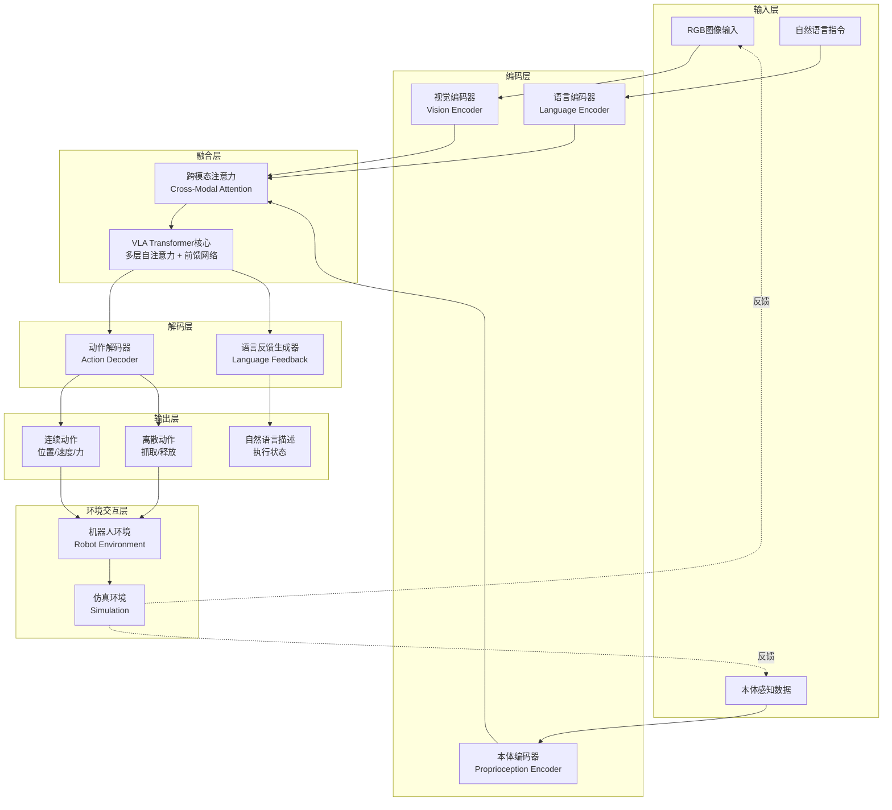
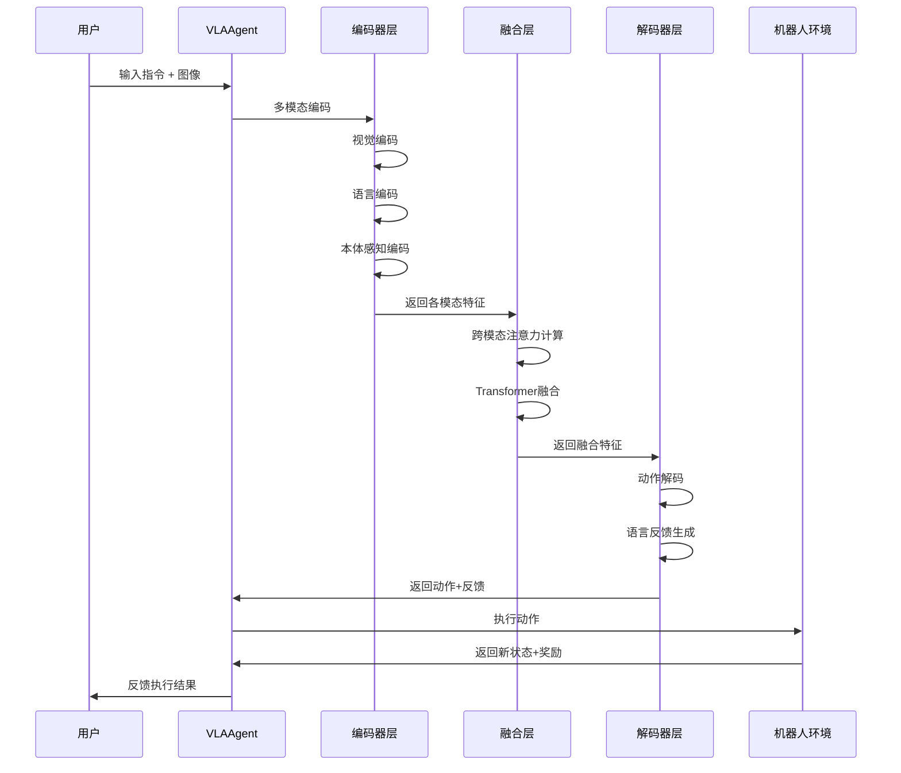

# TinyAI 视觉-语言-动作（VLA）具身智能模块设计文档

## 1. 概述

### 1.1 模块简介

`tinyai-agent-embodied-vla` 是 TinyAI 智能体系统层的高级具身智能模块，专注于实现基于**视觉-语言-动作（Vision-Language-Action, VLA）架构**的端到端具身智能系统。该模块通过融合视觉感知、自然语言理解和动作生成三大核心能力，构建能够理解指令、感知环境并执行复杂操作任务的智能体。

### 1.2 设计目标

- **多模态融合**：实现视觉、语言、动作三种模态的深度融合
- **端到端学习**：支持从原始感知输入直接到动作输出的端到端学习
- **指令理解**：能够理解自然语言指令并转化为具体动作序列
- **场景适应**：支持多种具身智能场景（机器人操作、导航、交互等）
- **模块复用**：充分复用 TinyAI 项目内部已有组件，减少外部依赖

### 1.3 核心特性

- 🎯 **统一架构**：VLA三模态统一建模，共享Transformer骨干网络
- 🧠 **语言引导**：自然语言指令引导视觉注意力和动作生成
- 👁️ **视觉理解**：深度图像特征提取与场景语义理解
- 🤖 **精准控制**：连续动作空间与离散动作空间统一建模
- 🔄 **闭环反馈**：执行结果反馈到感知层，形成完整闭环
- 📚 **零样本泛化**：支持通过语言指令完成未训练过的新任务

### 1.4 与现有模块的关系

本模块在 `tinyai-agent-embodied` 基础上进行扩展：

| 对比维度 | tinyai-agent-embodied | tinyai-agent-embodied-vla |
|---------|----------------------|--------------------------|
| 核心架构 | 感知-决策-执行分离 | 视觉-语言-动作统一融合 |
| 输入模态 | 传感器数据（数值） | 图像 + 自然语言指令 |
| 决策方式 | 策略网络 + 规则约束 | Transformer端到端推理 |
| 输出形式 | 结构化动作参数 | 动作序列 + 自然语言反馈 |
| 应用场景 | 自动驾驶 | 机器人操作、人机协作 |

## 2. 技术架构

### 2.1 系统整体架构



### 2.2 分层架构设计

```
┌─────────────────────────────────────────────────────────────┐
│                     VLA智能体核心层                           │
│  ┌──────────────┬──────────────┬──────────────┬───────────┐ │
│  │ VLA编码器     │ 跨模态融合    │ VLA解码器     │ 学习引擎   │ │
│  └──────────────┴──────────────┴──────────────┴───────────┘ │
└─────────────────────────────────────────────────────────────┘
                              ↕
┌─────────────────────────────────────────────────────────────┐
│                     模态处理层                                │
│  ┌──────────────┬──────────────┬──────────────┐             │
│  │ 视觉处理      │ 语言处理      │ 动作处理      │             │
│  └──────────────┴──────────────┴──────────────┘             │
└─────────────────────────────────────────────────────────────┘
                              ↕
┌─────────────────────────────────────────────────────────────┐
│                     环境仿真层                                │
│  ┌──────────────┬──────────────┬──────────────┐             │
│  │ 机器人环境    │ 操作任务      │ 场景管理      │             │
│  └──────────────┴──────────────┴──────────────┘             │
└─────────────────────────────────────────────────────────────┘
                              ↕
┌─────────────────────────────────────────────────────────────┐
│                  TinyAI 核心模块层                            │
│  ┌──────────┬──────────┬──────────┬──────────┬───────────┐  │
│  │ NdArray  │ AutoGrad │ NeuralNet│ GPT模型   │ RL模块    │  │
│  └──────────┴──────────┴──────────┴──────────┴───────────┘  │
└─────────────────────────────────────────────────────────────┘
```

### 2.3 核心模块职责

| 模块 | 主要职责 | 依赖组件 |
|-----|---------|---------|
| **VLAEncoder** | 多模态输入编码与特征提取 | GPT Transformer、NdArray |
| **CrossModalFusion** | 视觉-语言-本体感知特征融合 | Attention机制、Layer Norm |
| **VLADecoder** | 动作序列生成与语言反馈 | Transformer Decoder、MLP |
| **VisionProcessor** | 图像预处理与卷积特征提取 | NdArray、卷积神经网络 |
| **LanguageProcessor** | 文本编码与语义理解 | GPT Tokenizer、Embedding |
| **ActionExecutor** | 动作执行与环境交互 | Robot Environment API |
| **RobotEnvironment** | 机器人仿真环境 | 物理引擎抽象、奖励函数 |
| **VLALearningEngine** | 端到端训练与策略优化 | RL模块、AutoGrad |

## 3. 核心组件设计

### 3.1 数据模型层

#### 3.1.1 多模态输入表示

**VisionInput - 视觉输入**

| 字段 | 类型 | 说明 | 维度 |
|-----|------|------|-----|
| rgbImage | NdArray | RGB图像 | [H, W, 3] |
| depthImage | NdArray | 深度图（可选） | [H, W, 1] |
| imageFeatures | NdArray | 视觉编码特征 | [196, 768] |
| objectMasks | NdArray | 目标分割掩码 | [N, H, W] |
| timestamp | long | 采集时间戳 | - |

**LanguageInput - 语言输入**

| 字段 | 类型 | 说明 | 维度 |
|-----|------|------|-----|
| instruction | String | 自然语言指令 | - |
| tokenIds | NdArray | Token ID序列 | [seq_len] |
| attentionMask | NdArray | 注意力掩码 | [seq_len] |
| embeddings | NdArray | 文本嵌入向量 | [seq_len, 768] |

**ProprioceptionInput - 本体感知输入**

| 字段 | 类型 | 说明 | 维度 |
|-----|------|------|-----|
| jointPositions | NdArray | 关节位置 | [n_joints] |
| jointVelocities | NdArray | 关节速度 | [n_joints] |
| endEffectorPose | NdArray | 末端执行器姿态 | [7] (位置+四元数) |
| gripperState | double | 夹爪状态 | [1] |

#### 3.1.2 统一状态表示

**VLAState - VLA统一状态**

| 字段 | 类型 | 说明 |
|-----|------|------|
| visionInput | VisionInput | 视觉模态输入 |
| languageInput | LanguageInput | 语言模态输入 |
| proprioceptionInput | ProprioceptionInput | 本体感知输入 |
| fusedFeatures | NdArray | 融合后的多模态特征 |
| attentionWeights | Map<String, NdArray> | 各模态注意力权重 |
| timestamp | long | 状态时间戳 |

#### 3.1.3 动作空间定义

**VLAAction - VLA动作表示**

| 字段 | 类型 | 说明 | 取值范围 |
|-----|------|------|---------|
| continuousAction | NdArray | 连续动作向量 | 具体任务定义 |
| discreteAction | int | 离散动作索引 | [0, num_actions) |
| actionType | ActionType | 动作类型枚举 | MOVE/GRASP/RELEASE |
| confidence | double | 动作置信度 | [0.0, 1.0] |
| languageFeedback | String | 自然语言反馈 | - |

**ActionType - 动作类型枚举**

```
MOVE_END_EFFECTOR    // 移动末端执行器
ROTATE_JOINTS        // 旋转关节
GRASP_OBJECT         // 抓取物体
RELEASE_OBJECT       // 释放物体
NAVIGATE_TO_TARGET   // 导航到目标点
WAIT                 // 等待
SPEAK                // 语言输出
```

### 3.2 视觉-语言-动作编码器

#### 3.2.1 视觉编码器架构

**VisionEncoder - 基于卷积神经网络与视觉Transformer**

**架构流程**：

```
输入图像 [H, W, 3]
    ↓
卷积特征提取（ResNet-style）
    ├─ Conv2D (3→64, kernel=7, stride=2)
    ├─ MaxPool (kernel=3, stride=2)
    ├─ ResBlock × 4 (64→128)
    ├─ ResBlock × 4 (128→256)
    └─ ResBlock × 4 (256→512)
    ↓
空间特征图 [H/32, W/32, 512]
    ↓
位置编码注入
    ↓
Flatten + Linear投影
    ↓
视觉Token序列 [196, 768]
```

**核心特征**：
- 分层特征提取，保留空间结构信息
- 2D位置编码，建模空间关系
- 输出维度与语言编码器对齐，便于跨模态融合

#### 3.2.2 语言编码器架构

**LanguageEncoder - 基于GPT Transformer**

**架构流程**：

```
自然语言指令
    ↓
Tokenization（BPE/WordPiece）
    ↓
Token Embedding [seq_len, 768]
    ↓
位置编码（正弦/学习式）
    ↓
Transformer编码器 × 6层
    ├─ Multi-Head Self-Attention
    ├─ Layer Normalization
    ├─ Feed-Forward Network
    └─ Residual Connection
    ↓
语言Token序列 [seq_len, 768]
    ↓
指令嵌入向量（取[CLS] token或mean pooling）
```

**复用策略**：
- 直接复用 `tinyai-model-gpt` 中的 GPT Transformer Block
- 复用 Tokenizer 与 Embedding 层
- 可选预训练权重加载机制

#### 3.2.3 本体感知编码器

**ProprioceptionEncoder - MLP编码器**

**架构流程**：

```
关节状态向量 [n_joints * 2]
    ↓
Linear Layer (input_dim → 256)
    ↓
Layer Norm + ReLU
    ↓
Linear Layer (256 → 512)
    ↓
Layer Norm + ReLU
    ↓
Linear Layer (512 → 768)
    ↓
本体感知嵌入 [1, 768]
```

### 3.3 跨模态融合层

#### 3.3.1 跨模态注意力机制

**CrossModalAttention - 三模态融合**

**注意力计算流程**：

```
Query: 语言特征 [seq_len_lang, 768]
Key:   [视觉特征; 本体特征] [196+1, 768]
Value: [视觉特征; 本体特征] [196+1, 768]

Attention(Q, K, V) = softmax(QK^T / √d_k) V

输出: 语言引导的多模态特征 [seq_len_lang, 768]
```

**注意力类型**：

| 注意力类型 | Query来源 | Key/Value来源 | 作用 |
|-----------|---------|--------------|------|
| Vision-to-Language | 语言Token | 视觉Token | 语言理解视觉场景 |
| Language-to-Vision | 视觉Token | 语言Token | 视觉关注语言指令 |
| Proprioception-to-All | 所有模态 | 本体感知 | 当前状态全局感知 |

#### 3.3.2 统一Transformer主干

**VLATransformerCore - 多层融合Transformer**

**网络结构**：

```
输入: 拼接的多模态Token序列
[语言Token; 视觉Token; 本体Token]
    ↓
Transformer Layer × 12
    ├─ Multi-Head Self-Attention (全局注意力)
    ├─ Cross-Modal Attention (跨模态注意力)
    ├─ Feed-Forward Network (2048→768)
    └─ Layer Norm + Residual
    ↓
融合特征表示 [total_seq_len, 768]
```

**关键设计**：
- 全局自注意力：所有模态Token可以互相关注
- 位置无关性：通过学习的模态嵌入区分不同来源
- 深层融合：多层交互确保充分的信息交换

### 3.4 动作解码器

#### 3.4.1 动作头设计

**ActionDecoder - 多头输出架构**

```
融合特征 [total_seq_len, 768]
    ↓
特征聚合（取最后一个Token或Attention Pooling）
    ↓
    ├─ 连续动作头
    │   └─ MLP (768→512→256→action_dim)
    │       └─ Tanh激活（归一化到[-1, 1]）
    │
    ├─ 离散动作头
    │   └─ Linear (768→num_discrete_actions)
    │       └─ Softmax
    │
    └─ 语言反馈头
        └─ Transformer Decoder (生成式)
            └─ 文本序列输出
```

**输出维度示例**（机器人操作任务）：

| 输出类型 | 维度 | 说明 |
|---------|-----|------|
| 末端执行器位置增量 | 3 | (Δx, Δy, Δz) |
| 末端执行器旋转增量 | 3 | (Δroll, Δpitch, Δyaw) |
| 夹爪开合度 | 1 | [0, 1] |
| 离散动作分类 | 8 | 8种基础动作类型 |

#### 3.4.2 动作序列生成

**支持自回归动作生成**：

```
初始状态 s_0
    ↓
编码器输出融合特征 h
    ↓
for t in range(T):
    a_t = Decoder(h, a_{t-1}, ...)
    执行动作 a_t
    观察新状态 s_{t+1}
    更新融合特征 h（可选）
```

### 3.5 环境仿真层

#### 3.5.1 机器人环境接口

**RobotEnvironment - 统一环境接口**

**核心方法**：

```
reset() → VLAState
    重置环境到初始状态，返回初始观测

step(VLAAction) → (VLAState, reward, done, info)
    执行动作，返回新状态、奖励、终止标志和额外信息

render() → Image
    渲染当前环境图像（用于可视化）

getActionSpace() → ActionSpaceSpec
    获取动作空间定义

getObservationSpace() → ObservationSpaceSpec
    获取观测空间定义

close()
    清理环境资源
```

#### 3.5.2 任务场景定义

**内置任务场景**：

| 任务类型 | 难度 | 描述 | 成功标准 |
|---------|------|------|---------|
| PickAndPlace | ⭐⭐ | 拾取物体并放置到目标位置 | 物体位于目标区域 |
| StackBlocks | ⭐⭐⭐ | 堆叠多个方块 | 方块按顺序堆叠 |
| OpenDrawer | ⭐⭐⭐ | 打开抽屉 | 抽屉打开角度>60° |
| PourWater | ⭐⭐⭐⭐ | 倒水任务 | 目标容器水量达标 |
| AssembleParts | ⭐⭐⭐⭐⭐ | 组装零件 | 零件正确组合 |

**场景配置示例**：

```
PickAndPlace任务:
    物体类型: 立方体/球体/圆柱体
    初始位置: 随机范围 [0.3, 0.6] × [−0.3, 0.3] × [0.0, 0.2]
    目标位置: 固定区域 [0.5, 0.5] × [0.0, 0.0] × [0.0, 0.0]
    语言指令样例:
        - "Pick up the red cube and place it in the box"
        - "Grab the blue ball and move it to the left"
        - "拿起红色方块放到篮子里"
```

### 3.6 学习引擎

#### 3.6.1 学习策略

**VLALearningEngine - 端到端学习**

**支持的学习范式**：

| 学习方式 | 说明 | 适用场景 |
|---------|------|---------|
| 行为克隆（BC） | 监督学习，模仿专家演示 | 有大量标注演示数据 |
| 强化学习（RL） | 通过奖励信号学习策略 | 可定义明确奖励函数 |
| 逆强化学习（IRL） | 从演示中学习奖励函数 | 奖励难以人工设计 |
| 混合学习 | BC预训练 + RL微调 | 实际应用推荐方式 |

#### 3.6.2 训练流程

**行为克隆训练流程**：

```
1. 数据收集
   - 收集专家演示轨迹 D = {(s_i, a_i, instruction_i)}
   - 数据增强（图像变换、指令改写）

2. 模型训练
   for epoch in range(num_epochs):
       for batch in DataLoader(D):
           vision_input = batch.images
           lang_input = batch.instructions
           target_actions = batch.actions
           
           # 前向传播
           predicted_actions = vla_model(vision_input, lang_input)
           
           # 计算损失
           loss = MSELoss(predicted_actions, target_actions)
           
           # 反向传播
           loss.backward()
           optimizer.step()

3. 评估与部署
   - 在验证集上评估成功率
   - 在真实环境中测试泛化能力
```

**强化学习训练流程**：

```
1. 环境交互
   for episode in range(num_episodes):
       state = env.reset()
       trajectory = []
       
       for step in range(max_steps):
           action = vla_model.predict(state)
           next_state, reward, done = env.step(action)
           trajectory.append((state, action, reward))
           
           if done:
               break
           state = next_state

2. 策略更新（PPO算法）
   - 计算优势函数 A(s, a)
   - 计算策略损失 L_policy
   - 计算价值损失 L_value
   - 梯度下降优化

3. 迭代优化
   - 定期评估策略性能
   - 调整超参数
   - 保存最佳模型
```

## 4. 关键算法实现

### 4.1 视觉特征提取算法

**残差卷积块（ResBlock）**

```
输入特征图 F_in [B, C_in, H, W]
    ↓
分支1（恒等映射）:
    F_identity = F_in
    
分支2（卷积变换）:
    F_conv = Conv2D(C_in → C_out, 3×3)(F_in)
    F_conv = BatchNorm(F_conv)
    F_conv = ReLU(F_conv)
    F_conv = Conv2D(C_out → C_out, 3×3)(F_conv)
    F_conv = BatchNorm(F_conv)
    
合并:
    F_out = ReLU(F_identity + F_conv)
```

**空间位置编码**

```
对于特征图上的每个位置 (i, j):

PE(i, j, 2k)   = sin(i / 10000^(2k/d))
PE(i, j, 2k+1) = cos(i / 10000^(2k/d))
PE(i, j, d/2+2k)   = sin(j / 10000^(2k/d))
PE(i, j, d/2+2k+1) = cos(j / 10000^(2k/d))

最终位置编码维度: [H, W, d]
```

### 4.2 跨模态注意力计算

**缩放点积注意力**

```
输入:
    Q: Query矩阵 [batch, n_heads, seq_len_q, d_k]
    K: Key矩阵   [batch, n_heads, seq_len_k, d_k]
    V: Value矩阵 [batch, n_heads, seq_len_v, d_v]

计算:
    # 1. 计算注意力分数
    scores = (Q @ K^T) / sqrt(d_k)
    # scores: [batch, n_heads, seq_len_q, seq_len_k]
    
    # 2. 应用掩码（可选）
    if mask is not None:
        scores = scores.masked_fill(mask == 0, -1e9)
    
    # 3. Softmax归一化
    attn_weights = softmax(scores, dim=-1)
    
    # 4. 加权求和
    output = attn_weights @ V
    # output: [batch, n_heads, seq_len_q, d_v]
    
返回: output, attn_weights
```

### 4.3 动作归一化与反归一化

**连续动作归一化**

```
给定动作空间范围:
    action_low  = [-1.0, -1.0, -1.0, 0.0]  # 最小值
    action_high = [1.0,  1.0,  1.0,  1.0]  # 最大值

原始动作 a_raw（模型输出，Tanh后范围[-1, 1]）

归一化到真实动作空间:
    a_real = action_low + (a_raw + 1) / 2 * (action_high - action_low)

反归一化（用于监督学习）:
    a_normalized = 2 * (a_real - action_low) / (action_high - action_low) - 1
```

### 4.4 奖励函数设计

**组合奖励设计（PickAndPlace任务）**

```
总奖励 R_total = Σ w_i · R_i

分项奖励:

1. 接近目标奖励
   R_reach = -distance(gripper, object)
   
2. 抓取成功奖励
   R_grasp = +10.0  如果抓取成功
             0.0    否则
   
3. 放置成功奖励
   R_place = +50.0  如果物体在目标区域
             0.0    否则
   
4. 动作平滑奖励
   R_smooth = -|a_t - a_{t-1}|
   
5. 碰撞惩罚
   R_collision = -20.0  如果发生碰撞
                  0.0   否则

权重配置:
    w_reach = 1.0
    w_grasp = 10.0
    w_place = 50.0
    w_smooth = 0.1
    w_collision = 20.0
```

## 5. 模块依赖与集成

### 5.1 内部模块依赖

| 依赖模块 | 使用组件 | 用途 |
|---------|---------|------|
| tinyai-deeplearning-ndarr | NdArray | 多维数组运算 |
| tinyai-deeplearning-func | Variable, AutoGrad | 自动微分与梯度计算 |
| tinyai-deeplearning-nnet | Linear, Conv2D, LayerNorm | 神经网络层 |
| tinyai-deeplearning-ml | Optimizer, LossFunction | 训练优化 |
| tinyai-deeplearning-rl | PolicyGradient, ValueNetwork | 强化学习算法 |
| tinyai-model-gpt | GPT Transformer, Attention | Transformer骨干网络 |
| tinyai-agent-embodied | VehicleDynamics, Environment接口 | 环境仿真参考 |

### 5.2 Maven依赖配置

```xml
<dependencies>
    <!-- TinyAI 深度学习核心模块 -->
    <dependency>
        <groupId>io.leavesfly.tinyai</groupId>
        <artifactId>tinyai-deeplearning-ndarr</artifactId>
    </dependency>
    
    <dependency>
        <groupId>io.leavesfly.tinyai</groupId>
        <artifactId>tinyai-deeplearning-func</artifactId>
    </dependency>
    
    <dependency>
        <groupId>io.leavesfly.tinyai</groupId>
        <artifactId>tinyai-deeplearning-nnet</artifactId>
    </dependency>
    
    <dependency>
        <groupId>io.leavesfly.tinyai</groupId>
        <artifactId>tinyai-deeplearning-ml</artifactId>
    </dependency>
    
    <dependency>
        <groupId>io.leavesfly.tinyai</groupId>
        <artifactId>tinyai-deeplearning-rl</artifactId>
    </dependency>
    
    <!-- TinyAI 模型层 -->
    <dependency>
        <groupId>io.leavesfly.tinyai</groupId>
        <artifactId>tinyai-model-gpt</artifactId>
    </dependency>
    
    <!-- 测试依赖 -->
    <dependency>
        <groupId>junit</groupId>
        <artifactId>junit</artifactId>
        <scope>test</scope>
    </dependency>
    
    <dependency>
        <groupId>org.junit.jupiter</groupId>
        <artifactId>junit-jupiter</artifactId>
        <scope>test</scope>
    </dependency>
</dependencies>
```

### 5.3 模块目录结构

```
tinyai-agent-embodied-vla/
├── src/
│   ├── main/
│   │   └── java/io/leavesfly/tinyai/agent/vla/
│   │       ├── VLAAgent.java                    # VLA智能体核心
│   │       ├── VLADemo.java                     # 演示程序
│   │       ├── encoder/                         # 编码器模块
│   │       │   ├── VisionEncoder.java           # 视觉编码器
│   │       │   ├── LanguageEncoder.java         # 语言编码器
│   │       │   └── ProprioceptionEncoder.java   # 本体感知编码器
│   │       ├── fusion/                          # 融合模块
│   │       │   ├── CrossModalAttention.java     # 跨模态注意力
│   │       │   └── VLATransformerCore.java      # Transformer核心
│   │       ├── decoder/                         # 解码器模块
│   │       │   ├── ActionDecoder.java           # 动作解码器
│   │       │   └── LanguageFeedbackGenerator.java # 语言反馈生成
│   │       ├── env/                             # 环境模块
│   │       │   ├── RobotEnvironment.java        # 机器人环境接口
│   │       │   ├── SimpleRobotEnv.java          # 简单机器人环境
│   │       │   └── TaskScenario.java            # 任务场景定义
│   │       ├── learning/                        # 学习模块
│   │       │   ├── VLALearningEngine.java       # 学习引擎
│   │       │   ├── BehaviorCloningLearner.java  # 行为克隆
│   │       │   └── RLLearner.java               # 强化学习
│   │       ├── model/                           # 数据模型
│   │       │   ├── VLAState.java                # VLA状态
│   │       │   ├── VLAAction.java               # VLA动作
│   │       │   ├── VisionInput.java             # 视觉输入
│   │       │   ├── LanguageInput.java           # 语言输入
│   │       │   ├── ProprioceptionInput.java     # 本体感知输入
│   │       │   └── TaskConfig.java              # 任务配置
│   │       └── utils/                           # 工具类
│   │           ├── ImageProcessor.java          # 图像处理
│   │           ├── Tokenizer.java               # 文本分词
│   │           └── ActionNormalizer.java        # 动作归一化
│   └── test/
│       └── java/io/leavesfly/tinyai/agent/vla/
│           ├── VLAAgentTest.java
│           ├── encoder/
│           ├── fusion/
│           └── decoder/
├── doc/
│   ├── 技术架构文档.md
│   └── 使用指南.md
├── README.md
└── pom.xml
```

## 6. 数据流与交互流程

### 6.1 完整推理流程



### 6.2 训练数据流

```
专家演示数据
    ├─ 图像序列: [T, H, W, 3]
    ├─ 语言指令: String
    ├─ 关节状态序列: [T, n_joints]
    └─ 动作序列: [T, action_dim]
    
    ↓ 数据预处理
    
训练Batch
    ├─ vision_batch: [B, T, H, W, 3]
    ├─ language_batch: [B, seq_len]
    ├─ proprio_batch: [B, T, n_joints]
    └─ action_batch: [B, T, action_dim]
    
    ↓ 前向传播
    
预测动作: [B, T, action_dim]
    
    ↓ 损失计算
    
Loss = MSE(predicted_actions, target_actions)
     + λ1 * L2_regularization
     + λ2 * action_smoothness_loss
     
    ↓ 反向传播
    
更新模型参数
```

### 6.3 环境交互循环

```
初始化:
    env = SimpleRobotEnv(task_config)
    agent = VLAAgent(model_config)
    instruction = "Pick up the red cube"

单个Episode:
    state = env.reset()
    done = False
    total_reward = 0
    
    while not done:
        # 1. 获取观测
        vision_input = state.vision
        proprio_input = state.proprioception
        
        # 2. 智能体决策
        action, feedback = agent.predict(
            vision_input, 
            instruction, 
            proprio_input
        )
        
        # 3. 执行动作
        next_state, reward, done, info = env.step(action)
        
        # 4. 记录与学习
        total_reward += reward
        agent.store_transition(state, action, reward, next_state)
        
        # 5. 状态更新
        state = next_state
        
    print(f"Episode finished: total_reward = {total_reward}")
```

## 7. 性能优化策略

### 7.1 计算效率优化

| 优化方向 | 具体措施 | 预期提升 |
|---------|---------|---------|
| 视觉编码加速 | 图像缓存、批量处理 | 30% |
| 注意力计算优化 | Flash Attention、稀疏注意力 | 50% |
| 模型剪枝 | 移除冗余层、知识蒸馏 | 40% |
| 批处理推理 | 动态Batch合并 | 2-3x |

### 7.2 内存优化

- **梯度检查点**：在Transformer层使用梯度检查点，减少50%显存
- **混合精度训练**：使用FP16/BF16，减少内存占用
- **动态图剪枝**：及时释放不需要的计算图节点
- **特征复用**：缓存不变的编码特征（如语言指令）

### 7.3 训练加速

- **课程学习**：从简单任务逐步增加难度
- **预训练迁移**：利用GPT预训练权重初始化
- **并行训练**：多环境并行采样数据
- **异步更新**：环境交互与模型更新异步进行

## 8. 扩展性设计

### 8.1 新模态接入

```
添加触觉传感器:

1. 定义触觉输入模型
   TactileInput:
       forceSensor: NdArray [n_sensors]
       pressureMap: NdArray [H, W]

2. 实现触觉编码器
   TactileEncoder extends Encoder:
       encode(TactileInput) → NdArray [seq_len, 768]

3. 注册到融合层
   CrossModalFusion.registerModality("tactile", tactileEncoder)
```

### 8.2 新任务场景

```
添加"倒水"任务:

1. 定义任务配置
   PourWaterTask extends TaskScenario:
       container: GameObject
       targetContainer: GameObject
       waterVolume: double

2. 实现奖励函数
   reward = w1 * (-distance_to_target)
          + w2 * (water_poured_correctly)
          - w3 * (water_spilled)

3. 场景注册
   TaskRegistry.register("pour_water", PourWaterTask.class)
```

### 8.3 新学习算法

```
添加离线强化学习:

1. 实现离线RL学习器
   OfflineRLLearner extends VLALearner:
       learnFromDataset(Dataset) → Policy

2. 数据集加载
   dataset = loadDemonstrations("expert_demos.h5")

3. 训练流程
   learner.train(dataset, num_epochs=100)
```

## 9. 测试策略

### 9.1 单元测试

| 测试模块 | 测试内容 | 覆盖目标 |
|---------|---------|---------|
| VisionEncoder | 特征维度、数值范围 | 100% |
| LanguageEncoder | Tokenization、Embedding | 100% |
| CrossModalAttention | 注意力权重归一化 | 100% |
| ActionDecoder | 动作范围、类型正确性 | 100% |
| RobotEnvironment | 状态转移、奖励计算 | 100% |

### 9.2 集成测试

- **端到端推理测试**：验证从输入到输出的完整流程
- **训练收敛测试**：验证简单任务能够成功学习
- **多任务泛化测试**：验证在多个任务上的表现
- **长时间稳定性测试**：验证连续运行不会内存泄漏

### 9.3 性能基准测试

| 指标 | 基准值 | 说明 |
|-----|--------|------|
| 推理延迟 | < 50ms | 单次动作预测时间 |
| 训练速度 | > 100 steps/s | 训练吞吐量 |
| 成功率（简单任务） | > 90% | PickAndPlace成功率 |
| 成功率（复杂任务） | > 60% | AssembleParts成功率 |

## 10. 应用场景

### 10.1 机器人操作

- **物体抓取与放置**：拾取任意物体并按指令放置
- **组装任务**：组装简单零件（乐高、家具）
- **工具使用**：使用工具完成任务（扳手、螺丝刀）

### 10.2 人机协作

- **辅助装配**：协助人类完成装配工作
- **物料搬运**：根据指令搬运物料
- **质量检查**：检查产品质量并反馈

### 10.3 服务机器人

- **家庭服务**：整理房间、收拾物品
- **餐饮服务**：端送餐饮、清理桌面
- **医疗辅助**：辅助医护人员完成简单操作

## 11. 技术亮点

### 11.1 创新点

- **统一多模态建模**：视觉、语言、动作在统一Transformer框架下建模
- **语言引导注意力**：自然语言指令动态调节视觉注意力权重
- **端到端优化**：从感知到动作的全链路可微分学习
- **零样本泛化**：通过语言指令组合完成未见过的新任务

### 11.2 工程优势

- **纯Java实现**：完全基于TinyAI生态，无外部依赖
- **模块化设计**：各组件松耦合，易于替换和扩展
- **高度可复用**：充分复用GPT、RL等已有模块
- **文档完善**：详细的设计文档与代码注释

### 11.3 教育价值

- **VLA架构理解**：深入理解前沿VLA模型原理
- **多模态学习**：掌握多模态融合技术
- **具身智能实践**：体验完整的具身智能开发流程
- **端到端学习**：理解端到端学习的优势与挑战
