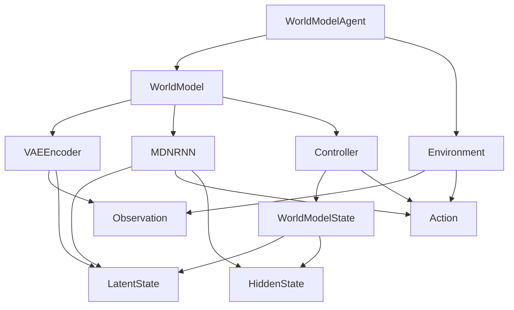

# TinyAI 世界模型具身智能模块 - 技术架构文档

## 1. 文档概述

本文档详细描述了 TinyAI 世界模型模块（`tinyai-agent-embodied-wm`）的技术架构、设计决策、核心算法和实现细节。

**文档版本**: v1.0  
**创建日期**: 2025-10-18  
**作者**: TinyAI团队

## 2. 项目背景与目标

### 2.1 世界模型简介

世界模型（World Model）是一种强大的深度强化学习方法，由David Ha和Jürgen Schmidhuber在2018年提出。其核心思想是：

> "智能体无需直接与环境交互，而是学习环境的内部表示（世界模型），然后在这个内部模型中进行训练和规划。"

### 2.2 核心优势

1. **样本效率高**：通过想象训练，大幅减少真实环境交互需求
2. **训练速度快**：内部模型运行速度远超真实物理仿真
3. **安全性好**：避免在真实环境中的危险探索
4. **可解释性强**：可以可视化智能体的"想象"过程

### 2.3 设计目标

- **完整性**：实现VAE、MDN-RNN、Controller三大核心组件
- **可复用**：充分利用TinyAI现有深度学习组件
- **可扩展**：支持不同环境和任务
- **教育性**：代码清晰，便于学习和理解

## 3. 系统整体架构

### 3.1 分层架构

```
┌─────────────────────────────────────────────────────┐
│              应用层（Application Layer）              │
│  ┌────────────────┬──────────────────────────────┐  │
│  │ WorldModelAgent│  WorldModelDemo              │  │
│  └────────────────┴──────────────────────────────┘  │
└─────────────────────────────────────────────────────┘
                         ↕
┌─────────────────────────────────────────────────────┐
│            世界模型层（World Model Layer）            │
│  ┌──────────┬────────────┬─────────────────────┐   │
│  │VAEEncoder│  MDNRNN    │  Controller         │   │
│  └──────────┴────────────┴─────────────────────┘   │
└─────────────────────────────────────────────────────┘
                         ↕
┌─────────────────────────────────────────────────────┐
│              环境层（Environment Layer）              │
│  ┌───────────────────────────────────────────────┐  │
│  │ SimpleDrivingEnvironment                      │  │
│  └───────────────────────────────────────────────┘  │
└─────────────────────────────────────────────────────┘
                         ↕
┌─────────────────────────────────────────────────────┐
│         TinyAI 深度学习核心层（DL Modules）          │
│  ┌────────────┬───────────┬────────────┬─────────┐ │
│  │ NdArray    │ Variable  │ Block      │ Model   │ │
│  └────────────┴───────────┴────────────┴─────────┘ │
└─────────────────────────────────────────────────────┘
```

### 3.2 核心模块关系



## 4. 核心组件设计

### 4.1 数据模型层

#### 4.1.1 观察（Observation）

**设计目的**：封装环境的原始观察数据

**核心字段**：
```java
public class Observation {
    private final NdArray visualObservation;  // 视觉数据 [C, H, W]
    private final NdArray stateVector;        // 状态向量 [stateSize]
    private final long timestamp;             // 时间戳
}
```

**关键方法**：
- `getVisualShape()`: 获取视觉数据维度
- `getStateSize()`: 获取状态向量维度
- `copy()`: 深拷贝

#### 4.1.2 动作（Action）

**设计目的**：统一表示连续和离散动作

**核心字段**：
```java
public class Action {
    private final NdArray actionVector;    // 动作向量
    private final ActionType actionType;   // 动作类型
    private final long timestamp;          // 时间戳
}
```

**工厂方法**：
```java
// 创建连续动作
Action.createContinuous(0.5, -0.3, 0.8);

// 创建离散动作
Action.createDiscrete(2, 5);  // 选择第2个动作，共5个
```

#### 4.1.3 潜在状态（LatentState）

**设计目的**：表示VAE编码后的压缩表示

**核心字段**：
```java
public class LatentState {
    private final NdArray z;        // 潜在向量
    private final NdArray mu;       // 均值（VAE）
    private final NdArray logVar;   // 对数方差（VAE）
}
```

**关键算法**：
```java
// KL散度计算
public double calculateKLDivergence() {
    // KL(q||p) = -0.5 * Σ(1 + log(σ²) - μ² - σ²)
    NdArray kl = mu.multiply(mu).negate()
        .add(logVar.exp().negate())
        .add(logVar)
        .add(1.0);
    return -0.5 * kl.sum();
}
```

#### 4.1.4 隐藏状态（HiddenState）

**设计目的**：表示RNN的记忆状态

**核心字段**：
```java
public class HiddenState {
    private final NdArray h;    // 隐藏状态
    private final NdArray c;    // 细胞状态（LSTM专用）
}
```

**工厂方法**：
```java
// 创建零初始化状态
HiddenState.zeros(256, false);  // GRU
HiddenState.zeros(256, true);   // LSTM
```

### 4.2 VAE编码器

#### 4.2.1 架构设计

**编码器网络**：
```
Input(observationSize)
    ↓
Linear(observationSize, hiddenSize) + ReLU
    ↓
Linear(hiddenSize, hiddenSize) + ReLU
    ↓
分支：
├─ Linear(hiddenSize, latentSize) → μ
└─ Linear(hiddenSize, latentSize) → log(σ²)
```

**重参数化技巧**：
```java
// z = μ + σ * ε, ε ~ N(0,1)
NdArray sigma = logVar.multiply(0.5).exp();
NdArray epsilon = NdArray.randn(new int[]{latentSize});
NdArray z = mu.add(sigma.multiply(epsilon));
```

**解码器网络**：
```
Input(latentSize)
    ↓
Linear(latentSize, hiddenSize) + ReLU
    ↓
Linear(hiddenSize, hiddenSize) + ReLU
    ↓
Linear(hiddenSize, observationSize)
    ↓
Output(observationSize)
```

#### 4.2.2 损失函数

**总损失**：
```
L_VAE = L_recon + β * L_KL
```

**重建损失**（MSE）：
```java
NdArray diff = original.subtract(reconstructed);
double reconLoss = diff.multiply(diff).mean();
```

**KL散度**：
```java
double klLoss = latentState.calculateKLDivergence();
```

#### 4.2.3 训练流程

```java
// 1. 前向传播
EncoderOutput output = vae.forward(observation);
LatentState latent = output.getLatentState();
NdArray reconstructed = output.getReconstructed();

// 2. 计算损失
double loss = vae.calculateLoss(observation, output);

// 3. 反向传播（使用TinyAI自动微分）
// ...

// 4. 更新参数
// ...
```

### 4.3 MDN-RNN

#### 4.3.1 架构设计

**整体流程**：
```
[z_t; a_t] 
    ↓
Linear(latentSize+actionSize, hiddenSize)
    ↓
GRU(hiddenSize)
    ↓ h_{t+1}
MDN Output
    ↓
[π, μ, σ] (混合高斯参数)
```

**GRU单元**：
```java
// 重置门
r = σ(W_r * [input; h])

// 更新门
z = σ(W_z * [input; h])

// 候选隐藏状态
h_tilde = tanh(W * [input; r⊙h])

// 新隐藏状态
h_new = (1-z)⊙h + z⊙h_tilde
```

**MDN输出层**：
```java
// 混合权重（经过softmax）
π = softmax(W_π * h)

// 均值
μ = W_μ * h

// 标准差（经过exp确保为正）
σ = exp(W_σ * h)
```

#### 4.3.2 混合密度网络

**概率模型**：
```
p(z_{t+1}|z_t, a_t, h_t) = Σ_{i=1}^K π_i · N(z_{t+1}|μ_i, σ_i²)
```

**采样过程**：
```java
// 1. 根据混合权重选择分量
int k = sampleMixture(weights);

// 2. 从选定的高斯分布采样
NdArray mu_k = params.getMu(k);
NdArray sigma_k = params.getSigma(k);
NdArray epsilon = NdArray.randn(mu_k.getShape());
NdArray z = mu_k.add(sigma_k.multiply(epsilon));
```

#### 4.3.3 损失函数

**负对数似然**：
```java
// 计算混合概率密度
double totalProb = 0.0;
for (int i = 0; i < numMixtures; i++) {
    double weight = weights[i];
    double density = gaussianDensity(target, mu[i], sigma[i]);
    totalProb += weight * density;
}

// 负对数似然
double loss = -Math.log(totalProb + 1e-8);
```

**高斯密度**：
```java
// N(x|μ,σ²) = (1/√(2πσ²)) * exp(-||x-μ||²/(2σ²))
double exponent = -diff.multiply(diff).sum() / (2 * sigma * sigma);
double normalization = 1.0 / (sigma * Math.sqrt(2 * Math.PI));
return normalization * Math.exp(exponent);
```

### 4.4 控制器

#### 4.4.1 架构设计

**策略网络**：
```
[z; h] (latentSize + hiddenSize)
    ↓
Linear(inputSize, 64) + ReLU
    ↓
Linear(64, 32) + ReLU
    ↓
Linear(32, actionSize) + Tanh
    ↓
action ∈ [-1, 1]^actionSize
```

#### 4.4.2 探索策略

**确定性策略**：
```java
NdArray action = policyNetwork.forward(state);
```

**随机策略**（添加探索噪声）：
```java
NdArray action = policyNetwork.forward(state);
NdArray noise = NdArray.randn(action.getShape()).multiply(0.1);
action = action.add(noise).clip(-1.0, 1.0);
```

#### 4.4.3 优化算法

**CMA-ES（协方差矩阵自适应进化策略）**：

```
1. 初始化：
   - 均值 m ∈ ℝ^n
   - 协方差矩阵 C ∈ ℝ^{n×n}
   - 步长 σ

2. 迭代：
   for generation = 1 to G do
       // 生成种群
       for i = 1 to λ do
           x_i = m + σ · N(0, C)
       end
       
       // 评估适应度
       for i = 1 to λ do
           f_i = evaluate(x_i)
       end
       
       // 选择精英
       sort by fitness
       select top μ individuals
       
       // 更新分布
       m_new = Σ w_i · x_i
       C_new = update_covariance(...)
       σ_new = update_step_size(...)
   end
```

### 4.5 世界模型整合

#### 4.5.1 完整工作流程

```java
// 1. 重置
worldModel.reset();

// 2. 观察 -> 潜在状态
Observation obs = env.reset();
LatentState z = vae.encode(obs);

// 3. 循环交互
for (int t = 0; t < maxSteps; t++) {
    // 3.1 选择动作
    Action a = controller.selectAction(z, h);
    
    // 3.2 执行动作
    StepResult result = env.step(a);
    
    // 3.3 更新状态
    z_next = vae.encode(result.observation);
    
    // 3.4 更新记忆
    RNNOutput rnnOut = mdnRnn.forward(z, a, h);
    h_next = rnnOut.nextHidden;
    
    // 3.5 更新
    z = z_next;
    h = h_next;
}
```

#### 4.5.2 想象训练

```java
// 在内部模型中rollout
public Episode dreamRollout(WorldModelState initialState, int steps) {
    WorldModelState state = initialState.copy();
    Episode dreamEpisode = new Episode("dream");
    
    for (int t = 0; t < steps; t++) {
        // 1. 选择动作
        Action action = controller.selectAction(state);
        
        // 2. 预测下一状态（使用MDN-RNN）
        RNNOutput output = mdnRnn.forward(
            state.getLatentState(),
            action,
            state.getHiddenState()
        );
        
        // 3. 采样下一潜在状态
        LatentState nextLatent = mdnRnn.sample(output.getMdnParams());
        HiddenState nextHidden = output.getNextHidden();
        
        // 4. 计算想象奖励
        double reward = calculateImaginedReward(state, action, nextState);
        
        // 5. 记录转换
        dreamEpisode.addTransition(...);
        
        state = new WorldModelState(nextLatent, nextHidden);
    }
    
    return dreamEpisode;
}
```

## 5. 环境设计

### 5.1 环境接口

```java
public interface Environment {
    Observation reset();
    StepResult step(Action action);
    void close();
    int getActionSize();
    int getObservationSize();
}
```

### 5.2 简单驾驶环境

**状态空间**：
- 位置：(x, y)
- 速度：(vx, vy)
- 朝向：θ
- 目标：(target_x, target_y)

**动作空间**：
- 转向：[-1, 1]
- 油门：[-1, 1]
- 刹车：[0, 1]

**动力学模型**：
```java
// 更新朝向
theta += steering * 0.1;

// 更新速度
ax = (throttle - brake) * maxAcceleration * cos(theta);
ay = (throttle - brake) * maxAcceleration * sin(theta);
vx += ax * dt;
vy += ay * dt;

// 更新位置
x += vx * dt;
y += vy * dt;
```

**奖励函数**：
```java
// 距离奖励
distReward = -distance_to_target * 0.01;

// 速度奖励
speedReward = -abs(speed - target_speed) * 0.01;

// 动作惩罚
actionPenalty = -(abs(steering) + abs(throttle) + brake) * 0.001;

// 到达奖励
reachReward = (distance < 5.0) ? 100.0 : 0.0;

// 总奖励
totalReward = distReward + speedReward + actionPenalty + reachReward;
```

## 6. 训练流程

### 6.1 三阶段训练

**阶段一：训练VAE**
```java
// 收集观察数据
List<Observation> observations = collectObservations(1000);

// 训练VAE
for (int epoch = 0; epoch < 100; epoch++) {
    double totalLoss = 0.0;
    for (Observation obs : observations) {
        EncoderOutput output = vae.forward(obs);
        double loss = vae.calculateLoss(obs, output);
        vae.backward(loss);
        vae.update();
        totalLoss += loss;
    }
    System.out.println("Epoch " + epoch + ", Loss: " + totalLoss);
}
```

**阶段二：训练MDN-RNN**
```java
// 在潜在空间收集序列
List<Sequence> sequences = collectLatentSequences(100);

// 训练MDN-RNN
for (int epoch = 0; epoch < 50; epoch++) {
    double totalLoss = 0.0;
    for (Sequence seq : sequences) {
        for (int t = 0; t < seq.length() - 1; t++) {
            RNNOutput output = mdnRnn.forward(
                seq.getLatent(t),
                seq.getAction(t),
                seq.getHidden(t)
            );
            double loss = mdnRnn.calculateLoss(
                seq.getLatent(t + 1),
                output.getMdnParams()
            );
            mdnRnn.backward(loss);
            mdnRnn.update();
            totalLoss += loss;
        }
    }
    System.out.println("Epoch " + epoch + ", Loss: " + totalLoss);
}
```

**阶段三：训练控制器**
```java
// 在想象环境中训练（CMA-ES）
CMAESOptimizer optimizer = new CMAESOptimizer(paramSize);

for (int generation = 0; generation < 100; generation++) {
    // 生成种群
    List<NdArray> population = optimizer.samplePopulation();
    
    // 评估适应度
    double[] fitness = new double[population.size()];
    for (int i = 0; i < population.size(); i++) {
        controller.setParameters(population.get(i));
        Episode dreamEpisode = worldModel.dreamRollout(initialState, 100);
        fitness[i] = dreamEpisode.getTotalReward();
    }
    
    // 更新分布
    optimizer.update(fitness);
    
    System.out.println("Generation " + generation + 
                      ", Best Fitness: " + max(fitness));
}
```

### 6.2 端到端训练（可选）

也可以联合训练所有组件：

```java
for (int iteration = 0; iteration < 10000; iteration++) {
    // 1. 真实环境交互
    Episode realEpisode = agent.runEpisode(100);
    
    // 2. 更新VAE
    updateVAE(realEpisode);
    
    // 3. 更新MDN-RNN
    updateMDNRNN(realEpisode);
    
    // 4. 想象训练更新控制器
    Episode dreamEpisode = agent.trainInDream(100);
    updateController(dreamEpisode);
    
    // 5. 评估
    if (iteration % 100 == 0) {
        double avgReward = agent.evaluate(10);
        System.out.println("Iteration " + iteration + 
                          ", Avg Reward: " + avgReward);
    }
}
```

## 7. 性能优化

### 7.1 计算优化

**批处理**：
```java
// 批量编码
List<Observation> batch = ...;
List<LatentState> latents = vae.encodeBatch(batch);
```

**并行化**：
```java
// 并行评估控制器
ExecutorService executor = Executors.newFixedThreadPool(nThreads);
List<Future<Double>> futures = new ArrayList<>();

for (NdArray params : population) {
    futures.add(executor.submit(() -> {
        return evaluateFitness(params);
    }));
}
```

### 7.2 内存优化

**经验回放缓冲区**：
```java
public class ReplayBuffer {
    private final int capacity;
    private final Deque<Transition> buffer;
    
    public void add(Transition t) {
        if (buffer.size() >= capacity) {
            buffer.removeFirst();
        }
        buffer.addLast(t);
    }
    
    public List<Transition> sample(int batchSize) {
        // 随机采样
    }
}
```

## 8. 扩展与应用

### 8.1 支持新环境

实现Environment接口：
```java
public class CustomEnvironment implements Environment {
    @Override
    public Observation reset() {
        // 自定义重置逻辑
    }
    
    @Override
    public StepResult step(Action action) {
        // 自定义步进逻辑
    }
    
    // ...
}
```

### 8.2 自定义奖励函数

在环境中定义：
```java
protected double calculateReward(...) {
    // 自定义奖励计算
}
```

### 8.3 可视化

```java
// 可视化潜在空间
public void visualizeLatentSpace(List<LatentState> latents) {
    // 使用t-SNE降维到2D
    // 绘制散点图
}

// 可视化想象轨迹
public void visualizeDreamTrajectory(Episode dreamEpisode) {
    // 从潜在状态解码为观察
    // 生成视频或图像序列
}
```

## 9. 总结

本模块实现了完整的世界模型架构，包括：

1. **VAE编码器**：学习压缩的潜在表示
2. **MDN-RNN**：预测环境动态
3. **控制器**：基于内部表示做决策
4. **想象训练**：在内部模型中高效学习

核心优势：
- ✅ 样本效率高
- ✅ 训练速度快  
- ✅ 可扩展性强
- ✅ 代码清晰易懂

适用场景：
- 机器人控制
- 自动驾驶
- 游戏AI
- 任何需要高效强化学习的场景

---

**文档结束**
