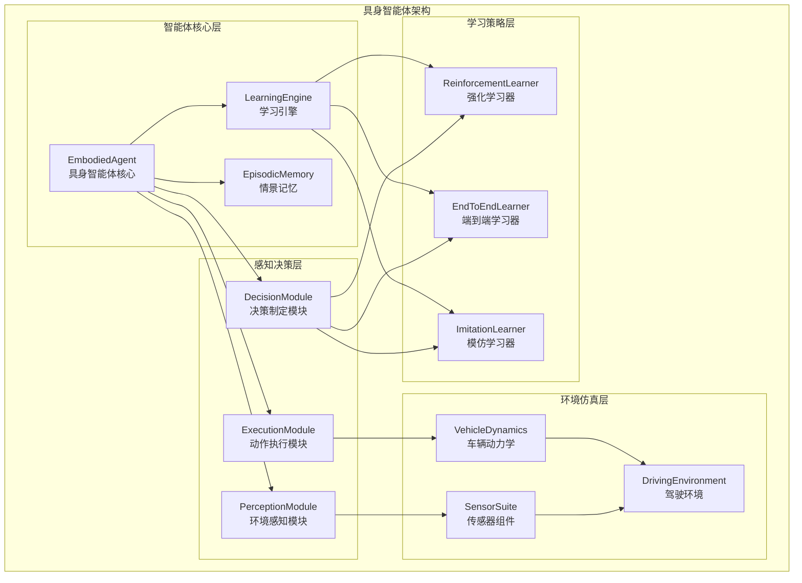
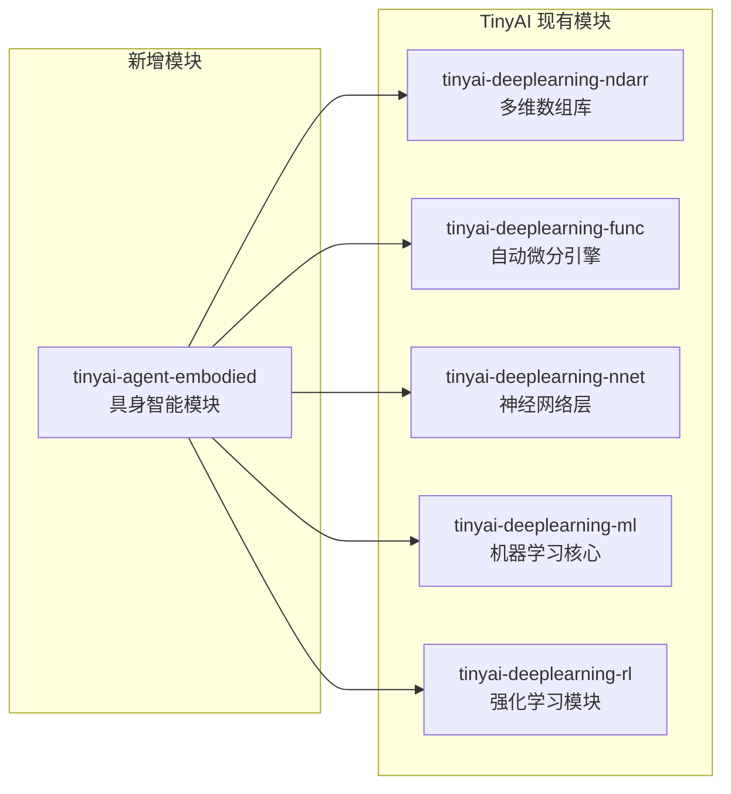
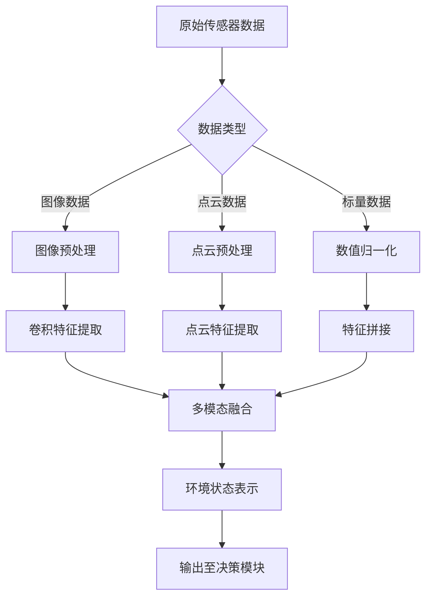
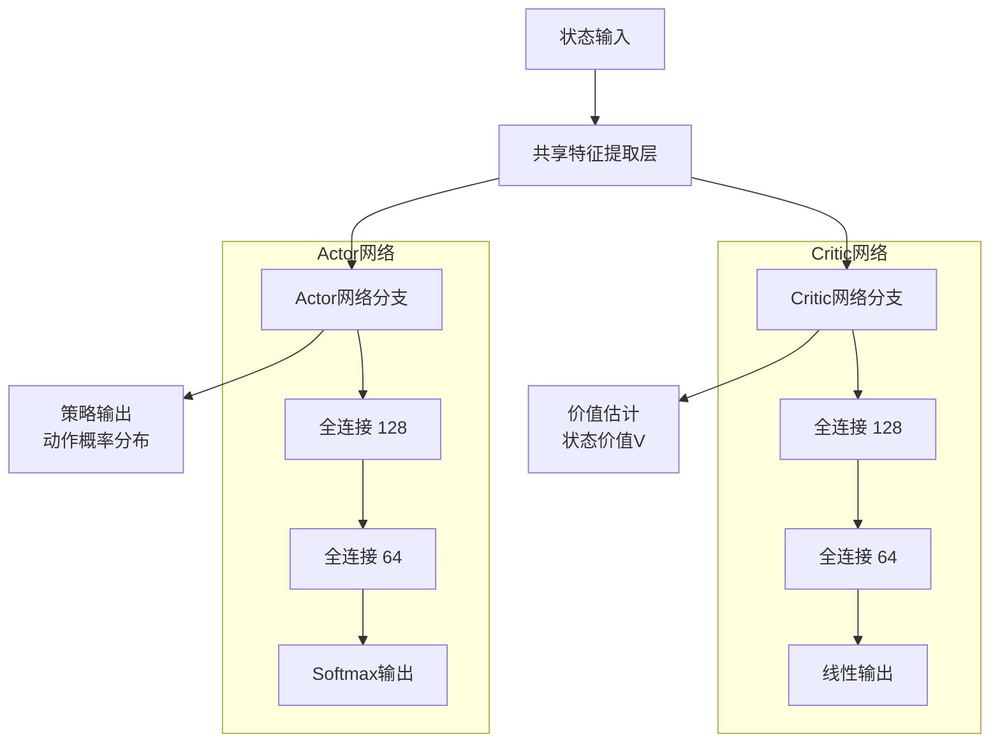
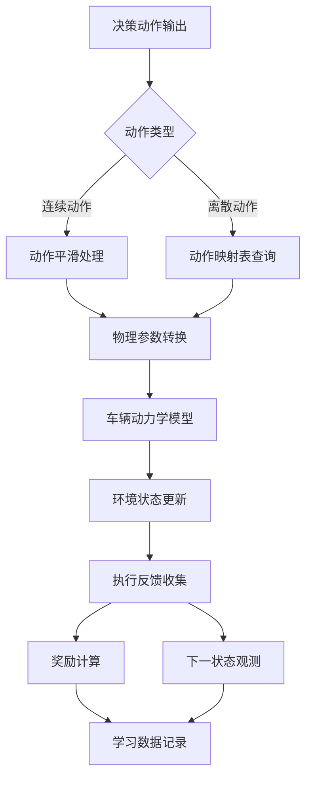
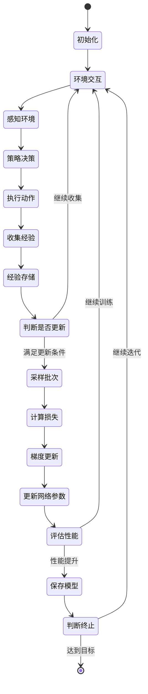
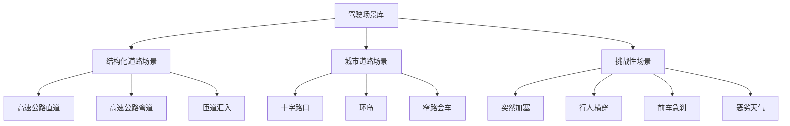
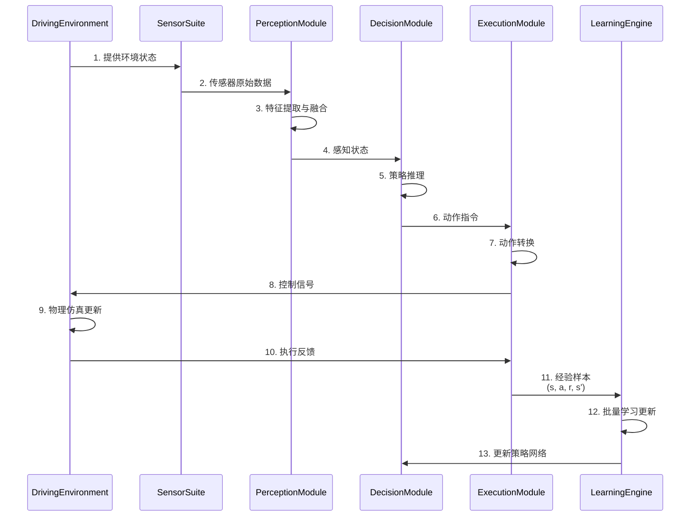
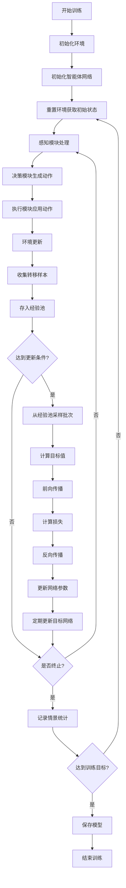
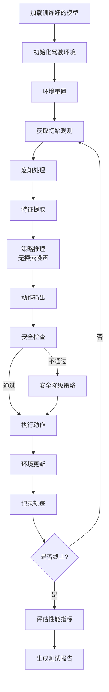

# TinyAI 具身智能模块设计文档

## 1. 项目概述

### 1.1 项目背景

具身智能（Embodied Intelligence）是人工智能领域的重要研究方向，强调智能体通过与物理环境的直接交互来感知、学习和决策。本模块以自动驾驶场景为典型应用案例，构建一个完整的具身智能体技术架构，展现端到端学习能力。

本模块将作为 TinyAI 智能体系统层的重要组成部分，复用项目现有的深度学习、神经网络和强化学习等核心组件，最小化第三方依赖，保持架构的一致性。

### 1.2 设计目标

- 🚗 构建基于自动驾驶场景的具身智能模拟系统
- 🧠 实现感知-决策-执行的完整闭环架构
- 🔄 展现端到端学习和持续适应能力
- 🔧 复用 TinyAI 现有组件（神经网络、强化学习、自动微分等）
- 📊 提供可扩展的环境模拟和传感器抽象
- 🎯 支持多种学习策略（强化学习、模仿学习、端到端学习）

### 1.3 应用场景

- **自动驾驶研究**：车辆控制策略学习、路径规划、障碍物规避
- **机器人控制**：具身智能体在虚拟环境中的学习和决策
- **教学演示**：展示具身智能的核心概念和技术架构
- **算法验证**：验证各类学习算法在具身任务中的有效性

## 2. 整体架构

### 2.1 系统架构概览



### 2.2 模块依赖关系



### 2.3 核心技术特点

- **模块化设计**：感知、决策、执行三大模块职责清晰、可独立扩展
- **学习策略可插拔**：支持多种学习算法，可根据场景灵活切换
- **传感器抽象**：统一的传感器接口，便于扩展新型传感器
- **环境可配置**：支持自定义道路、天气、交通等环境参数
- **记忆管理**：记录关键驾驶场景，支持经验回放和案例学习

## 3. 核心组件设计

### 3.1 环境感知模块（PerceptionModule）

#### 3.1.1 设计目标

环境感知模块负责从模拟环境中获取多源传感器数据，并进行预处理和特征提取，为决策模块提供结构化的环境表示。

#### 3.1.2 传感器体系

| 传感器类型 | 数据维度 | 输出内容 | 用途说明 |
|----------|---------|---------|---------|
| 相机传感器 | 3D图像数组 (H×W×C) | RGB图像帧 | 车道线检测、障碍物识别、交通标志识别 |
| 激光雷达 | 3D点云 (N×3) | 距离、角度、反射强度 | 障碍物距离测量、3D环境建模 |
| IMU惯性单元 | 6D向量 | 加速度、角速度 | 车辆姿态估计、运动状态感知 |
| GPS定位 | 2D坐标 | 经纬度坐标 | 全局定位、路径规划 |
| 速度传感器 | 标量 | 当前速度 | 速度控制、安全距离计算 |

#### 3.1.3 感知处理流程



#### 3.1.4 核心数据结构

**PerceptionState（感知状态）**

| 字段名称 | 数据类型 | 说明 |
|---------|---------|------|
| visualFeatures | NdArray | 视觉特征向量 |
| lidarFeatures | NdArray | 激光雷达特征 |
| vehicleState | NdArray | 车辆自身状态（速度、加速度、姿态） |
| obstacleMap | ObstacleInfo[] | 障碍物信息列表 |
| laneInfo | LaneGeometry | 车道几何信息 |
| timestamp | long | 时间戳 |

**ObstacleInfo（障碍物信息）**

| 字段名称 | 数据类型 | 说明 |
|---------|---------|------|
| objectType | ObstacleType | 障碍物类型（车辆、行人、静态物体） |
| position | Vector3D | 相对位置 |
| velocity | Vector3D | 相对速度 |
| boundingBox | BoundingBox | 包围盒尺寸 |
| confidence | double | 检测置信度 |

#### 3.1.5 特征提取策略

**图像特征提取**
- 利用卷积神经网络（复用 tinyai-deeplearning-nnet 的 ConvLayer）
- 多尺度特征金字塔提取
- 输出固定维度特征向量

**点云特征提取**
- 体素化处理点云数据
- 距离分布统计特征
- 关键点检测和描述

**多模态特征融合**
- 特征级融合：拼接不同模态特征
- 注意力机制：动态加权不同传感器信息
- 时序融合：结合历史帧信息

### 3.2 决策制定模块（DecisionModule）

#### 3.2.1 设计目标

决策模块接收感知模块输出的环境状态，基于学习策略生成驾驶行为决策，包括转向角度、油门/刹车控制等连续或离散动作。

#### 3.2.2 决策模式分类

| 决策模式 | 适用场景 | 技术特点 | 学习方式 |
|---------|---------|---------|---------|
| 端到端模式 | 结构化道路、低复杂度场景 | 感知到控制直接映射 | 监督学习、模仿学习 |
| 分层决策模式 | 复杂城市道路 | 路径规划+轨迹跟踪 | 强化学习、规划算法 |
| 混合模式 | 通用场景 | 结合规则和学习 | 多策略融合 |

#### 3.2.3 动作空间定义

**连续动作空间（用于端到端学习）**

| 动作维度 | 取值范围 | 物理意义 |
|---------|---------|---------|
| 转向角 | [-1.0, 1.0] | 方向盘转角（归一化） |
| 油门 | [0.0, 1.0] | 加速踏板深度 |
| 刹车 | [0.0, 1.0] | 刹车踏板深度 |

**离散动作空间（用于强化学习）**

| 动作编号 | 动作名称 | 转向 | 油门 | 刹车 |
|---------|---------|------|------|------|
| 0 | 直行加速 | 0 | 1.0 | 0 |
| 1 | 左转 | -0.5 | 0.5 | 0 |
| 2 | 右转 | 0.5 | 0.5 | 0 |
| 3 | 减速 | 0 | 0 | 0.5 |
| 4 | 急刹车 | 0 | 0 | 1.0 |
| 5 | 左转加速 | -0.3 | 0.8 | 0 |
| 6 | 右转加速 | 0.3 | 0.8 | 0 |

#### 3.2.4 决策网络架构

**端到端决策网络**

```mermaid
flowchart LR
    A[感知特征<br/>维度: 512] --> B[全连接层1<br/>256神经元]
    B --> C[ReLU激活]
    C --> D[全连接层2<br/>128神经元]
    D --> E[ReLU激活]
    E --> F[输出层<br/>3维动作]
    F --> G[Tanh激活<br/>归一化到[-1,1]]
    
    subgraph "网络结构"
        B
        C
        D
        E
        F
    end
```

**强化学习决策网络（Actor-Critic）**



#### 3.2.5 安全约束机制

- **速度限制**：根据道路限速约束动作输出
- **碰撞预测**：前瞻预测避免危险动作
- **舒适性约束**：限制急加速、急刹车、急转向
- **规则遵守**：强制遵守交通规则（红绿灯、禁行区等）

### 3.3 动作执行模块（ExecutionModule）

#### 3.3.1 设计目标

将决策模块输出的抽象动作指令转化为车辆动力学模型可接受的控制信号，并反馈给模拟环境执行，同时收集执行结果用于学习反馈。

#### 3.3.2 控制指令转换流程



#### 3.3.3 车辆动力学模型

采用简化的自行车模型（Bicycle Model）描述车辆运动：

**状态变量**

| 变量名称 | 符号 | 说明 |
|---------|------|------|
| 位置 x | x | 车辆质心 x 坐标 |
| 位置 y | y | 车辆质心 y 坐标 |
| 航向角 | θ | 车辆朝向角度 |
| 速度 | v | 车辆纵向速度 |

**控制输入**

| 输入名称 | 符号 | 说明 |
|---------|------|------|
| 转向角 | δ | 前轮转向角 |
| 加速度 | a | 纵向加速度 |

**动力学方程（离散化）**

- x(t+Δt) = x(t) + v(t) × cos(θ(t)) × Δt
- y(t+Δt) = y(t) + v(t) × sin(θ(t)) × Δt
- θ(t+Δt) = θ(t) + v(t) / L × tan(δ(t)) × Δt
- v(t+Δt) = v(t) + a(t) × Δt

其中 L 为车辆轴距，Δt 为时间步长。

#### 3.3.4 执行反馈机制

**反馈数据结构（ExecutionFeedback）**

| 字段名称 | 数据类型 | 说明 |
|---------|---------|------|
| success | boolean | 动作是否成功执行 |
| actualAction | NdArray | 实际执行的动作参数 |
| nextState | PerceptionState | 执行后的环境状态 |
| reward | double | 即时奖励值 |
| done | boolean | 是否到达终止状态 |
| info | Map<String, Object> | 附加调试信息 |

### 3.4 学习与适应机制（LearningEngine）

#### 3.4.1 设计目标

学习引擎是具身智能体的核心能力，通过与环境的持续交互，优化感知、决策模块的参数，提升驾驶策略的性能和安全性。

#### 3.4.2 学习策略矩阵

| 学习方式 | 数据需求 | 适用阶段 | 优势 | 挑战 |
|---------|---------|---------|------|------|
| 模仿学习 | 专家演示轨迹 | 初始化训练 | 快速获得基础能力 | 难以超越专家 |
| 强化学习 | 环境交互奖励 | 策略优化 | 可持续改进 | 训练效率低 |
| 端到端学习 | 感知-动作配对 | 全流程优化 | 简化架构 | 可解释性差 |
| 迁移学习 | 源域预训练模型 | 快速适应新场景 | 减少训练数据需求 | 域差异处理 |

#### 3.4.3 强化学习实现方案

**基于 DQN 的离散动作学习**

- 复用 tinyai-deeplearning-rl 的 DQNAgent
- 状态空间：感知模块输出的特征向量
- 动作空间：7 个离散驾驶动作
- 奖励函数：速度奖励 + 车道保持 - 碰撞惩罚

**基于 DDPG 的连续动作学习**

- 参考 tinyai-deeplearning-rl 的 Actor-Critic 架构扩展
- Actor 网络输出连续的转向、油门、刹车值
- Critic 网络评估状态-动作对的价值
- 经验回放机制提升样本利用率

#### 3.4.4 奖励函数设计

**组合奖励函数**

```
总奖励 R = w1 × R_speed + w2 × R_lane + w3 × R_collision + w4 × R_comfort

其中：
- R_speed：速度奖励，鼓励达到目标速度
  R_speed = 1 - |v - v_target| / v_max
  
- R_lane：车道保持奖励，鼓励保持在车道中心
  R_lane = exp(-lateral_deviation²)
  
- R_collision：碰撞惩罚
  R_collision = -100（发生碰撞时）
  R_collision = -10 × min_distance（距离过近时）
  
- R_comfort：舒适性奖励，惩罚急加速、急转向
  R_comfort = -|acceleration| - |jerk|
  
权重配置：
w1 = 0.3, w2 = 0.4, w3 = 1.0, w4 = 0.1
```

#### 3.4.5 学习流程设计



#### 3.4.6 情景记忆机制

**记忆存储结构（EpisodicMemory）**

| 字段名称 | 数据类型 | 说明 |
|---------|---------|------|
| episodeId | String | 情景唯一标识 |
| trajectory | List<Transition> | 完整轨迹序列 |
| totalReward | double | 累积奖励 |
| scenarioType | ScenarioType | 场景类型（高速、城市、乡村等） |
| criticalEvents | List<Event> | 关键事件列表 |
| learnedLessons | List<String> | 经验教训总结 |

**Transition（状态转移）**

| 字段名称 | 数据类型 | 说明 |
|---------|---------|------|
| state | PerceptionState | 当前状态 |
| action | NdArray | 执行动作 |
| reward | double | 即时奖励 |
| nextState | PerceptionState | 下一状态 |
| done | boolean | 是否终止 |

**记忆检索策略**

- **优先回放**：优先回放高奖励或高惩罚的关键情景
- **难度采样**：根据学习进度调整采样难度
- **多样性保证**：确保采样覆盖不同场景类型

## 4. 驾驶环境模拟

### 4.1 环境抽象设计

#### 4.1.1 环境接口规范

**DrivingEnvironment 接口**

| 方法名称 | 输入参数 | 输出结果 | 说明 |
|---------|---------|---------|------|
| reset() | 无 | PerceptionState | 重置环境到初始状态 |
| step(action) | NdArray action | StepResult | 执行动作，返回下一状态和奖励 |
| render() | 无 | 可视化数据 | 渲染当前环境状态（可选） |
| getObservation() | 无 | PerceptionState | 获取当前观测 |
| isTerminated() | 无 | boolean | 判断是否终止 |
| getSensorData() | SensorType | NdArray | 获取指定传感器数据 |

**StepResult 数据结构**

| 字段名称 | 数据类型 | 说明 |
|---------|---------|------|
| observation | PerceptionState | 执行后的观测 |
| reward | double | 即时奖励 |
| done | boolean | 是否终止 |
| info | Map<String, Object> | 附加信息 |

#### 4.1.2 场景配置参数

| 配置类别 | 参数名称 | 取值范围 | 说明 |
|---------|---------|---------|------|
| 道路参数 | 车道数量 | 1-6 | 单向车道数 |
| 道路参数 | 车道宽度 | 3.0-4.0米 | 每条车道宽度 |
| 道路参数 | 曲率半径 | 50-1000米 | 弯道曲率 |
| 交通参数 | 车辆密度 | 0-100辆/公里 | 环境车辆数量 |
| 交通参数 | 速度限制 | 30-120 km/h | 道路限速 |
| 天气参数 | 能见度 | 10-1000米 | 影响传感器精度 |
| 天气参数 | 路面摩擦系数 | 0.3-0.9 | 影响车辆动力学 |

### 4.2 场景库设计

#### 4.2.1 场景分类体系



#### 4.2.2 场景难度等级

| 难度等级 | 场景特点 | 训练阶段 | 示例场景 |
|---------|---------|---------|---------|
| Level 1 | 单车道、无障碍物、直道 | 初始训练 | 空旷高速公路 |
| Level 2 | 多车道、静态障碍物 | 基础能力 | 施工路段绕行 |
| Level 3 | 动态车辆、简单交互 | 进阶训练 | 高速公路跟车 |
| Level 4 | 复杂交互、交通规则 | 高级能力 | 城市路口通行 |
| Level 5 | 突发事件、极端情况 | 鲁棒性测试 | 紧急避障 |

### 4.3 物理仿真精度

#### 4.3.1 仿真层级

| 仿真层级 | 精度 | 计算成本 | 适用场景 |
|---------|------|---------|---------|
| 运动学仿真 | 低 | 低 | 策略学习、快速迭代 |
| 简化动力学 | 中 | 中 | 本模块采用方案 |
| 高保真动力学 | 高 | 高 | 最终验证、实车对比 |

#### 4.3.2 时间步长设置

- **控制频率**：20 Hz（每 50ms 一次决策）
- **仿真时间步**：10 ms（保证数值稳定性）
- **感知更新频率**：10 Hz（模拟真实传感器）

## 5. 数据流与交互

### 5.1 核心数据流



### 5.2 训练循环流程



### 5.3 推理部署流程



## 6. 技术实现策略

### 6.1 复用现有组件映射

| 功能需求 | 复用模块 | 具体组件 | 用途说明 |
|---------|---------|---------|---------|
| 多维数组运算 | tinyai-deeplearning-ndarr | NdArray | 存储状态、动作、奖励等数据 |
| 自动微分 | tinyai-deeplearning-func | Variable | 神经网络梯度计算 |
| 神经网络层 | tinyai-deeplearning-nnet | ConvLayer、AffineLayer、ReLuLayer | 构建感知和决策网络 |
| 模型管理 | tinyai-deeplearning-ml | Model、Trainer | 网络训练和管理 |
| 强化学习 | tinyai-deeplearning-rl | DQNAgent、Experience、ReplayBuffer | 强化学习算法实现 |

### 6.2 新增组件清单

**核心类文件**

| 类名 | 包路径 | 职责说明 |
|-----|--------|---------|
| EmbodiedAgent | io.leavesfly.tinyai.agent.embodied | 具身智能体主控制器 |
| PerceptionModule | io.leavesfly.tinyai.agent.embodied.perception | 环境感知核心 |
| DecisionModule | io.leavesfly.tinyai.agent.embodied.decision | 决策制定核心 |
| ExecutionModule | io.leavesfly.tinyai.agent.embodied.execution | 动作执行核心 |
| LearningEngine | io.leavesfly.tinyai.agent.embodied.learning | 学习引擎 |
| DrivingEnvironment | io.leavesfly.tinyai.agent.embodied.env | 驾驶环境接口 |
| SimpleDrivingEnv | io.leavesfly.tinyai.agent.embodied.env.impl | 简化驾驶环境实现 |
| VehicleDynamics | io.leavesfly.tinyai.agent.embodied.dynamics | 车辆动力学模型 |
| SensorSuite | io.leavesfly.tinyai.agent.embodied.sensor | 传感器组件集合 |
| EpisodicMemory | io.leavesfly.tinyai.agent.embodied.memory | 情景记忆管理 |

**数据模型类**

| 类名 | 包路径 | 职责说明 |
|-----|--------|---------|
| PerceptionState | io.leavesfly.tinyai.agent.embodied.model | 感知状态 |
| ObstacleInfo | io.leavesfly.tinyai.agent.embodied.model | 障碍物信息 |
| VehicleState | io.leavesfly.tinyai.agent.embodied.model | 车辆状态 |
| DrivingAction | io.leavesfly.tinyai.agent.embodied.model | 驾驶动作 |
| StepResult | io.leavesfly.tinyai.agent.embodied.model | 环境步进结果 |
| ExecutionFeedback | io.leavesfly.tinyai.agent.embodied.model | 执行反馈 |
| Transition | io.leavesfly.tinyai.agent.embodied.model | 状态转移 |
| Episode | io.leavesfly.tinyai.agent.embodied.model | 完整情景 |

**枚举类型**

| 枚举名 | 包路径 | 说明 |
|-------|--------|------|
| SensorType | io.leavesfly.tinyai.agent.embodied.sensor | 传感器类型枚举 |
| ObstacleType | io.leavesfly.tinyai.agent.embodied.model | 障碍物类型枚举 |
| ScenarioType | io.leavesfly.tinyai.agent.embodied.env | 场景类型枚举 |
| LearningStrategy | io.leavesfly.tinyai.agent.embodied.learning | 学习策略枚举 |
| SafetyLevel | io.leavesfly.tinyai.agent.embodied | 安全等级枚举 |

### 6.3 目录结构规范

```
tinyai-agent-embodied/
├── src/
│   ├── main/
│   │   └── java/
│   │       └── io/leavesfly/tinyai/agent/embodied/
│   │           ├── EmbodiedAgent.java
│   │           ├── perception/
│   │           │   ├── PerceptionModule.java
│   │           │   ├── FeatureExtractor.java
│   │           │   └── MultiModalFusion.java
│   │           ├── decision/
│   │           │   ├── DecisionModule.java
│   │           │   ├── EndToEndPolicy.java
│   │           │   └── SafetyConstraint.java
│   │           ├── execution/
│   │           │   ├── ExecutionModule.java
│   │           │   └── ActionConverter.java
│   │           ├── learning/
│   │           │   ├── LearningEngine.java
│   │           │   ├── DQNLearner.java
│   │           │   ├── E2ELearner.java
│   │           │   └── ImitationLearner.java
│   │           ├── env/
│   │           │   ├── DrivingEnvironment.java
│   │           │   ├── impl/
│   │           │   │   ├── SimpleDrivingEnv.java
│   │           │   │   └── ScenarioLoader.java
│   │           │   └── scenario/
│   │           │       ├── HighwayScenario.java
│   │           │       └── UrbanScenario.java
│   │           ├── dynamics/
│   │           │   ├── VehicleDynamics.java
│   │           │   └── BicycleModel.java
│   │           ├── sensor/
│   │           │   ├── SensorSuite.java
│   │           │   ├── CameraSensor.java
│   │           │   ├── LidarSensor.java
│   │           │   └── IMUSensor.java
│   │           ├── memory/
│   │           │   ├── EpisodicMemory.java
│   │           │   └── PriorityReplayBuffer.java
│   │           └── model/
│   │               ├── PerceptionState.java
│   │               ├── DrivingAction.java
│   │               ├── StepResult.java
│   │               └── ... (其他数据模型)
│   └── test/
│       └── java/
│           └── io/leavesfly/tinyai/agent/embodied/
│               ├── EmbodiedAgentTest.java
│               ├── PerceptionModuleTest.java
│               ├── DecisionModuleTest.java
│               ├── DrivingEnvironmentTest.java
│               └── IntegrationTest.java
├── doc/
│   ├── 技术架构文档.md
│   ├── 使用指南.md
│   └── API参考文档.md
├── README.md
└── pom.xml
```

## 7. 关键算法说明

### 7.1 感知特征融合算法

**目标**：将多源异构传感器数据融合为统一的环境表示。

**输入**
- 图像特征向量：维度 256
- 激光雷达特征：维度 128
- 车辆状态向量：维度 6

**输出**
- 融合特征向量：维度 512

**融合策略**
1. **特征对齐**：将不同维度特征投影到统一空间
2. **注意力加权**：根据当前场景动态调整各模态权重
3. **拼接融合**：将加权后的特征拼接形成最终表示

**伪代码描述**
```
函数 multiModalFusion(imageFeature, lidarFeature, vehicleState):
    // 特征投影
    imageProjected = 全连接层(imageFeature, 输出维度=256)
    lidarProjected = 全连接层(lidarFeature, 输出维度=128)
    vehicleProjected = 全连接层(vehicleState, 输出维度=128)
    
    // 计算注意力权重
    attentionScores = softmax([imageScore, lidarScore, vehicleScore])
    
    // 加权特征
    imageWeighted = imageProjected * attentionScores[0]
    lidarWeighted = lidarProjected * attentionScores[1]
    vehicleWeighted = vehicleProjected * attentionScores[2]
    
    // 拼接
    fusedFeature = 拼接(imageWeighted, lidarWeighted, vehicleWeighted)
    
    返回 fusedFeature
```

### 7.2 强化学习更新算法

**目标**：基于经验回放优化决策策略网络。

**输入**
- 经验批次：(s, a, r, s', done)
- 当前 Q 网络
- 目标 Q 网络

**输出**
- 更新后的 Q 网络参数

**算法描述**

```
函数 updateDQN(experienceBatch, qNetwork, targetNetwork, gamma, learningRate):
    对于 批次中的每个转移 (s, a, r, s', done):
        // 计算目标 Q 值
        如果 done:
            targetQ = r
        否则:
            targetQ = r + gamma * max(targetNetwork(s'))
        
        // 计算当前 Q 值
        currentQ = qNetwork(s)[a]
        
        // 计算损失
        loss += (targetQ - currentQ)²
    
    // 梯度下降更新
    梯度 = 反向传播(loss)
    qNetwork.参数 -= learningRate * 梯度
    
    返回 qNetwork
```

### 7.3 安全约束检查算法

**目标**：验证决策动作的安全性，必要时修正为安全动作。

**输入**
- 原始动作：(转向, 油门, 刹车)
- 当前状态：车辆位置、速度、周边障碍物

**输出**
- 安全动作

**检查规则**

```
函数 safetyCheck(action, currentState):
    安全动作 = action
    
    // 规则1: 碰撞预测
    预测轨迹 = 模拟未来 N 步(安全动作, currentState)
    如果 存在碰撞(预测轨迹):
        安全动作.油门 = 0
        安全动作.刹车 = 1.0
    
    // 规则2: 速度限制
    如果 currentState.速度 > 速度限制:
        安全动作.油门 = 0
        安全动作.刹车 = min(1.0, (速度 - 限制) / 10)
    
    // 规则3: 车道边界
    如果 预测偏离车道(安全动作):
        安全动作.转向 = 修正转向角
    
    // 规则4: 舒适性约束
    安全动作.转向 = clip(安全动作.转向, -最大转向角, +最大转向角)
    
    返回 安全动作
```

## 8. 评估与验证

### 8.1 性能评估指标

#### 8.1.1 任务完成指标

| 指标名称 | 计算方法 | 目标值 | 说明 |
|---------|---------|-------|------|
| 完成率 | 成功到达终点次数 / 总次数 | >90% | 基础能力指标 |
| 平均速度 | 总行驶距离 / 总时间 | 接近限速 80% | 效率指标 |
| 碰撞次数 | 统计碰撞事件 | 0 | 安全性指标 |
| 车道偏离率 | 偏离车道时间 / 总时间 | <5% | 控制精度指标 |

#### 8.1.2 学习效率指标

| 指标名称 | 计算方法 | 说明 |
|---------|---------|------|
| 样本效率 | 达到目标性能所需交互步数 | 越少越好 |
| 收敛速度 | 奖励曲线达到稳定的轮次 | 越快越好 |
| 泛化能力 | 在未见场景上的性能 | 迁移能力 |

#### 8.1.3 舒适性指标

| 指标名称 | 计算方法 | 阈值 | 说明 |
|---------|---------|------|------|
| 平均加速度 | mean(abs(acceleration)) | <2 m/s² | 乘坐舒适性 |
| 加加速度（Jerk） | mean(abs(d(acceleration)/dt)) | <2 m/s³ | 平滑性 |
| 横向加速度 | v² / R | <4 m/s² | 转弯舒适性 |

### 8.2 测试场景库

#### 8.2.1 基础测试场景

| 场景编号 | 场景名称 | 测试目的 | 成功标准 |
|---------|---------|---------|---------|
| T01 | 直道跟车 | 速度控制、距离保持 | 保持安全距离，无碰撞 |
| T02 | 弯道行驶 | 转向控制 | 不偏离车道 |
| T03 | 变道超车 | 多步骤决策 | 安全完成变道 |
| T04 | 红绿灯停车 | 规则遵守 | 红灯停车，绿灯通过 |

#### 8.2.2 挑战性测试场景

| 场景编号 | 场景名称 | 挑战点 | 预期行为 |
|---------|---------|--------|---------|
| C01 | 前车急刹 | 紧急避障 | 及时刹车，保持距离 |
| C02 | 侧方加塞 | 快速反应 | 减速礼让或变道 |
| C03 | 雨天湿滑路面 | 物理参数变化 | 降低速度，增大距离 |
| C04 | 复杂路口 | 多目标决策 | 遵守规则，安全通过 |

### 8.3 对比基线

| 基线方法 | 说明 | 对比维度 |
|---------|------|---------|
| 固定规则策略 | 基于规则的传统控制 | 性能上限对比 |
| 随机策略 | 随机选择动作 | 学习有效性验证 |
| 纯监督学习 | 仅使用模仿学习 | 自主改进能力对比 |
| 预训练迁移 | 使用其他场景预训练模型 | 迁移学习效果 |

## 9. 扩展性设计

### 9.1 传感器扩展

**新增传感器接口**

支持添加新型传感器（如毫米波雷达、超声波传感器）：
- 实现统一的 Sensor 接口
- 注册到 SensorSuite
- 在 PerceptionModule 中添加对应特征提取器

### 9.2 学习算法扩展

**新增学习策略**

支持集成新的学习算法（如 PPO、SAC）：
- 实现 LearningStrategy 接口
- 定义策略网络结构
- 在 LearningEngine 中注册策略

### 9.3 环境场景扩展

**自定义场景开发**

支持用户自定义驾驶场景：
- 继承 DrivingEnvironment 基类
- 实现场景初始化逻辑
- 定义场景专属奖励函数
- 通过配置文件加载场景

### 9.4 多智能体扩展

**支持多车协同**

未来可扩展支持多辆车辆同时学习：
- 每辆车作为独立智能体
- 共享环境状态
- 支持车车通信（V2V）
- 协作式学习策略

## 10. 技术挑战与解决方案

### 10.1 挑战识别

| 挑战点 | 具体问题 | 影响 |
|-------|---------|------|
| 样本效率低 | 强化学习需要大量交互 | 训练时间长 |
| 奖励函数设计 | 难以平衡多个目标 | 学习不稳定 |
| 环境复杂度 | 真实驾驶场景多样 | 泛化能力差 |
| 安全性保证 | 学习过程可能产生危险动作 | 实际部署受限 |
| 传感器噪声 | 仿真与真实差距 | Sim-to-Real 差距 |

### 10.2 解决方案

**提升样本效率**
- 采用经验回放和优先回放
- 使用模仿学习预训练
- 多任务学习共享表示
- 迁移学习复用知识

**奖励函数优化**
- 分层奖励设计
- 动态权重调整
- 引入专家示范约束
- 逆强化学习自动学习奖励

**增强泛化能力**
- 课程学习逐步增加难度
- 域随机化增加场景多样性
- 对抗训练提升鲁棒性

**安全性保证**
- 规则约束硬限制
- 安全屏蔽层过滤危险动作
- 形式化验证关键决策
- 仿真充分测试后再实车部署

**缩小 Sim-to-Real 差距**
- 高保真物理仿真
- 真实传感器噪声建模
- 少量真实数据微调
- 渐进式实车适应

## 11. 项目里程碑

### 11.1 开发阶段划分

| 阶段 | 目标 | 主要交付物 | 预期时长 |
|-----|------|-----------|---------|
| 阶段一 | 基础架构搭建 | 模块骨架、数据模型定义 | 1-2周 |
| 阶段二 | 环境模拟实现 | SimpleDrivingEnv、VehicleDynamics | 2-3周 |
| 阶段三 | 感知模块开发 | PerceptionModule、传感器仿真 | 2周 |
| 阶段四 | 决策执行模块 | DecisionModule、ExecutionModule | 2周 |
| 阶段五 | 学习引擎集成 | LearningEngine、DQN/E2E 学习器 | 3周 |
| 阶段六 | 测试与优化 | 单元测试、集成测试、性能调优 | 2周 |
| 阶段七 | 文档与示例 | 技术文档、使用示例、演示程序 | 1周 |

### 11.2 验收标准

**最小可行产品（MVP）**
- ✅ 能在简单直道场景中完成端到端驾驶
- ✅ 支持至少一种学习策略（DQN 或端到端）
- ✅ 无碰撞完成 10 次连续测试
- ✅ 提供基础演示程序和文档

**完整版本**
- ✅ 支持 3 种以上复杂场景
- ✅ 集成至少 2 种学习策略
- ✅ 完成率 >90%，平均速度达到限速 80%
- ✅ 通过全部基础测试场景
- ✅ 提供完整技术文档和 API 参考

