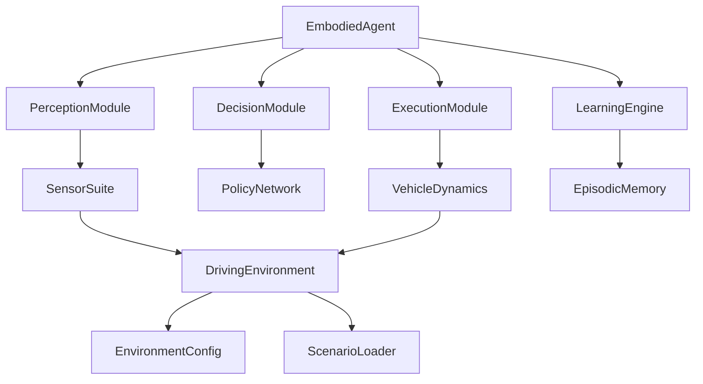

# TinyAI 具身智能模块 - 技术架构文档

## 1. 文档概述

本文档详细描述了 TinyAI 具身智能模块（`tinyai-agent-embodied`）的技术架构、设计决策、核心算法和实现细节。

**文档版本**: v1.0  
**创建日期**: 2025-10-17  
**模块状态**: 开发中（已完成阶段一、二）

## 2. 项目背景与目标

### 2.1 背景

具身智能（Embodied Intelligence）是人工智能领域的重要研究方向，强调智能体通过与物理环境的直接交互来感知、学习和决策。本模块以自动驾驶场景为典型应用案例，展示端到端学习能力。

### 2.2 设计目标

- **完整性**：实现感知-决策-执行的完整闭环
- **可复用**：复用TinyAI现有深度学习组件
- **可扩展**：支持添加新传感器、新场景、新算法
- **教育性**：代码清晰，便于学习和理解
- **实用性**：支持实际应用场景验证

## 3. 系统整体架构

### 3.1 分层架构

```
┌─────────────────────────────────────────────────────┐
│           智能体核心层（EmbodiedAgent）               │
│  ┌────────────┬───────────┬────────────┬──────────┐ │
│  │ 感知模块    │ 决策模块   │ 执行模块    │ 学习引擎  │ │
│  └────────────┴───────────┴────────────┴──────────┘ │
└─────────────────────────────────────────────────────┘
                         ↕
┌─────────────────────────────────────────────────────┐
│              环境仿真层（Environment）                │
│  ┌────────────┬───────────┬────────────┐            │
│  │ 传感器组件  │ 车辆动力学 │ 场景管理   │            │
│  └────────────┴───────────┴────────────┘            │
└─────────────────────────────────────────────────────┘
                         ↕
┌─────────────────────────────────────────────────────┐
│         TinyAI 深度学习核心层（DL Modules）          │
│  ┌────────────┬───────────┬────────────┬──────────┐ │
│  │ NdArray    │ AutoGrad  │ NeuralNet  │ RL       │ │
│  └────────────┴───────────┴────────────┴──────────┘ │
└─────────────────────────────────────────────────────┘
```

### 3.2 核心模块关系



## 4. 核心组件设计

### 4.1 数据模型层

#### 4.1.1 基础几何类

**Vector3D** - 三维向量
```java
public class Vector3D {
    private double x, y, z;
    
    // 核心方法
    public double magnitude()                    // 向量长度
    public double distanceTo(Vector3D other)     // 距离计算
    public Vector3D add(Vector3D other)          // 向量加法
    public Vector3D multiply(double scalar)      // 标量乘法
}
```

**BoundingBox** - 包围盒
```java
public class BoundingBox {
    private double length, width, height;
    
    public double getVolume()      // 体积
    public double getFootprint()   // 占地面积
}
```

#### 4.1.2 状态表示类

**VehicleState** - 车辆状态

| 字段 | 类型 | 说明 | 单位 |
|-----|------|------|------|
| position | Vector3D | 车辆位置 | 米 |
| heading | double | 航向角 | 弧度 |
| speed | double | 速度 | m/s |
| acceleration | double | 加速度 | m/s² |
| steeringAngle | double | 转向角 | 弧度 |
| angularVelocity | double | 角速度 | rad/s |

**PerceptionState** - 感知状态

| 字段 | 类型 | 说明 |
|-----|------|------|
| visualFeatures | NdArray | 视觉特征向量（256维） |
| lidarFeatures | NdArray | 激光雷达特征（128维） |
| vehicleState | VehicleState | 车辆自身状态 |
| obstacleMap | List<ObstacleInfo> | 障碍物列表 |
| laneInfo | LaneGeometry | 车道几何信息 |
| timestamp | long | 时间戳 |

#### 4.1.3 动作定义

**DrivingAction** - 驾驶动作

```java
public class DrivingAction {
    private double steering;   // [-1.0, 1.0] 转向
    private double throttle;   // [0.0, 1.0] 油门
    private double brake;      // [0.0, 1.0] 刹车
    
    public void clip()                           // 限制到有效范围
    public boolean isEmergencyBrake()            // 判断紧急制动
    public NdArray toArray()                     // 转换为数组
    public static DrivingAction fromArray(...)   // 从数组创建
}
```

### 4.2 环境仿真层

#### 4.2.1 车辆动力学模型

**VehicleDynamics** - 基于自行车模型

**状态更新方程**：
```
x(t+Δt) = x(t) + v·cos(θ)·Δt
y(t+Δt) = y(t) + v·sin(θ)·Δt
θ(t+Δt) = θ(t) + ω·Δt
v(t+Δt) = v(t) + a·Δt

其中：
ω = v·tan(δ) / L
```

**关键参数**：

| 参数 | 默认值 | 说明 |
|-----|--------|------|
| wheelbase (L) | 2.7 m | 车辆轴距 |
| maxSteeringAngle | 0.6 rad | 最大转向角 |
| maxAcceleration | 3.0 m/s² | 最大加速度 |
| maxDeceleration | 8.0 m/s² | 最大减速度 |
| frictionCoeff | 0.8 | 路面摩擦系数 |

**核心方法**：

```java
public VehicleState update(VehicleState current, 
                          DrivingAction action, 
                          double dt)
```

#### 4.2.2 驾驶环境

**SimpleDrivingEnv** - 简化驾驶环境实现

**主要功能**：
1. 环境初始化与重置
2. 动作执行与状态更新
3. 奖励计算
4. 碰撞检测
5. 终止条件判断

**状态更新流程**：

```
step(action)
  ├── 1. 动作限幅 (action.clip())
  ├── 2. 更新车辆状态 (dynamics.update())
  ├── 3. 更新道路进度
  ├── 4. 更新车道偏离
  ├── 5. 更新障碍物相对位置
  ├── 6. 计算奖励 (calculateReward())
  ├── 7. 检查终止条件 (checkTermination())
  └── 8. 返回结果 (StepResult)
```

#### 4.2.3 奖励函数设计

**组合奖励公式**：

```
R_total = Σ w_i · R_i

R_speed = 1 - |v - v_target| / v_max
R_lane = exp(-lateral_deviation²)
R_collision = -100 (碰撞) / -10·min_distance (接近)
R_comfort = -|a| - 2|δ|
R_progress = 0.1 (每步基础奖励)
```

**权重配置**：

| 奖励项 | 权重 | 说明 |
|-------|------|------|
| w_speed | 0.3 | 速度控制重要性 |
| w_lane | 0.4 | 车道保持重要性 |
| w_collision | 1.0 | 安全性最高优先级 |
| w_comfort | 0.1 | 舒适性相对次要 |

### 4.3 场景管理

**ScenarioLoader** - 场景加载器

**内置场景**：

```java
TEST          // 简单测试场景
HIGHWAY       // 高速公路场景
URBAN         // 城市道路场景
RURAL         // 乡村道路场景
PARKING_LOT   // 停车场场景
INTERSECTION  // 路口场景
```

**场景配置示例**：

```java
// 高速公路配置
EnvironmentConfig highway = new EnvironmentConfig();
highway.setLaneCount(3);
highway.setVehicleDensity(20);
highway.setSpeedLimit(120.0);
highway.setTargetSpeed(100.0);
```

## 5. 关键算法实现

### 5.1 车辆动力学更新算法

```java
public VehicleState update(VehicleState current, 
                          DrivingAction action, 
                          double dt) {
    // 1. 计算加速度
    double a = computeAcceleration(action, current.getSpeed());
    
    // 2. 更新速度
    double v_new = max(0, current.getSpeed() + a * dt);
    
    // 3. 计算转向角
    double δ = clip(action.getSteering() * steeringGain,
                   -maxSteeringAngle, maxSteeringAngle);
    
    // 4. 计算角速度
    double ω = (v_new * tan(δ)) / wheelbase;
    
    // 5. 更新航向角
    double θ_new = normalizeAngle(current.getHeading() + ω * dt);
    
    // 6. 更新位置
    double x_new = current.x + v_new * cos(θ_new) * dt;
    double y_new = current.y + v_new * sin(θ_new) * dt;
    
    return new VehicleState(x_new, y_new, θ_new, v_new, a, δ, ω);
}
```

### 5.2 碰撞检测算法

```java
private boolean checkCollision() {
    // 1. 检测与障碍物的碰撞
    for (ObstacleInfo obstacle : obstacles) {
        if (obstacle.getDistance() < COLLISION_THRESHOLD) {
            return true;
        }
    }
    
    // 2. 检测是否驶出道路边界
    double y = egoVehicle.getPosition().getY();
    double roadWidth = config.getLaneCount() * config.getLaneWidth();
    if (y < 0 || y > roadWidth) {
        return true;
    }
    
    return false;
}
```

### 5.3 车道偏离计算

```java
private void updateLaneDeviation() {
    double y = egoVehicle.getPosition().getY();
    double laneWidth = config.getLaneWidth();
    
    // 确定当前车道
    int laneId = (int)(y / laneWidth);
    
    // 计算车道中心
    double laneCenter = (laneId + 0.5) * laneWidth;
    
    // 计算偏离距离
    double deviation = y - laneCenter;
    
    laneInfo.setLateralDeviation(deviation);
    laneInfo.setLaneId(laneId);
}
```

## 6. 接口设计

### 6.1 核心接口

**DrivingEnvironment** - 驾驶环境接口

```java
public interface DrivingEnvironment {
    PerceptionState reset();
    StepResult step(DrivingAction action);
    PerceptionState getObservation();
    boolean isTerminated();
    NdArray getSensorData(SensorType type);
    Object render();
    void close();
}
```

**Sensor** - 传感器接口

```java
public interface Sensor {
    SensorType getType();
    NdArray readData();
    boolean isReady();
    void reset();
    double getNoiseLevel();
}
```

## 7. 数据流与交互

### 7.1 环境交互循环

```
初始化阶段:
  env = new SimpleDrivingEnv(config)
  state = env.reset()

交互循环:
  for step in range(max_steps):
    action = policy.decide(state)
    result = env.step(action)
    
    state_next = result.getObservation()
    reward = result.getReward()
    done = result.isDone()
    
    memory.store(state, action, reward, state_next, done)
    
    if done:
      break
    
    state = state_next

清理:
  env.close()
```

### 7.2 数据流图

```
Sensor Data → PerceptionModule → Features
                                     ↓
VehicleState ────────────────→ DecisionModule → Action
                                     ↑
                              PolicyNetwork
                                     
Action → ExecutionModule → VehicleDynamics → New State
                                ↓
                         Reward Calculation
```

## 8. 性能优化

### 8.1 计算效率优化

1. **障碍物管理**：移除视野外的障碍物，减少计算量
2. **特征缓存**：缓存重复计算的特征
3. **批量更新**：支持批量环境并行更新

### 8.2 内存优化

1. **对象复用**：复用VehicleState对象
2. **延迟加载**：按需生成障碍物
3. **定期清理**：清理历史数据

## 9. 扩展性设计

### 9.1 添加新传感器

```java
public class CustomSensor implements Sensor {
    @Override
    public SensorType getType() {
        return SensorType.CUSTOM;
    }
    
    @Override
    public NdArray readData() {
        // 实现传感器读取逻辑
    }
}
```

### 9.2 添加新场景

```java
ScenarioLoader loader = new ScenarioLoader();

Map<String, Object> customParams = new HashMap<>();
customParams.put("laneCount", 4);
customParams.put("speedLimit", 140.0);

EnvironmentConfig custom = loader.createCustomScenario(
    ScenarioType.HIGHWAY, customParams);
```

## 10. 测试策略

### 10.1 单元测试

- VehicleDynamics 动力学精度测试
- 奖励函数正确性测试
- 碰撞检测准确性测试
- 场景加载功能测试

### 10.2 集成测试

- 环境完整交互流程测试
- 多场景切换测试
- 长时间运行稳定性测试

## 11. 已知限制与改进方向

### 11.1 当前限制

1. **简化的物理模型**：采用自行车模型，未考虑轮胎滑移等复杂因素
2. **简化的传感器模拟**：未实现真实的图像和点云生成
3. **固定的奖励函数**：权重需要手动调整

### 11.2 改进方向

1. 引入更高保真的车辆动力学模型
2. 实现真实的传感器仿真（图像渲染、点云生成）
3. 支持逆强化学习自动学习奖励函数
4. 添加更多真实交通场景

## 12. 参考资料

- 自行车模型：Kong et al., "Kinematic and Dynamic Vehicle Models for Autonomous Driving Control Design"
- 强化学习环境设计：OpenAI Gym Documentation
- 自动驾驶仿真：CARLA Simulator

---

**文档维护**: TinyAI Team  
**最后更新**: 2025-10-17
