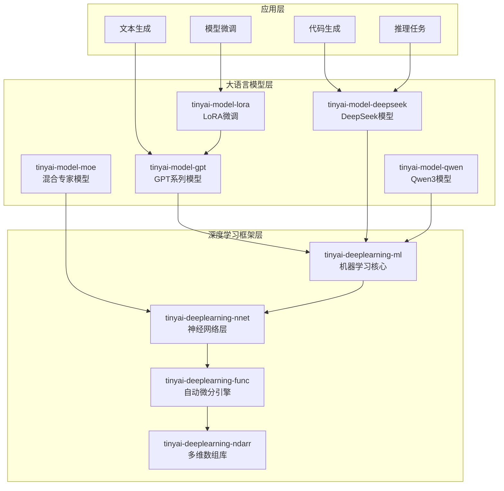

# TinyAI 大语言模型层

[](https://openjdk.org/projects/jdk/17/)
[](https://maven.apache.org/)
[](https://opensource.org/licenses/Apache-2.0)

## 📋 模块概述

`tinyai-model` 是 TinyAI 框架的大语言模型层，提供了从经典GPT系列到最新DeepSeek/Qwen模型的完整大语言模型实现。该层包含 **5个核心模块**，涵盖基础语言模型、高级推理模型、参数高效微调、混合专家架构等先进技术。

### 🎯 设计目标

- **完整实现**：基于官方论文和参考实现的完整模型架构
- **框架集成**：充分利用 TinyAI 的 Block/Layer/Model 设计模式
- **性能优化**：针对推理和训练场景的性能优化
- **易于扩展**：模块化设计，便于功能扩展和定制

## 🏗️ 模块架构



## 📦 核心模块

### 基础语言模型

| 模块 | 说明 | 核心特性 |
|------|------|---------|
| [**tinyai-model-gpt**](tinyai-model-gpt/README.md) | GPT系列模型 | GPT-1/2/3完整架构、自注意力机制、位置编码、文本生成 |
| [**tinyai-model-qwen**](tinyai-model-qwen/README.md) | Qwen3模型 | GQA注意力、RoPE位置编码、SwiGLU激活、现代架构 |

### 高级推理模型

| 模块 | 说明 | 核心特性 |
|------|------|---------|
| [**tinyai-model-deepseek**](tinyai-model-deepseek/README.md) | DeepSeek系列模型 | R1推理模型、V3混合专家、多步推理、自我反思、代码生成 |

### 高效微调技术

| 模块 | 说明 | 核心特性 |
|------|------|---------|
| [**tinyai-model-lora**](tinyai-model-lora/README.md) | LoRA微调 | 低秩适应、参数高效、权重管理、快速微调 |
| [**tinyai-model-moe**](tinyai-model-moe/README.md) | 混合专家模型 | 稀疏激活、专家路由、负载均衡、任务感知 |

## 🚀 快速开始

### 环境要求

- **Java**: JDK 17+
- **Maven**: 3.6+
- **内存**: 推荐 8GB+ (大型模型训练)
- **依赖**: TinyAI 核心模块

### 编译安装

```bash
# 编译所有模型模块
cd tinyai-model
mvn clean compile

# 运行测试
mvn test

# 打包安装
mvn install
```

### 使用示例

#### 1. GPT模型使用

```java
import io.leavesfly.tinyai.gpt2.GPT2Model;
import io.leavesfly.tinyai.ndarr.NdArray;

// 创建GPT-2模型
GPT2Model model = GPT2Model.createSmallModel("gpt2-small");

// 文本生成
List<Integer> prompt = Arrays.asList(100, 200, 300);
List<Integer> generated = model.generateText(prompt, 50);

// 序列生成
NdArray inputTokens = NdArray.of(new int[][]{{1, 2, 3}});
NdArray output = model.generateSequence(inputTokens, 20);
```

#### 2. DeepSeek R1 推理模型

```java
import io.leavesfly.tinyai.deepseek.rx.*;

// 创建R1模型
DeepSeekR1Model r1Model=new DeepSeekR1Model("DeepSeek-R1");

// 推理任务
        NdArray inputIds=createInput();
        DeepSeekR1Model.ReasoningResult result=r1Model.performReasoning(inputIds);

        System.out.println("推理步骤数: "+result.numSteps);
        System.out.println("置信度: "+result.averageConfidence);
        System.out.println("推理质量: "+result.reasoningQuality);

// 反思机制
        DeepSeekR1Model.ReflectionResult reflection=r1Model.performReflection(inputIds);
        System.out.println("反思质量: "+reflection.quality);
```

#### 3. DeepSeek V3 代码生成

```java
import io.leavesfly.tinyai.deepseek.v3.*;

// 创建V3模型
DeepSeekV3Model v3Model = new DeepSeekV3Model("DeepSeek-V3");

// 代码生成
DeepSeekV3Model.CodeGenerationResult codeResult = 
    v3Model.generateCode(inputIds);

System.out.println("检测语言: " + codeResult.detectedLanguage);
System.out.println("代码质量: " + codeResult.codeQuality);
System.out.println("代码置信度: " + codeResult.codeConfidence);

// 任务类型感知推理
DeepSeekV3Model.ReasoningResult reasoningResult = 
    v3Model.performReasoning(inputIds);
System.out.println("推理置信度: " + reasoningResult.averageConfidence);
```

#### 4. LoRA微调

```java
import io.leavesfly.tinyai.lora.*;

// 创建LoRA配置
LoraConfig config = LoraConfig.createMediumRank();

// 创建LoRA层
LoraLinearLayer layer = new LoraLinearLayer("lora_layer", 512, 256, config, true);

// 启用LoRA微调
layer.enableLora();

// 训练...

// 合并LoRA权重
layer.mergeLora();

// 禁用LoRA
layer.disableLora();
```

#### 5. Qwen3模型

```java
import io.leavesfly.tinyai.qwen3.*;

// 创建Qwen3模型
Qwen3Model qwenModel = new Qwen3Model("Qwen3-7B");

// 文本生成
NdArray inputIds = createInput();
NdArray output = qwenModel.generate(inputIds, maxLength);
```

## 🎯 模型对比

### 基础语言模型对比

| 特性 | GPT-2 | Qwen3 |
|------|-------|-------|
| 注意力机制 | 多头注意力 | GQA分组查询注意力 |
| 位置编码 | 可学习位置编码 | RoPE旋转位置编码 |
| 激活函数 | GELU | SwiGLU |
| 架构风格 | 经典Transformer | 现代优化架构 |
| 适用场景 | 教学、研究 | 生产应用 |

### 高级推理模型对比

| 特性 | DeepSeek R1 | DeepSeek V3 |
|------|-------------|-------------|
| 推理步骤 | 7步迭代推理 | 任务感知推理 |
| 反思机制 | ✅ 完整反思模块 | ✅ 自我纠错 |
| 置信度评估 | ✅ 动态评估 | ✅ 多维度评估 |
| 任务类型识别 | ❌ | ✅ 5种任务类型 |
| 专家路由 | ❌ | ✅ 8专家MoE |
| 代码生成优化 | ❌ | ✅ 10种语言支持 |

### 性能特点

| 模型 | 参数规模 | 推理延迟 | 内存使用 | 适用场景 |
|------|----------|----------|----------|----------|
| GPT-2-Small | ~100M | ~30ms | ~200MB | 教育演示 |
| GPT-2-Medium | ~350M | ~80ms | ~600MB | 研究实验 |
| R1-Small | ~100M | ~50ms | ~200MB | 推理任务 |
| R1-Base | ~500M | ~150ms | ~1GB | 复杂推理 |
| V3-Small | ~200M | ~80ms | ~400MB | 代码生成 |
| V3-Base | ~1B | ~200ms | ~2GB | 生产应用 |
| Qwen3-7B | ~7B | ~300ms | ~14GB | 通用任务 |

## 📊 模块统计

### 代码规模

| 指标 | 数值 |
|------|------|
| 总模块数 | 5个 |
| Java类文件 | 80+ |
| 测试用例 | 120+ |
| 代码行数 | 25,000+ |
| 文档页数 | 80+ |

### 测试覆盖

| 模块 | 测试数量 | 覆盖率 | 状态 |
|------|----------|--------|------|
| tinyai-model-gpt | 30+ | 95%+ | ✅ 通过 |
| tinyai-model-deepseek | 40+ | 90%+ | ✅ 通过 |
| tinyai-model-qwen | 20+ | 85%+ | ✅ 通过 |
| tinyai-model-lora | 15+ | 90%+ | ✅ 通过 |
| tinyai-model-moe | 15+ | 85%+ | ✅ 通过 |
| **总计** | **120+** | **90%+** | **✅ 全部通过** |

## 🎓 学习路径

### 初级：理解基础语言模型

1. 学习 [tinyai-model-gpt](tinyai-model-gpt/README.md) - 理解GPT系列架构演进
2. 掌握Transformer、自注意力、位置编码等核心概念
3. 完成简单的文本生成任务

### 中级：掌握现代架构

1. 学习 [tinyai-model-qwen](tinyai-model-qwen/README.md) - 理解现代优化技术
2. 学习 [tinyai-model-lora](tinyai-model-lora/README.md) - 掌握高效微调方法
3. 实现基于LoRA的模型微调

### 高级：高级推理与专家模型

1. 学习 [tinyai-model-deepseek](tinyai-model-deepseek/README.md) - 理解推理和反思机制
2. 学习 [tinyai-model-moe](tinyai-model-moe/README.md) - 掌握混合专家架构
3. 构建支持复杂推理的大语言模型应用

## 📖 演示程序

### 运行示例

```bash
# GPT模型演示
mvn exec:java -Dexec.mainClass="io.leavesfly.tinyai.gpt2.GPT2Demo" -pl tinyai-model-gpt

# DeepSeek R1演示
mvn exec:java -Dexec.mainClass="io.leavesfly.tinyai.deepseek.rx.DeepSeekR1Demo" -pl tinyai-model-deepseek

# DeepSeek V3演示
mvn exec:java -Dexec.mainClass="io.leavesfly.tinyai.deepseek.v3.DeepSeekV3Demo" -pl tinyai-model-deepseek

# Qwen3模型演示
mvn exec:java -Dexec.mainClass="io.leavesfly.tinyai.qwen3.Qwen3Demo" -pl tinyai-model-qwen
```

## 🎯 应用场景

### 文本生成

- **创意写作**: 基于GPT模型的故事、诗歌生成
- **内容创作**: 文章、报告、摘要生成
- **对话系统**: 智能客服、聊天机器人

### 代码生成

- **代码补全**: DeepSeek V3的智能代码补全
- **代码生成**: 从自然语言描述生成代码
- **代码分析**: 代码质量评估和优化建议

### 推理任务

- **逻辑推理**: DeepSeek R1的多步推理能力
- **数学问题**: 复杂数学问题求解
- **知识问答**: 基于推理的问答系统

### 模型微调

- **领域适配**: 使用LoRA快速适配特定领域
- **任务定制**: 针对特定任务的模型微调
- **参数高效**: 最小化微调参数和计算成本

## 🔧 扩展开发

### 自定义语言模型

```java
public class CustomLanguageModel extends Model {
    private Block transformerBlock;
    
    public CustomLanguageModel(String name, int vocabSize, int dModel) {
        super(name);
        // 实现自定义模型架构
        this.transformerBlock = new CustomTransformerBlock("transformer", dModel);
    }
    
    @Override
    public Variable modelForward(Variable... inputs) {
        // 实现前向传播逻辑
        return transformerBlock.blockForward(inputs);
    }
}
```

### 自定义注意力机制

```java
public class CustomAttention extends Layer {
    @Override
    public Variable layerForward(Variable... inputs) {
        // 实现自定义注意力计算
        Variable query = inputs[0];
        Variable key = inputs[1];
        Variable value = inputs[2];
        
        // 自定义注意力逻辑
        return computeCustomAttention(query, key, value);
    }
}
```

## 📚 技术文档

### 核心文档

- [GPT系列模型文档](tinyai-model-gpt/README.md)
- [DeepSeek R1模型文档](tinyai-model-deepseek/doc/R1_README.md)
- [DeepSeek V3模型文档](tinyai-model-deepseek/doc/V3_README.md)
- [Qwen3模型文档](tinyai-model-qwen/README.md)
- [LoRA微调文档](tinyai-model-lora/README.md)
- [混合专家模型文档](tinyai-model-moe/README.md)

### 架构设计文档

- [GPT架构演进](tinyai-model-gpt/doc/架构设计.md)
- [DeepSeek技术架构](tinyai-model-deepseek/doc/技术架构.md)
- [LoRA实现原理](tinyai-model-lora/doc/实现原理.md)

## 🤝 贡献指南

### 开发规范

1. **代码规范**: 遵循Java编码规范，添加详细中文注释
2. **测试覆盖**: 新功能必须包含完整的单元测试
3. **文档更新**: 重要功能需要更新相应的README和技术文档
4. **性能优化**: 注意内存使用和推理延迟

### 提交流程

1. Fork 项目仓库
2. 创建功能分支 (`git checkout -b feature/NewModel`)
3. 提交更改 (`git commit -m 'Add new language model'`)
4. 推送到分支 (`git push origin feature/NewModel`)
5. 创建 Pull Request

## 📄 许可证

本项目采用 Apache License 2.0 开源许可证。详情请参阅 [LICENSE](../LICENSE) 文件。

## 🙏 致谢

感谢所有为 TinyAI 大语言模型层做出贡献的开发者！

---

<div align="center">

**🎯 构建下一代大语言模型！**

**如果这个项目对您有帮助，请给我们一个 ⭐️**

[⚡ 快速开始](#🚀-快速开始) | [📖 查看文档](#📚-技术文档) | [🤝 参与贡献](#🤝-贡献指南)

</div>
